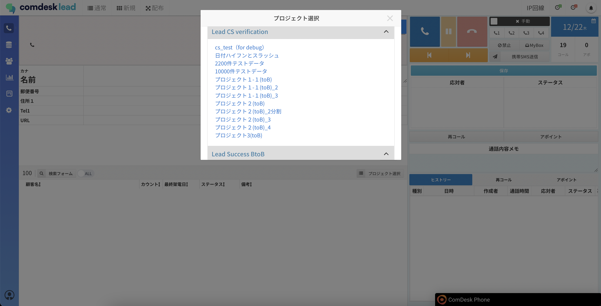
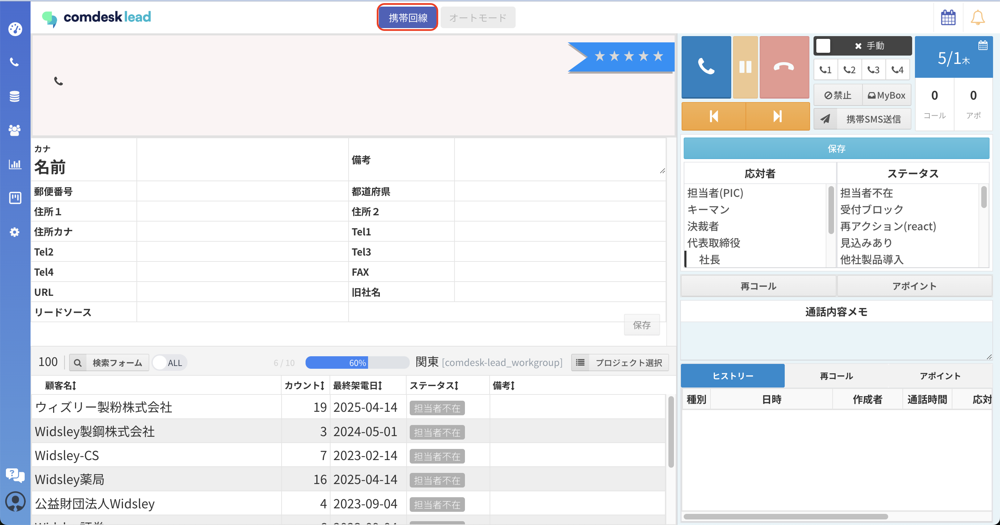
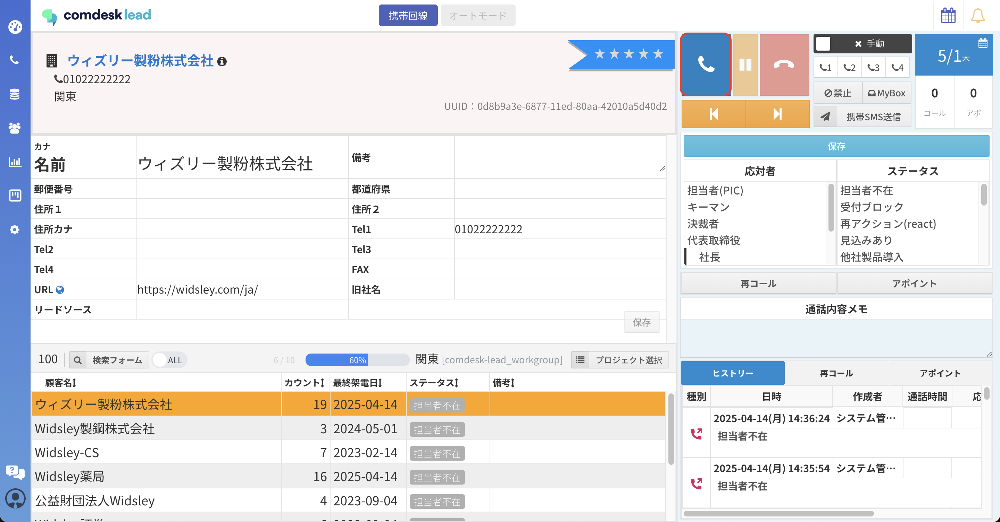

# 携帯回線での架電方法

Comdesk Leadは、携帯回線とIP回線から架電が可能です。

本記事では、携帯回線からの架電方法を説明いたします。

1.  携帯アプリ「CallServer」にログインします。  
    ログイン方法は [こちら](12744354427033_携帯回線発信制御アプリ（CallServer）のログイン・ログアウト.md) をご確認ください。  
      
    
2.  「待ち受け待機中」を表示させ、そのままの画面で表示させ続けます。  
    スリープに入ってしまったり、ロックをかけてしまうと架電が行えません。  
    画面点灯時間（スリープするまでの時間）の設定については[こちら](../../ハードウェアについて/弊社貸出端末について/12785391736345_画面点灯時間を設定する.md)をご確認ください。  
      
      
    
3.  パソコンでログインします。  
    ログイン方法は [こちら](12735918031513_Comdesk_Leadにログインする.md) をご確認ください。
    
    💡CallServerとComdesk Leadにログインする際、必ず同一のログインIDとパスワードを使用してください。  
    それぞれ別のログインIDとパスワードを使用すると、連動しなくなります。
    
4.  プロジェクトを選択します。  
      
      
    
5.  画面右上に「携帯回線」と表示されているか確認します。  
    「IP回線」と表示されている場合は、「IP回線」をクリックすると「携帯回線」に切り替わります。  
      
      
    
6.  画面下部のリストを選択し、画面上部の「発信」ボタンをクリックすると、携帯電話から発信ができます。  
      
      
    
7.  アクティビティ結果の保存方法は [**こちら**](12750855872025_架電終了後に結果を保存する.md) をご参照ください。

その他ご不明点などございましたら、[**サポートチームまでお問い合わせ**](https://comdesklead.zendesk.com/hc/ja/requests/new)をお願い致します。

お問い合わせ方法は**[こちら](../../トラブルシューティング/サポートチームへのお問い合わせ方法/12828937533081_サポートチームへのお問い合わせ方法.md)**
