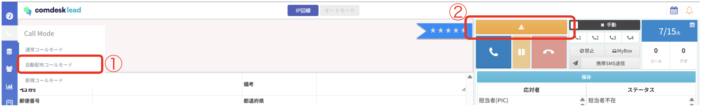
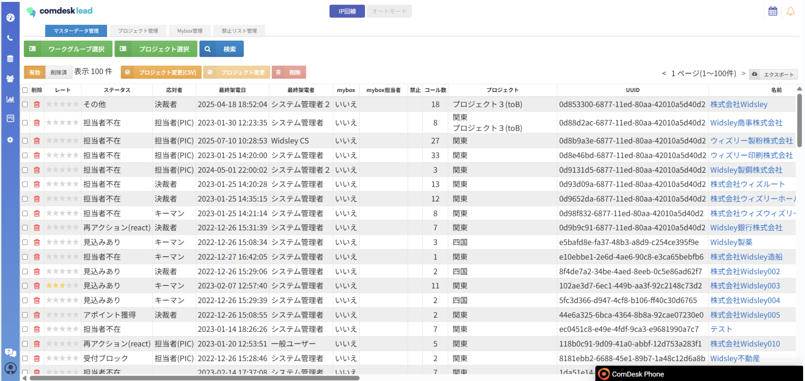
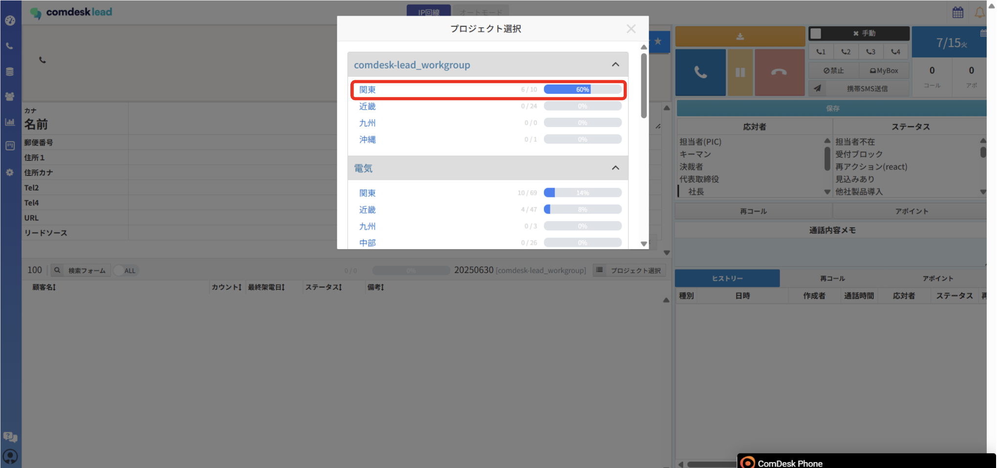
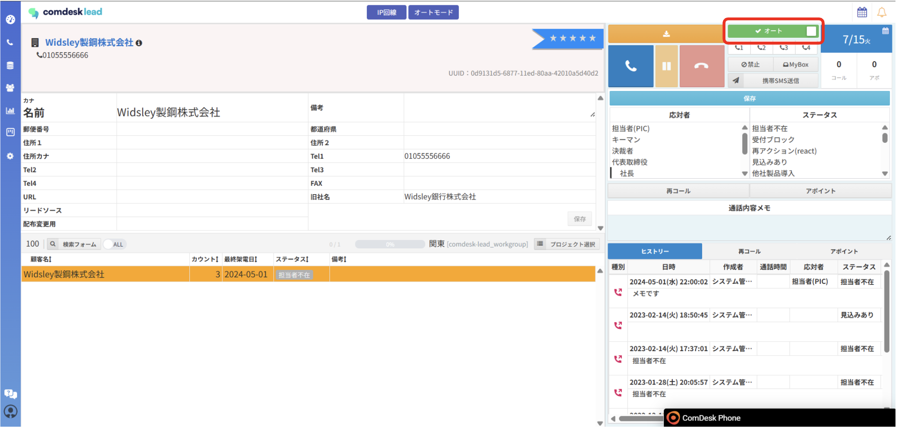

# 同じプロジェクトに複数人で同時に架電したい（配布コールモード）

同一プロジェクトに対して複数ユーザーが一斉に架電する場合は、配布コールモードをご利用ください。

**配布コールモード**：プロジェクト内にある未配布のリストを対象にランダムで配布

＋更に**オートコールモード**で架電を行うと、さらに効率が上がります。

配布コールモードを選択し（①）、配布ボタン（②）をクリックするとリストを取り込みます。

配布コールモードの架電方法は [**こちら**](12745769763609_リストに対して架電する.md) をご参照ください。

アポイント獲得率と架電効率を上げる一例をご紹介します。

1.  アポイントが取れやすい業種をプロジェクトに登録します。  
      
    
2.  配布コールモードで、上記1のプロジェクトを選択します。  
      
    
3.  配布コールモードを選択し、オートコールで架電します。  
    複数ユーザーで、同一プロジェクトを選択することをおすすめします。  
      
    
4.  選択しているプロジェクトのリストが全て「配布済」になるまでオートコールが可能です。  
    配布状況の確認は [**こちら**](../管理者ガイド/13896301861017_配布状況の確認.md) をご参照ください。

その他ご不明点などございましたら、[**サポートチームまでお問い合わせ**](https://comdesklead.zendesk.com/hc/ja/requests/new)をお願い致します。

お問い合わせ方法は**[こちら](../../トラブルシューティング/サポートチームへのお問い合わせ方法/12828937533081_サポートチームへのお問い合わせ方法.md)**
