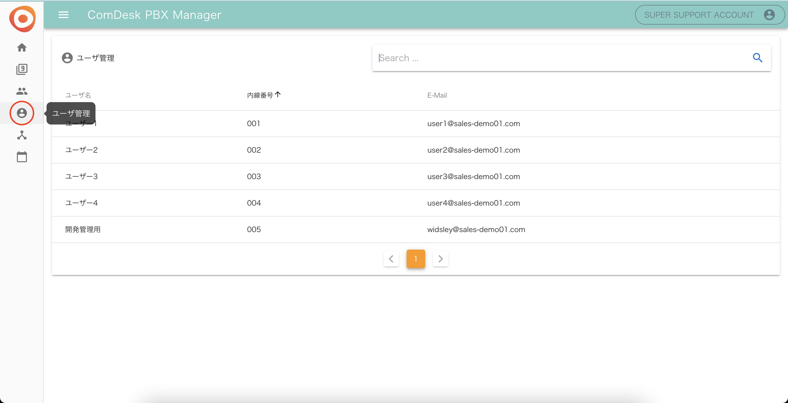
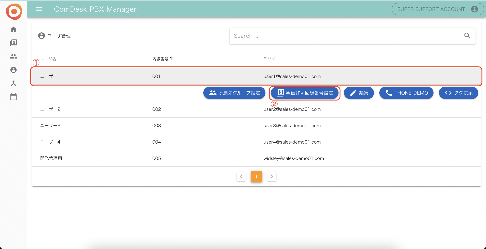
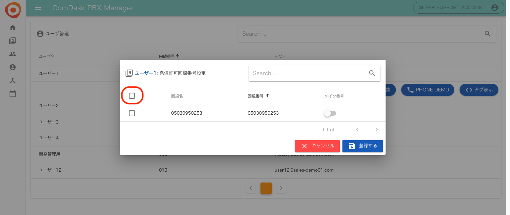
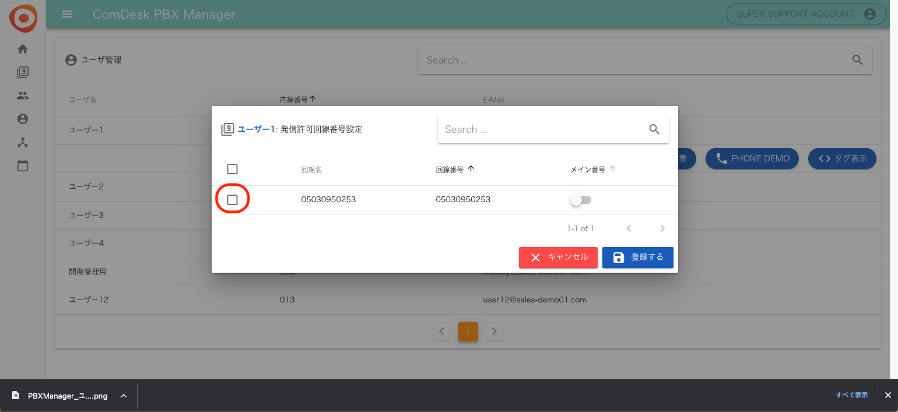
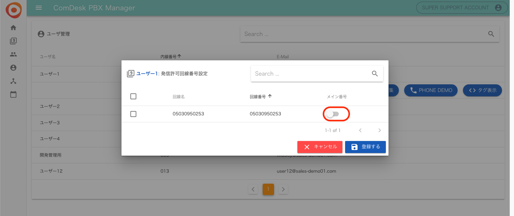
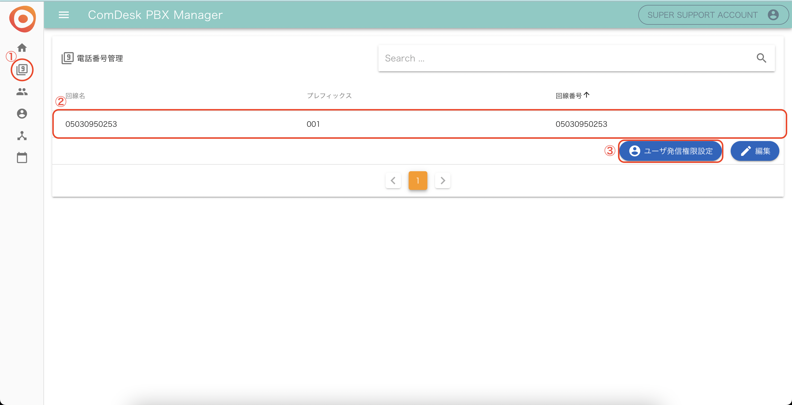
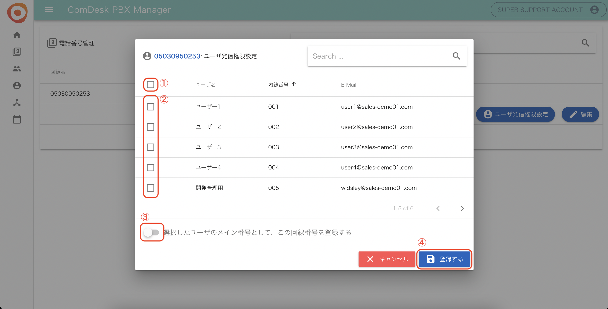

# PBX Manager 発信許可設定をする

## **発信許可設定とは**

ユーザーが架電する際の発信元となる電話番号を設定することです。  
ユーザーごとにIP回線を紐付けます。1回線に複数ユーザーを紐付けるだけでなく、1ユーザーに複数の回線を紐付けることも可能です。

## **ユーザーの発信許可番号/メイン番号の設定方法**

1.  PBX Manager画面左側の「ユーザ管理」をクリックします。  
    ※PBX Managerとは、IP回線の設定をする画面です。URLは、弊社より管理者の方にご案内致します。  
      
      
    
2.  設定したいユーザーを選択し「発信許可回線番号設定」をクリックします。  
      
      
    
3.  発信許可回線番号設定で発信許可を行います。  
    紐づける回線番号のチェックボックスに✔を入れて「登録する」をクリックしてください。  
      
    ・全ての回線を発信許可にする場合、項目欄のチェックボックスに✔を入れるとご契約中の全てのページの回線番号を選択することができます。  
      
      
    ・回線毎に発信許可を行う場合、回線名の左側のチェックボックスに✔を入れます。  
      
      
    
4.  発信許可回線番号設定を行う場合、メイン番号を設定する必要があります。  
    いずれかひとつの番号をメイン番号にし「登録をする」をクリックしてください。  
    

## **回線から一括でユーザーとメイン番号を設定する方法**

**※こちらの方法は上書きしてしまう恐れがあるため、初期設定時以外はお勧めできません。**

1.  PBX Manager画面左側の「電話番号管理」をクリックし、設定対象の回線番号を選択します。
    
    「ユーザ発信権限設定」をクリックします。  
      
      
    
2.  設定画面開き、
    
    ・全ユーザを一括で選択する場合は、赤枠①のチェックボックスに✔を入れます。
    
    ・対象ユーザの選択する場合は赤枠②の該当ユーザーのチェックボックスに✔を入れます。  
      
    
    選択したユーザのメイン回線番号としてこの回線番号を登録する場合は赤枠③をONにし、「登録する」を選択します。  
      
      
    

その他ご不明点などございましたら、[**サポートチームまでお問い合わせ**](https://comdesklead.zendesk.com/hc/ja/requests/new)をお願い致します。

お問い合わせ方法は**[こちら](../../トラブルシューティング/サポートチームへのお問い合わせ方法/12828937533081_サポートチームへのお問い合わせ方法.md)**
