# CallServerのインストール

CallServerのインストール方法についてご説明いたします。  
  
 

## **CallServerとは**

Comdesk Leadで携帯回線を使って発着信するためのアプリです。

Comdesk Leadをご利用になる際には必ずCallServerへのログインも必要です。

## **インストール方法**

SMSのご利用有無に応じてインストール方法が異なります。

SMSをご利用の場合は、PlayストアからインストールしたCallServerアプリは非対応となります。

```auto
・Playストアからインストール（SMS非対応）
・QRコードからインストール（SMS対応）
```

## **Playストアからインストール（SMS非対応）**

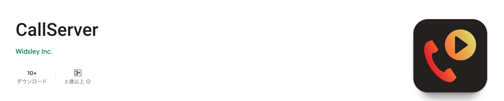

1.  インストールを行いたい携帯端末で「Play ストア」を開き、「CallServer」と検索  
    または、右記の[URL](https://play.google.com/store/apps/details?id=com.comdesk.lead.callserver.app&pcampaignid=web_share)をクリックするとアプリケーション画面にジャンプします。  
     
2.  アプリのインストールを行い、インストールした「CallServer」アプリを開きます。  
    最新バージョン Ver2.0.1（2026/03 時点）  
     
3.  「通知の送信を「CallServer」に許可しますか？」のポップアップに対して、  
    「許可」をタップします。
    
    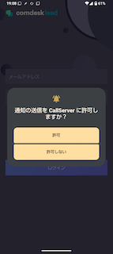
    
4.  「電話と発信と管理を「CallServer」に許可しますか？」のポップアップに対して、  
    「許可」をタップします。
    
    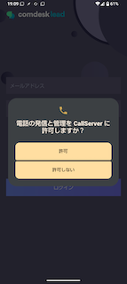
    

## **QRコードからインストール（SMS対応）**

1.  インストールを行いたい携帯端末で下記QRコードを読み取ります。  
    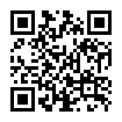  
    QRコードが読み取れない場合は、Google Chromeを開き「[gjmptw.pw](http://gjmptw.pw)」にアクセスします。  
     
2.  ログイン画面が表示されますので、ユーザー名とパスワードを入力し、ログインをタップします。  
    ユーザー名、パスワードについては弊社サポートへお問い合わせください。  
    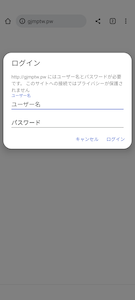  
     
3.  Telforce Apps画面が表示されますので、下記のDownloadボタンをクリックします。  
    **発信制御アプリ\[CallServer Comdesk Lead用\]**　最新バージョン Ver1.2.2（2026/03 時点）  
    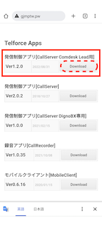  
      
     
4.  ダウンロードが完了したら「開く」をタップします。  
    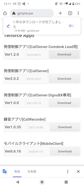  
     
5.  インストールをタップします。  
    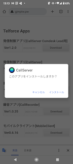  
     
6.  「開く」をタップします。  
    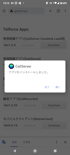  
     
7.  「音声の録音を「CallServer」に許可しますか？」の質問に対して、  
    「アプリの使用時のみ」をタップします。  
    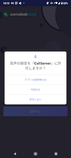  
     
8.  「通話履歴へのアクセスを「CallServer」に許可しますか？」のポップアップに対して、  
    「許可」をタップします。  
    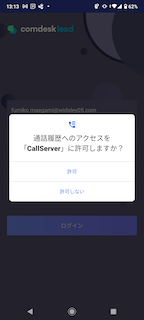  
     
9.  「電話と発信と管理を「CallServer」に許可しますか？」のポップアップに対して、  
    「許可」をタップします。  
      
     
10.  「SNSメッセージの送信と表示を「CallServer」に許可しますか？」のポップアップに対して、  
     「許可」をタップします。  
     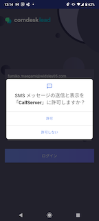  
      
11.  「デバイス内の写真やメディアへのアクセスを「CallServer」に許可しますか？」のポップアップに対して、「許可」をタップしインストール完了です。  
     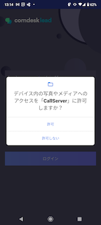  
      

その他ご不明点などございましたら、[**サポートチームまでお問い合わせ**](https://comdesklead.zendesk.com/hc/ja/requests/new)をお願い致します。

お問い合わせ方法は[**こちら**](../../トラブルシューティング/サポートチームへのお問い合わせ方法/12828937533081_サポートチームへのお問い合わせ方法.md)
