# CallServerのアンインストール

CallServerのアンインストール方法についてご説明いたします。  
ご利用の機種（DIGNO BX2もしくはAQUOS wish）のご説明をご覧ください。

目次  
1\. [DIGNO BX2をご利用の場合](12814709914777_CallServerのアンインストール.md)  
2\. [AQUOS Wishをご利用の場合](12814709914777_CallServerのアンインストール.md)

# **DIGNO BX2をご利用の場合**

## 1\. ダウンロードファイルの削除

1.  ホーム画面から設定アプリを開きます。  
    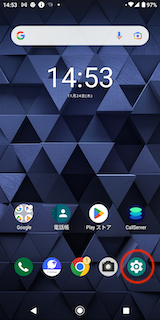  
      
      
    
2.  設定内の「ストレージ」をタップします。  
    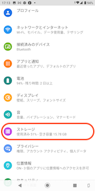  
      
    
3.  ストレージを開いたら、「ファイル」をタップします。  
    ※「ファイル」をタップ後、どのアプリケーションで開くか問われた場合には  
    　デフォルトの「ファイル」アプリを選択してください。  
    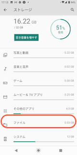
4.  ファイルアプリに移動したら「Download」フォルダをタップします。  
    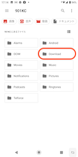  
      
    
5.  「Download」フォルダの中には今までダウンロードしたファイルが表示されます。  
    他のファイルをダウンロードしていない場合は**全て削除、  
    **複数ファイルが表示される場合は  
    ファイル名：**app-call\_server\_lead-1.2.0.apk**　を選択し削除してください。  
    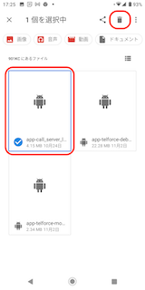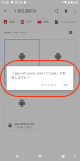  
     

## 2\. アプリのアンインストール

1.  ホーム画面に戻り、アンインストール対象のアプリを長押しし、「アプリ情報」をタップします。  
    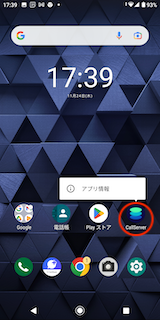  
      
    
2.  アプリ情報内の「アンインストール」をタップし、「OK」をタップします。  
    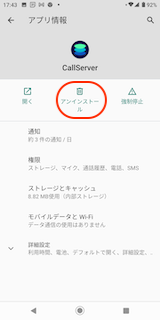　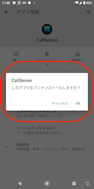  
      
    
3.  アプリ一覧から、アンインストール対象のアプリが消えていれば  
    アプリのアンインストールが完了です。

# **AQUOS Wishをご利用の場合**

## **1\. ダウンロードファイルの削除**

1.  ホーム画面から設定アプリを開きます。  
      
      
      
    
2.  設定内の「ストレージ」をタップします。  
      
      
      
    
3.  ストレージを開いたら、「ドキュメント、その他」をタップします。  
    ※「ドキュメント、その他」をタップ後、どのアプリケーションで開くか問われた場合は  
    　デフォルトの「ファイル」アプリを選択してください。  
      
    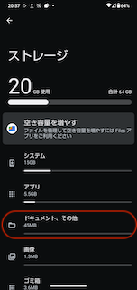  
      
    
4.  「ドキュメント」が表示されたら左上の三本線をクリックし、「ダウンロード」をタップします。  
    「ダウンロード」画面に遷移後、他のファイルをダウンロードしていない場合は**全て削除  
    **複数ファイルが表示される場合は  
    ファイル名：**app-call\_server\_lead-1.2.0.apk**　を選択し削除してください。  
      
        

## **2\. アプリのアンインストール**

1.  ホーム画面に戻り、アンインストール対象のアプリを長押しし、「アプリ情報」をタップします。  
      
    **  
      
    **
2.  アプリ情報内の「アンインストール」をタップし、「OK」をタップします。  
      
    　**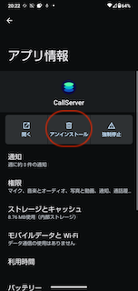　**
3.  アプリ一覧から、アンインストール対象のアプリが消えていれば  
    アプリのアンインストールが完了です。

その他ご不明点などございましたら、[**サポートチームまでお問い合わせ**](https://comdesklead.zendesk.com/hc/ja/requests/new)をお願い致します。

お問い合わせ方法は**[こちら](../../トラブルシューティング/サポートチームへのお問い合わせ方法/12828937533081_サポートチームへのお問い合わせ方法.md)**
