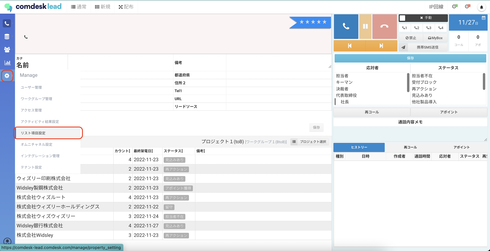
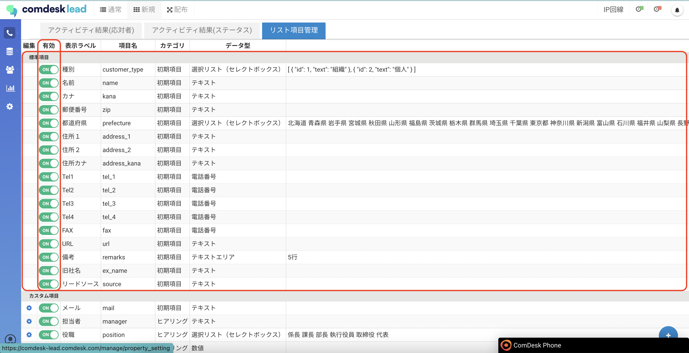
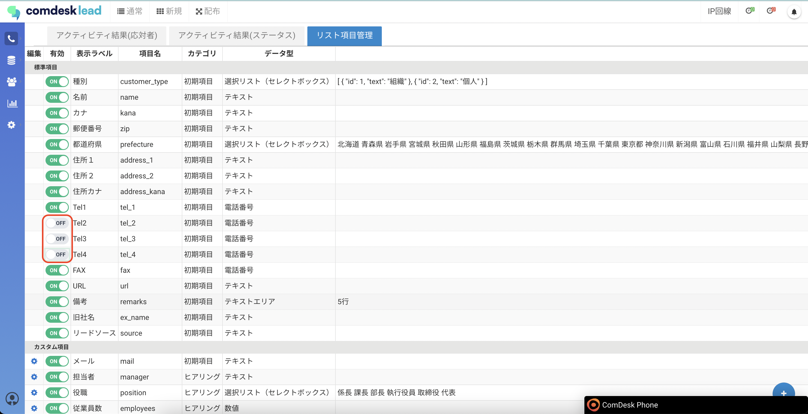
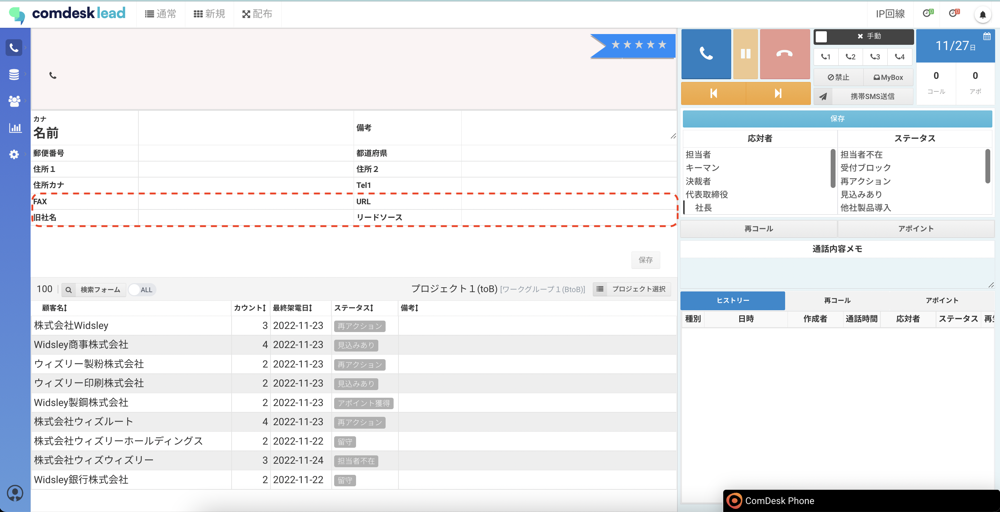

# リスト項目設定で標準項目の表示を設定する

**リスト項目の種類**  

リスト項目には2種類あります。

*   標準項目：初めから用意されている項目です。
*   カスタム項目：自由に追加作成いただける項目です。

## **項目名と項目ラベル**

*   項目名：内部処理で使用する名称です。
*   項目ラベル：コールモード画面に表示される名称です。

## **設定方法**

1.  画面左側のManageアイコンをクリックし、リスト項目設定をクリックします。  
      
    
2.  リスト項目設定画面が表示されますので、不要な標準項目の有効を無効に変更します。  
    ここで無効にすると、全てのプロジェクトで設定できない項目になりますのでご注意ください。  
      
    ※以下2点は、無効化できませんのでご注意ください。  
    ・名前  
    ・Tel1  
      
      
      
    例）tel2、tel3、tel4を無効にするコールモード画面を開き、tel2、tel3、tel4が非表示になっていることを確認します。

その他ご不明点などございましたら、[**サポートチームまでお問い合わせ**](https://comdesklead.zendesk.com/hc/ja/requests/new)をお願い致します。

お問い合わせ方法は**[こちら](../../トラブルシューティング/サポートチームへのお問い合わせ方法/12828937533081_サポートチームへのお問い合わせ方法.md)**
