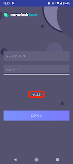
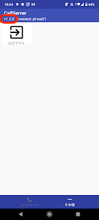

# CallServerアプリとの接続が切れてしまう

CallServerアプリの接続が切れてしまう原因として考えられるのは以下の通りです。

*   同一アカウントで複数台からCallServerにログインしている  
    →いずれかのCallServerアプリの接続が切れる場合がありますので、ログインは1アカウントにつき1台の携帯端末までとしてください。  
     
*   ネットワークが弱い/安定しない  
    →ネットワークが弱い/安定しない場合、接続が切れてしまうことがあります。  
    環境に合わせて、安定したネットワーク（モバイルネットワーク(4G/5G) または Wi-Fi）をお選びください。  
     
*   携帯端末がスリープモードになっている  
    →スリープモードになっている場合、接続が切れてしまう場合があります。  
    [こちら](../../ハードウェアについて/弊社貸出端末について/12785391736345_画面点灯時間を設定する.md)の記事をご確認ください。  
     
*   アプリが最新版ではない  
    →最新版へアップデートをお願いします。  
      
    ＜確認方法＞  
    1.ログイン画面から確認  
      
      
    2.その他タブからの確認  
    ログインしている場合は「その他」タブを開き、左上のバージョンの記載が、  
    最新バージョンの「Ver1.2.1」になっているかご確認ください。  
    

最新バージョンのCallServerのインストール方法は[こちら](12777882592153_CallServerのインストール.md)をご確認ください。

その他ご不明点などございましたら、[**サポートチームまでお問い合わせ**](https://comdesklead.zendesk.com/hc/ja/requests/new)をお願い致します。

お問い合わせ方法は[**こちら**](../../トラブルシューティング/サポートチームへのお問い合わせ方法/12828937533081_サポートチームへのお問い合わせ方法.md)
