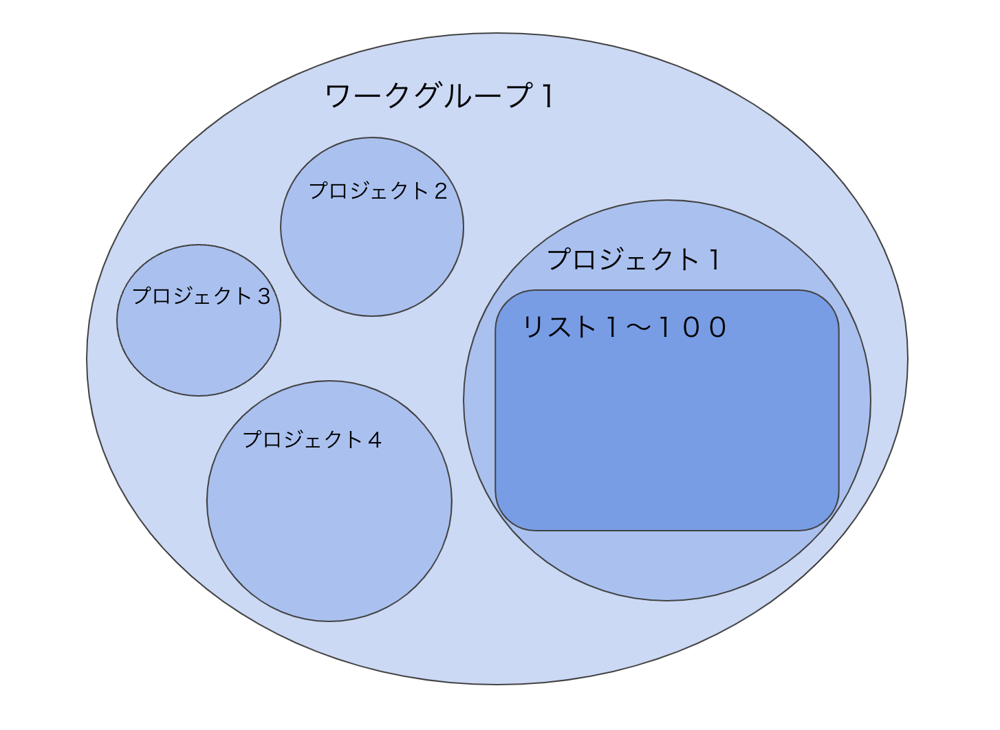

# （完了させる）1/3　ワークグループとは

## **ワークグループとは**

リスト情報は、以下のような構成で保管されます。

**ワークグループ＞****プロジェクト＞****リスト（図参照）**

その際に、同じアプローチ方法を用いるチームを**ワークグループ**として設定できます。

****

### **「ワークグループ」と各項目の関係性**

**「プロジェクト」**  
「プロジェクト」とは、顧客情報の束を指します。  
プロジェクトにアクセスするユーザーを指定することが可能です。

  
**「リード」**  
「リード」とは、プロジェクトに属する一つ一つの顧客情報です。  
プロジェクトに割り当てられたユーザーが、属するリードに対して実際に架電等の活動を実施します。

  
**「禁止」登録**  
リードを「禁止」登録すると、架電等の活動がブロックされます。  
「禁止」登録は、ワークグループ単位での活動がブロックされるため、ワークグループに属するユーザー全員が、そのリードに対して接触できなくなります。

  
**「マイボックス」登録**  
リードを「マイボックス」登録すると、特定のユーザーがリードを囲い込み、他のユーザーの接触をブロックすることができるようになります。  
なお特定のリードに対して、ワークグループごとに一人のユーザーのみ「マイボックス」登録することができます。

### **「ワークグループ」の活用**

**支店等複数の拠点を有する場合**  
拠点ごとにワークグループを作成することで、拠点ごとに独立した顧客情報の保持、ユーザーの活動履歴の把握が可能となります。

  
**複数の商材を有する場合**  
商材ごとにワークグループを作成することで、ワークグループごとに同リードに対して別途活動することができます。  
具体的には、あるワークグループで既存顧客を禁止登録した場合、別のワークグループで該当リードに対する活動を継続できます。

### **ワークグループ機能一覧**

ワークグループページでは、ワークグループの作成、編集が可能です。

*   **ワークグループの新規登録**  
    新規ワークグループの作成が可能です。
*   **ワークグループの設定**  
    各項目（ステータス・応対者・リスト項目）の設定が可能です。
*   **ワークグループの編集**  
    ワークグループ名、アクティブ／非アクティブの変更が可能です。
*   **ワークグループの削除**  
    ワークグループの削除が可能です。
