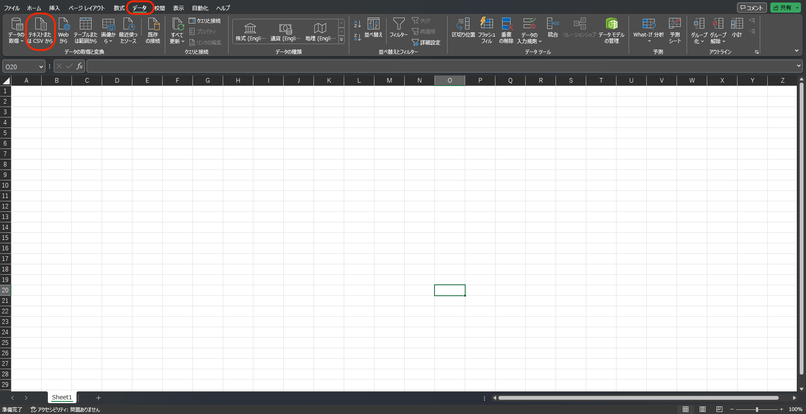
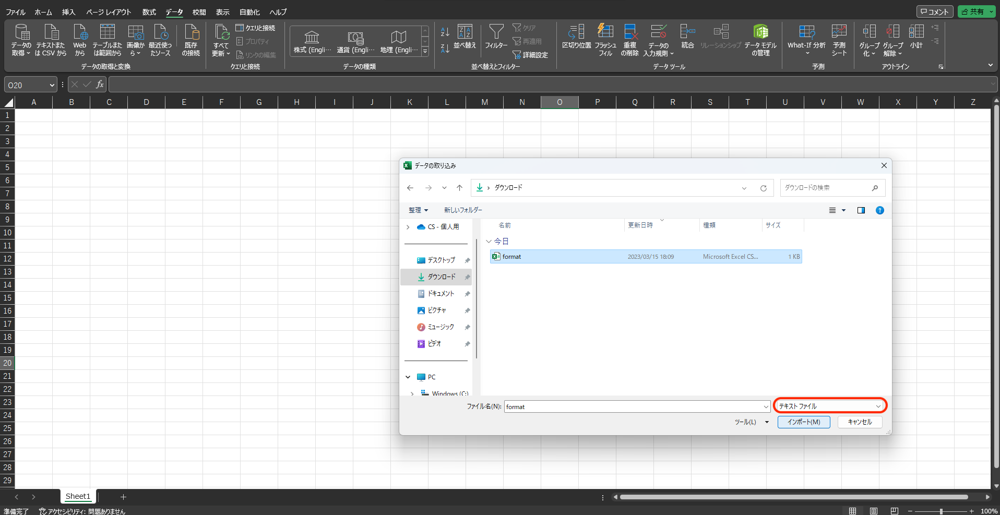
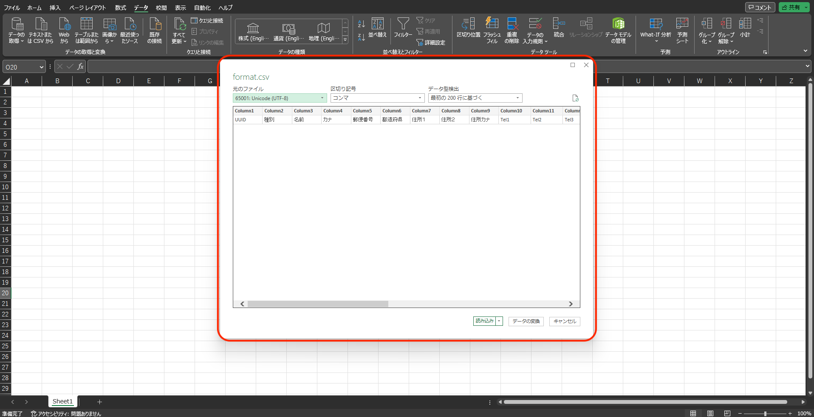
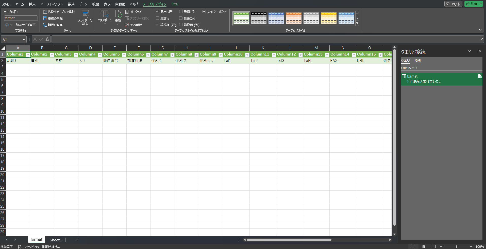

# CSV形式のファイルをExcelで開く

CSV形式のファイルをExcelで開く際の操作手順をご説明します。

1.  Excelを開きます。  
    「データ」タブを開き、「データの取得」の枠にある「テキストまたはCSVから」をクリックします。  
      
      
    
2.  開くファイルを選択します。（今回はCSVフォーマットを開きました。）  
    赤枠部分の設定を「テキストファイル」で選択し、「インポート」をクリックします。  
      
      
    
3.  データ型が検出されるので「読み込み」をクリックします。  
      
      
    
4.  テキストファイルが新しいシートにインポートされます。  
      
      
    
5.  編集が終わって、Comdesk Leadへリストインポートを行う際は、**必ずCSV形式で保存をし、CSVファイル**でダウンロードしてから実行してください。  
      
    参照記事：[リストをプロジェクトにインポート](12743928066585_リストをプロジェクトにインポート.md)

その他ご不明点などございましたら、[**サポートチームまでお問い合わせ**](https://comdesklead.zendesk.com/hc/ja/requests/new)をお願いいたします。

お問い合わせ方法は**[こちら](../../トラブルシューティング/サポートチームへのお問い合わせ方法/12828937533081_サポートチームへのお問い合わせ方法.md)**
