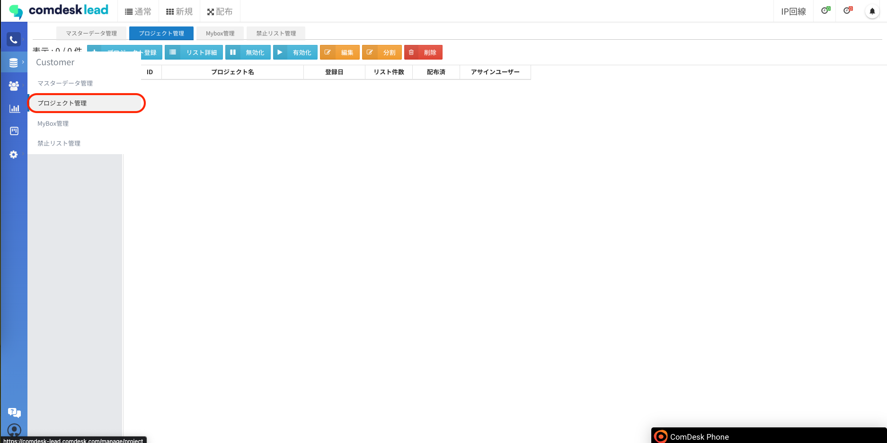
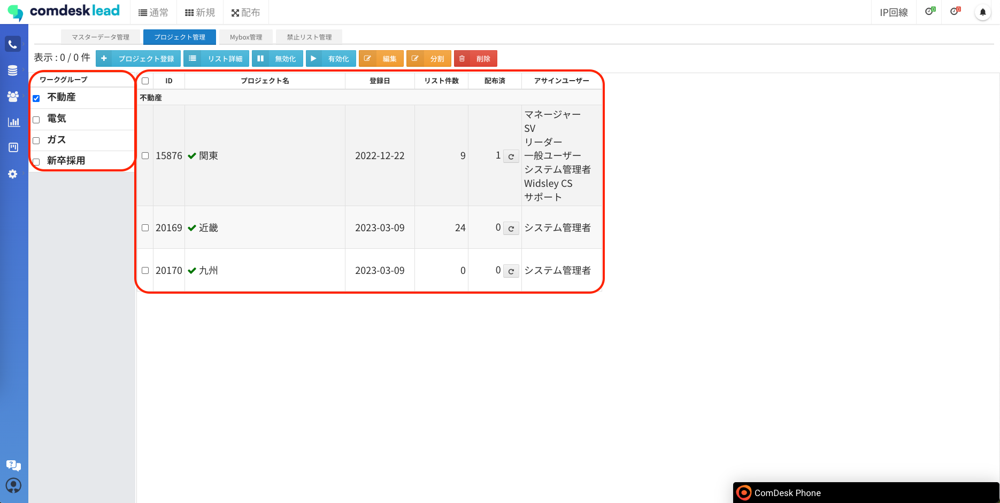
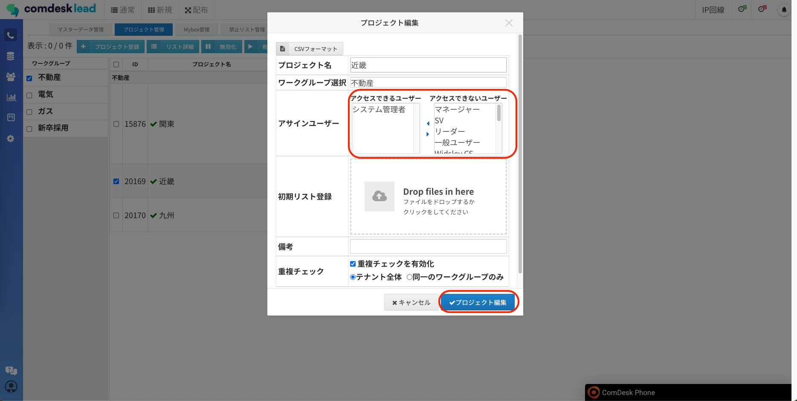
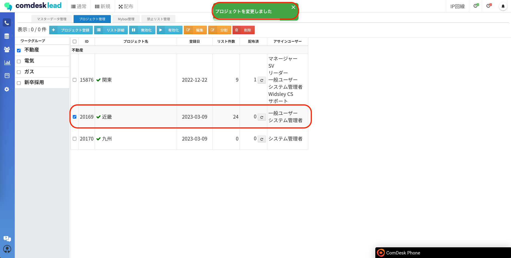

# ライセンス追加時の設定内容

ライセンス追加時のユーザーに対する設定内容をご説明します。

[プロジェクトへのアサイン](#h_01GXMTFVF93Q1ABSCQNMA3565F)  
[IP回線の発着信設定](#h_01GXMTG6HM722JEE40X687FMDP)  
　　※IP回線ご利用の場合のみ必要です

ライセンス追加のご依頼をいただいた後、弊社サポートメンバーから追加アカウントの共有をします。

## **プロジェクトへのアサイン**

ライセンスの追加後、追加ユーザーに対してプロジェクトへのアサインが必要です。  
プロジェクトへのアサインのないユーザーはログインしてもプロジェクトが選択できません。  
管理者アカウントでの操作をお願いいたします。

1.  管理者アカウントでログインを行い、プロジェクト管理画面を開きます。  
      
      
      
    
2.  追加ユーザーをアサインするワークグループ・プロジェクトを選択し、オレンジ色のボタン「編集」をクリックします。  
      
    
3.  「アクセスできないユーザー」から該当ユーザーをクリックすると、「アクセスできるユーザー」に移動します。  
    保存する際は「プロジェクト編集」ボタンをクリックします。  
      
      
      
    
4.  「プロジェクトを変更しました」と表示がされ、プロジェクトに追加ユーザーはアサインされていれば設定完了です。  
    同様の手順でアサインするプロジェクトに追加ユーザーを追加します。  
      
    

## **IP回線の発着信設定**

IP回線利用時には、IP回線の発着信設定をPBX Manager上で行う必要があります。

お渡ししているユーザーマッピングに記載のPBX Managerを開き、下記記事を参考に発着信設定を行ってください。

・発信許可設定：[12755256165145\_PBX\_Manager\_発信許可設定をする.md](12755256165145_PBX_Manager_発信許可設定をする.md)

・着信設定：[12758876873241\_PBX\_Manager\_着信設定をする.md](12758876873241_PBX_Manager_着信設定をする.md)

既に着信設定がされている場合は、新たに設定を作成せず所属させたい着信グループに追加することで着信スケジュール通りに着信が入ります。

その他ご不明点などございましたら、[**サポートチームまでお問い合わせ**](https://comdesklead.zendesk.com/hc/ja/requests/new)をお願い致します。

お問い合わせ方法は**[こちら](../../トラブルシューティング/サポートチームへのお問い合わせ方法/12828937533081_サポートチームへのお問い合わせ方法.md)**
