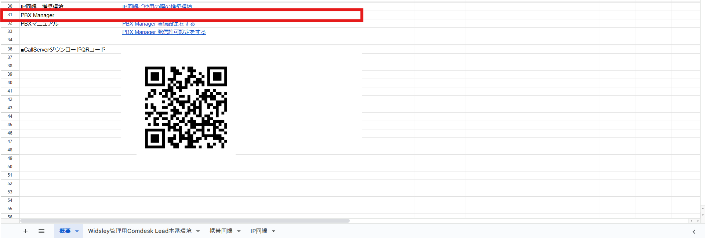
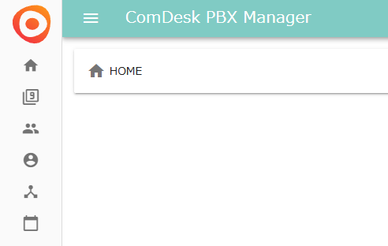

# PBX着信設定の概要

電話番号に対しての着信において、設定が必要になります。

弊社からお渡ししております、ユーザーマッピング図概要のシート「PBX Maneger」から設定画面に遷移していただき設定が可能になっております。

以下、step1~3を踏んでいただくことで、着信の設定が可能になります。

step1【グループ設定】

┗グループを作成し着信を受けるユーザーを選択できる

（画像）

step2【着信コールフロー管理】

┗どういう形で着信をするのか設定ができる

具体例）

グループに一斉着信（step1で作成したグループを使用

音声管理（音声ガイダンスの設定

自動転送

留守番電話

キューイング（順番待ち

（画像）

step3【着信スケジュール】

┗着信コールフローを適用させる電話番号・日時を設定できる

電話番号

着信コールフロー設定

（画像）
