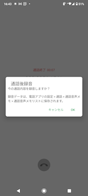
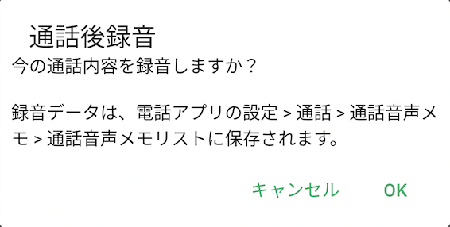
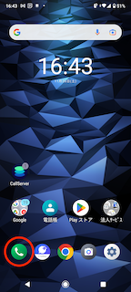
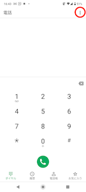
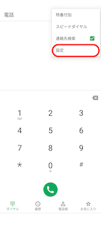
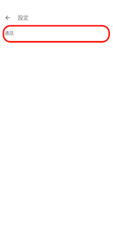
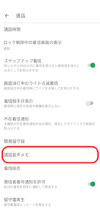
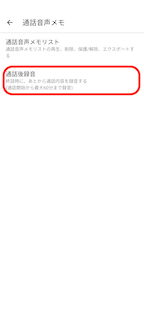
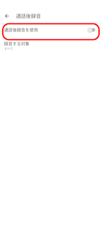

# 通話後録音をOFFにする

## **概要**

スマートフォンの電話アプリの設定で、通話後録音をONに設定するとオートコールモードがご利用いただけません。

終話するたびに下図のメッセージが表示される場合は、通話後録音をOFFに設定してください。

　　　　　

## **設定方法**

1.   電話アプリをタップします。  
      
      
    
2.  右上の「︙」をタップします。  
      
      
    
3.  メニューが表示されますので、「設定」をタップします。  
      
      
    
4.  「通話」をタップします。  
      
      
      
    
5.  「通話音声メモ」をタップします。  
      
      
    
6.  「通話後録音」をタップします。  
      
      
    
7.  「通話後録音を使用」をOFFにします。  
    

その他ご不明点などございましたら、[**サポートチームまでお問い合わせ**](https://comdesklead.zendesk.com/hc/ja/requests/new)をお願い致します。

お問い合わせ方法は**[こちら](../サポートチームへのお問い合わせ方法/12828937533081_サポートチームへのお問い合わせ方法.md)**
