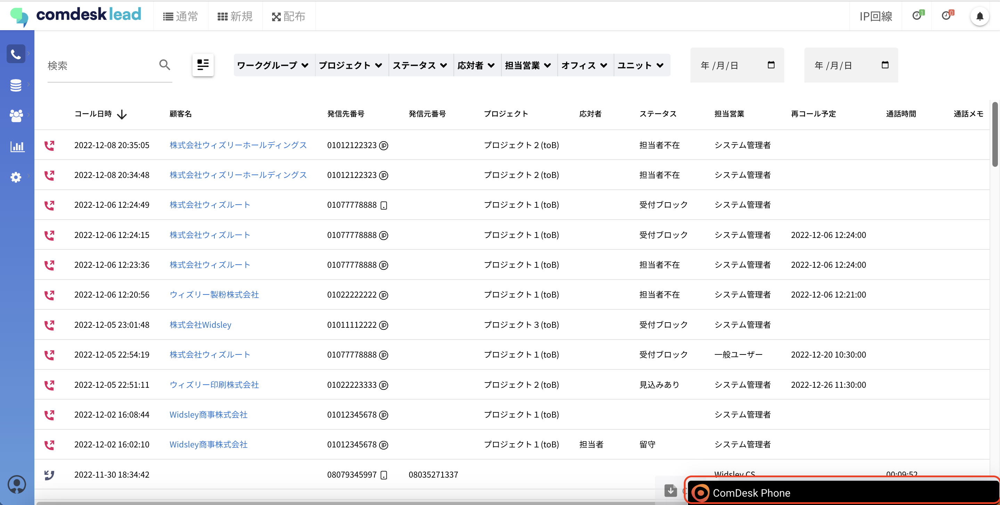
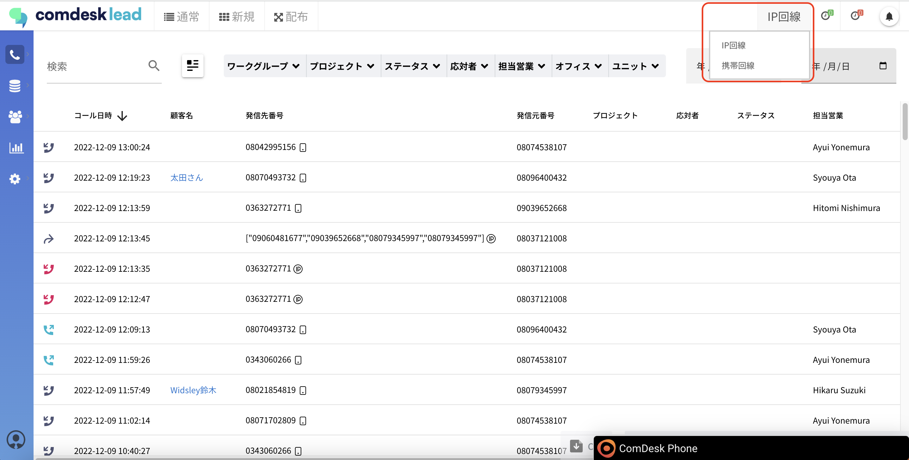
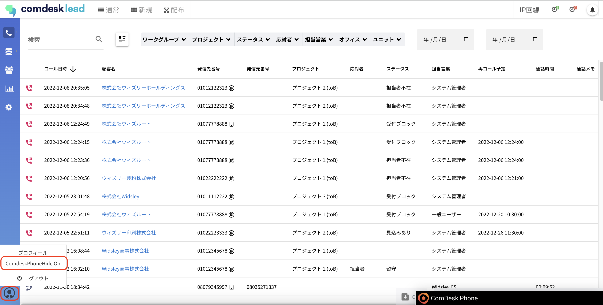

# Comdesk Phoneのヘッダーを非表示にしたい

この記事はIP回線をご利用中のお客様に役立つ記事です。

Comdesk Lead利用中、右下に表示されているComdesk Phoneのヘッダーが、下記のように画面表示と重なって使いづらい場合には、非表示にすることができます。

## **方法1：回線選択を一度「IP回線」から「携帯回線」に変更する**

※架電する際には、再度正しく回線を選択しなおしてください。**  
  
**

## **方法2：画面左下のボタンから「ComdeskPhoneHide On」をクリックし非表示にする  
  
**

その他ご不明点などございましたら、[**サポートチームまでお問い合わせ**](https://comdesklead.zendesk.com/hc/ja/requests/new)をお願い致します。

お問い合わせ方法は**[こちら](../サポートチームへのお問い合わせ方法/12828937533081_サポートチームへのお問い合わせ方法.md)**
