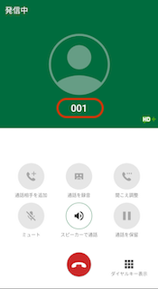
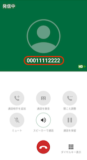

# 端末側に「有効な番号を入力して下さい」と通知が表示され、発信ができない

## **原因**

正しい（桁数）電話番号を入力していない場合、以下のような事象が発生します。

・「有効な番号を入力して下さい」と表示される

・アナウンスが流れる

・発信後、すぐに切れてしまう

　　　

## **解消方法**

電話番号を再度確認し、正しい番号（桁数）を入力してください。

その他ご不明点などございましたら、[**サポートチームまでお問い合わせ**](https://comdesklead.zendesk.com/hc/ja/requests/new)をお願いいたします。

お問い合わせ方法は**[こちら](../サポートチームへのお問い合わせ方法/12828937533081_サポートチームへのお問い合わせ方法.md)**
