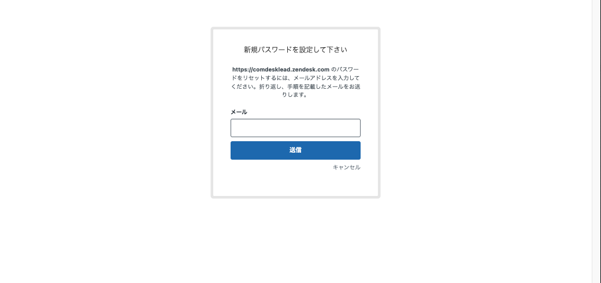

# ヘルプセンターログイン時のパスワードを忘れてしまった

ヘルプセンターログイン時のパスワードを忘れてしまった際の再設定方法についてご説明します。

1.  赤枠「パスワードを忘れた場合」をクリックします。  
    
2.  パスワードを再設定したいメールアドレスを入力し送信します。  
    
3.  登録しているメールアドレス宛にパスワード再設定のメールが届きます。  
    メールのURLより、パスワードの再設定を行ってください。  
    
4.  再設定後、メールアドレスと再設定したパスワードでログインを行ってください。

その他ご不明点などございましたら、[**サポートチームまでお問い合わせ**](https://comdesklead.zendesk.com/hc/ja/requests/new)をお願い致します。

お問い合わせ方法は**[こちら](12828937533081_サポートチームへのお問い合わせ方法.md)**
