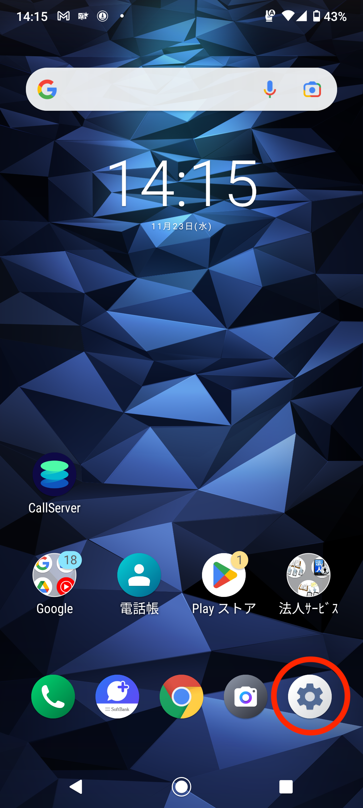
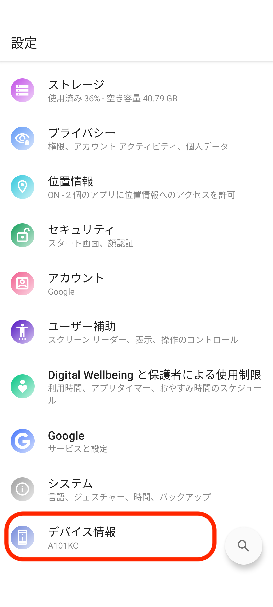
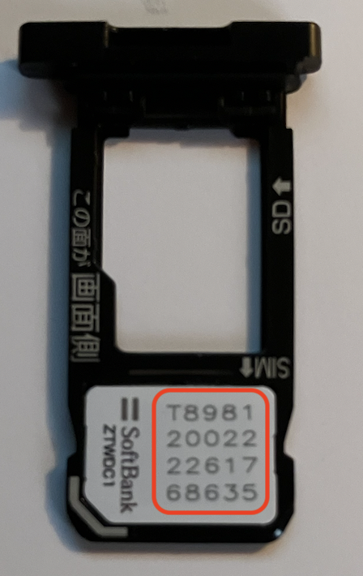

# ICCIDの確認方法

ICCIDとは、SIMカードの固有識別番号です。

キャリア録音の切り替えや、SIM故障の切り替えの際に確認をお願いすることがございます。

1.  スマートフォンの「設定」をタップします。  
      
      
    
2.  「デバイス情報」をタップします。  
    
3.  「SIMのステータス」をタップします。  
    
4.  「SIMのステータス」をタップします。  
    
5.  「ICCID」を確認します。  
    

💡SIMカードでも確認できます。SIMスロットを抜く前は、必ず電源をお切りください。  

その他ご不明点などございましたら、[**サポートチームまでお問い合わせ**](https://comdesklead.zendesk.com/hc/ja/requests/new)をお願い致します。

お問い合わせ方法は**[こちら](../../トラブルシューティング/サポートチームへのお問い合わせ方法/12828937533081_サポートチームへのお問い合わせ方法.md)**
