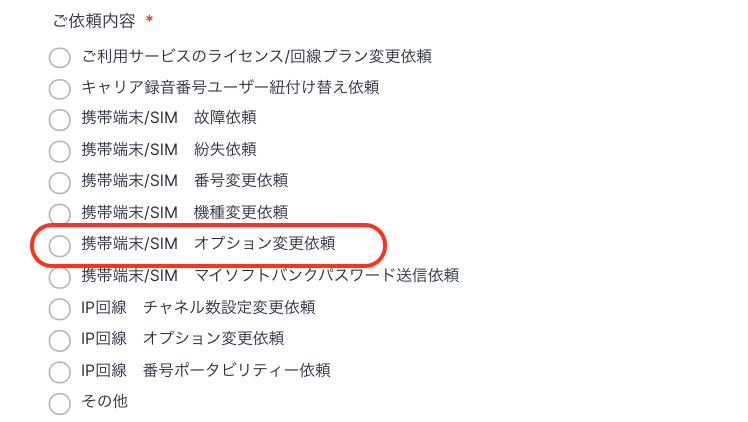
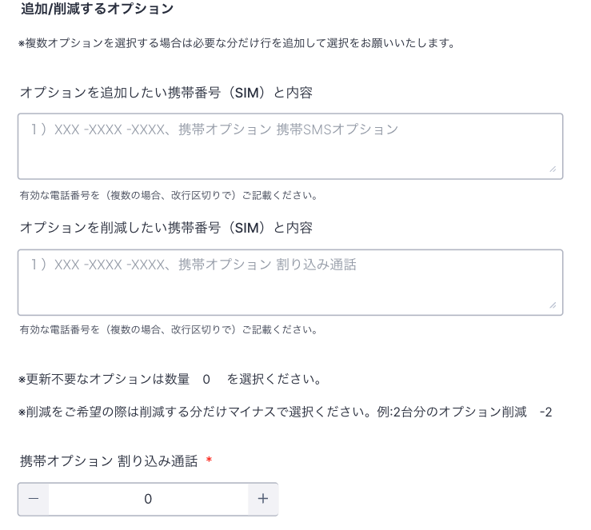

# 携帯端末のオプションについて

オプションの加入や解除をご希望の場合、フォームでのご依頼をお願いいたします。  
※オプションは加入日より日割りで費用が発生致します。  

## **依頼方法**

1.  オプション変更依頼フォーム：[https://comdesk.com/apply-lead.html](https://comdesk.com/apply-lead.html)  
      
    
2.  ご依頼内容は上から7番目の**「携帯端末/SIM　オプション変更依頼」**を選択してください。  
      
      
      
    
3.  加入or解除されたい携帯番号とそのオプション内容をご記入ください。  
    その後、対象のオプションの数量変動数を選択ください。  
      
      
    
4.  適用希望開始日を入力し送信をお願いいたします。

## **オプション詳細**

下記も併せてご参照ください。  
[https://www.softbank.jp/mobile/service/call-3g/](https://www.softbank.jp/mobile/service/call-3g/)

*   **割り込み通話**：通話中にかかってきた電話を受けることができます。  
    **月途中で加入した場合、月額使用料は日割りにてご請求が発生いたします。**  
    （一部の国および地域でご利用いただけない場合があります。）  
      
    
*   **グループ通話**：通話中に新たに別の人に電話をかけ、相手を切り替えながら交互に話したり、6人まで同時に通話できます。  
    （ナビダイヤルなど一部のサービスではご利用いただけない場合があります。）  
      
    
*   **留守番電話プラス**：3分までの伝言を100件まで、最大1週間お預かりします。  
    ボイスメッセージもご利用できます。  
    電源が入っていない場合や圏外の場合にもお預かりできます。  
    [https://www.softbank.jp/mobile/service/answering/#tab-type01-uid03](https://www.softbank.jp/mobile/service/answering/#tab-type01-uid03)  
      
    
*   **法人基本パック**：法人基本パックとは、ケータイ基本パックの便利な機能はそのままに、ビジネスでの使い勝手を向上させたサービスです。
    
    パック内容に割込通話と留守番電話プラスが含まれているため、上記2つのオプションに単体加入するより法人基本パックに加入した方がお得です。  
      
    
    **月途中で加入した場合、月額使用料は日割りにてご請求が発生いたします。  
      
    **以下のオプションサービスがセットになっています。  
    安否確認・共有電話帳・一斉メッセージ配信・位置ナビ一斉検索・安心遠隔ロック・ウエブ限定アクセス・アクセス履歴閲覧・法人ケータイ紛失捜索サービス・紛失携帯捜索サービス・留守番電話プラス・割り込み通話・グループ通話  
    [https://www.softbank.jp/biz/mobile/service\_solution/basicpack/](https://www.softbank.jp/biz/mobile/service_solution/basicpack/)

その他ご不明点などございましたら、[**サポートチームまでお問い合わせ**](https://comdesklead.zendesk.com/hc/ja/requests/new)をお願い致します。

お問い合わせ方法は**[こちら](../../トラブルシューティング/サポートチームへのお問い合わせ方法/12828937533081_サポートチームへのお問い合わせ方法.md)**
