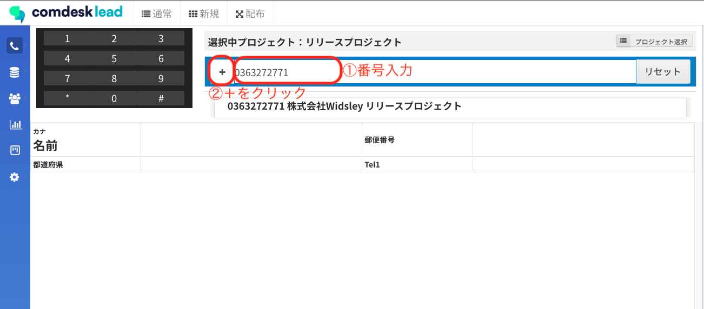

# Comdesk Lead　改修リリースのお知らせ（2022/12/14）

平素より大変お世話になっております。Widsley Supportでございます。  
いつもご利用ありがとうございます。

本日（2022/12/14）夜間リリースにて、Comdesk Leadに下記リリースを実施予定でございます。

挙動や仕様において、一部変更となる部分がございますので、ご認識いただけますと幸いです。

——————————————————————————–————————————————–——

・【新規コールモード】既存リストと番号が重複している場合でも新規追加が行える

・【コールモード】画面右下ヒストリー画面の表示を最適化

——————————————————————————–————————————————–——

詳細は以下のとおりです。

◆【新規コールモード】既存リストと番号が重複している場合でも新規追加が行える  
　　┗既存リストに同じ番号が存在している場合でも、別リストとして新規追加が行えるよう改修いたします。  
  
  
◆【コールモード】画面右下ヒストリー画面の表示を最適化  
　　┗画面右下ヒストリー画面の表示を、より見やすいものに改修いたします。

——————————————————————————–————————————————–——

リリース日時 ： 2022年12月14日(水)  21：00～26：00頃

※サービスの停止はありません。

——————————————————————————–————————————————–——

以上、ご確認いただけますと幸いです。

ご不明点ございましたら、お気軽に[サポート窓口](https://comdesklead.zendesk.com/hc/ja/requests/new)・担当CSまでご連絡くださいませ。

今後も、より一層みなさまのお役に立てるよう取り組んでまいりますので、引き続き、Comdesk Leadのご愛顧を賜りますよう心よりお願い申し上げます。
