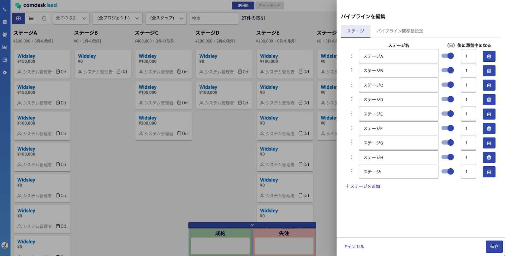
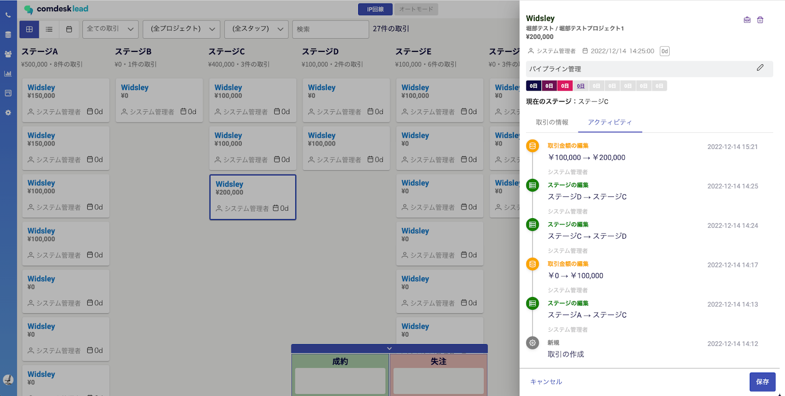

# Comdesk Lead　新機能リリースのお知らせ（2022/12/14）

平素より大変お世話になっております。Widsley Supportでございます。  
いつもご利用ありがとうございます。

本日（2022/12/14）夜間リリースにて、Comdesk Leadに下記、**新機能のリリース**を実施予定でございます。

挙動や仕様において、一部変更となる部分がございますので、ご認識いただけますと幸いです。

——————————————————————————–————————————————–——

**・顧客のフェーズ管理ができる新機能、パイプライン機能の追加**

——————————————————————————–————————————————–——

詳細は以下のとおりです。

◆グローバルメニュー「パイプライン」にて  
　　活動履歴から商談の管理まで営業活動を俯瞰して把握できるビジュアル化機能が追加  
  
  

→別途、操作方法等につきましては、ヘルプセンターにて記事をアップロードしてまいります。

　ご不明点ございましたら、お問い合わせにてご意見賜れますと幸いです。

——————————————————————————–————————————————–——

リリース日時 ： 2022年12月14日(水)  21：00～26：00頃

※サービスの停止はありません。

——————————————————————————–————————————————–——

以上、ご確認いただけますと幸いです。

ご不明点ございましたら、お気軽に[サポート窓口](https://comdesklead.zendesk.com/hc/ja/requests/new)・担当CSまでご連絡くださいませ。

今後も、より一層みなさまのお役に立てるよう取り組んでまいりますので、引き続き、Comdesk Leadのご愛顧を賜りますよう心よりお願い申し上げます。
