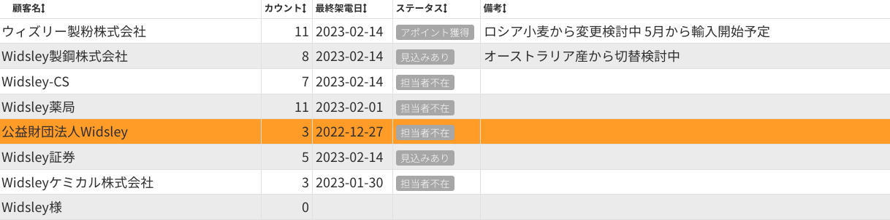

# Comdesk Lead　改修リリースのお知らせ（2023年02月15日）

平素より大変お世話になっております。Widsley Supportでございます。  
いつもご利用ありがとうございます。

本日（2023年02月15日）夜間リリースにて、Comdesk Leadに下記リリースを実施予定でございます。  
挙動や仕様において、一部変更となる部分がございますので、ご認識いただけますと幸いです。

——————————————————————————–————————————————–———————–——

・【コール画面】コール画面の下部リスト情報を即時反映する  
・【配布コールモード】特定の条件で顧客情報が保存できなくなる事象の解消

——————————————————————————–————————————————–———————–——

詳細は以下のとおりです。

◆【コール画面】コール画面の下部リスト情報を即時反映する  
　　　┗架電終了後、コール画面の下部リストに情報が即時反映されるよう改修を実施しました。  
  
  
◆【配布コールモード】特定の条件で顧客情報が保存できなくなる事象の解消  
　　　┗配布コールモードで連続架電している際に、直前に架電したリストの顧客情報が編集できない事象について改修を実施しました。  

——————————————————————————–————————————————–——

リリース日時 ： 2023年02月15日(水)  21：00～26：00頃  
※サービスの停止はありません。

——————————————————————————–————————————————–——

以上、ご確認ください。  
ご不明点ございましたら、お気軽に**[サポート窓口](https://comdesklead.zendesk.com/hc/ja/requests/new)**・弊社担当者までご連絡くださいませ。

今後も、より一層みなさまのお役に立てるよう取り組んでまいりますので、引き続き、Comdesk Leadのご愛顧を賜りますよう心よりお願い申し上げます。
