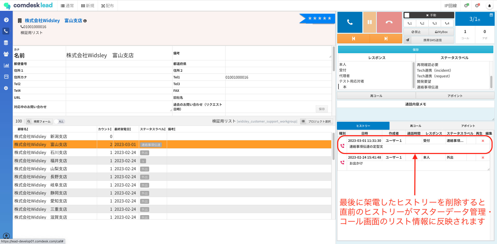
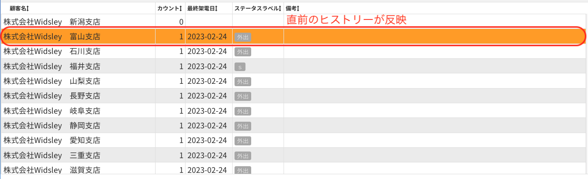
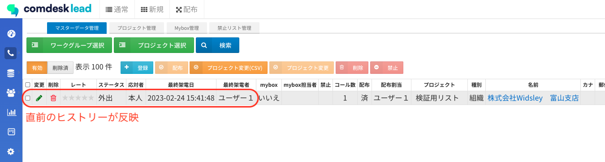

# Comdesk Lead　改修リリースのお知らせ（2023年03月01日）

平素より大変お世話になっております。Widsley Supportでございます。  
いつもご利用ありがとうございます。

本日（2023年03月01日）夜間リリースにて、Comdesk Leadに下記リリースを実施予定でございます。  
挙動や仕様において、一部変更となる部分がございますので、ご認識いただけますと幸いです。

——————————————————————————–————————————————–———————–——

・【マスターデータ管理・コール画面】最後に架電したヒストリーを削除した場合は、直前に架電したヒストリーのステータスが表示される事象の改修  
・【配布コールモード】Myboxに入っているにも関わらず、配布コールモードで配布されてしまう事象の改修  
・【再コール】リスト削除やプロジェクト変更時において、再コール設定が紐付けされるロジックを改善

——————————————————————————–————————————————–———————–——

詳細は以下のとおりです。

◆【マスターデータ管理・コール画面】最後に架電したヒストリーを削除した場合は、直前に架電したヒストリーのステータスが表示される事象の改修  
　　　┗最後に架電したヒストリーを削除しても、コール画面下部リストやマスターデータ管理の「最終架電日」「応対者」「ステータス」には削除したヒストリーのものが残ってしまう事象の改修を実施いたしました。  
　　　　　　これにより、一律削除した直前のヒストリーが表示されるようになります。  
　　　　　　なお、直前のヒストリーがない場合は空白となります。  
  
①最後に架電したヒストリーを削除します  
  
  
②コール画面の下部リストに反映されました  
  
  
③マスターデータ管理に反映されました  
  
  
◆【配布コールモード】Myboxに入っているにも関わらず、配布コールモードで配布されてしまう事象の改修  
　　　┗Myboxに入っているリストが配布されてしまう事象について、配布されることがないよう仕様改修を実施いたしました。  
  
◆【再コール】リスト削除やプロジェクト変更時において、再コール設定が紐付けされるロジックを改善  
　　　┗プロジェクト変更を行った際にも、再コール設定が引き継がれるよう改修を実施いたしました。  
　　　　　　なお、リストがプロジェクトに所属しない状態となった場合は、再コール設定が外れますのでご注意ください。  
  
　　　　再コールの記事は[こちら](../../機能一覧/活用ガイド/16037534896921_リスト削除時やプロジェクト変更時の再コール設定の紐付けについて.md)

——————————————————————————–————————————————–——

リリース日時 ： 2023年03月01日(水)  21：00～26：00頃  
※サービスの停止はありません。

——————————————————————————–————————————————–——

以上、ご確認ください。  
ご不明点ございましたら、お気軽に**[サポート窓口](https://comdesklead.zendesk.com/hc/ja/requests/new)**・弊社担当者までご連絡くださいませ。

今後も、より一層みなさまのお役に立てるよう取り組んでまいりますので、引き続き、Comdesk Leadのご愛顧を賜りますよう心よりお願い申し上げます。
