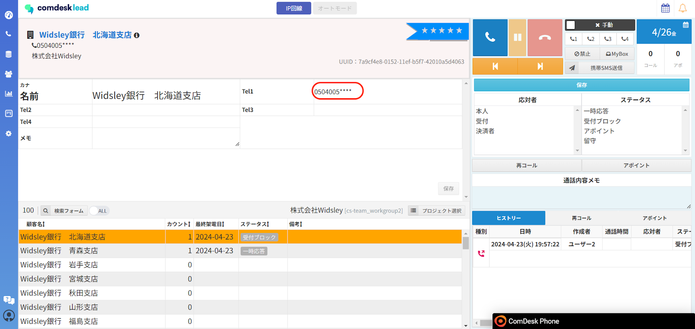
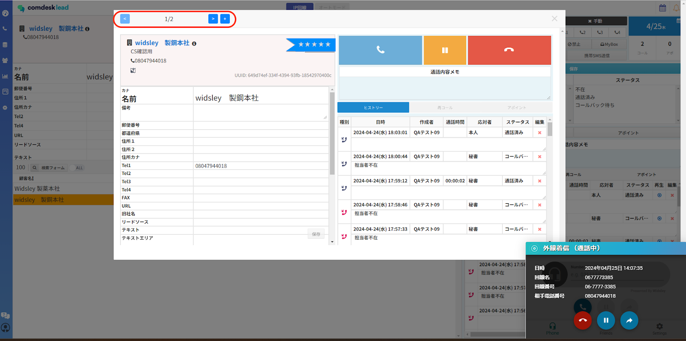

# 2024/04/30　アップデート予定の機能について

2024年04月30日夜間リリースにて、Comdesk Leadの一部機能をアップデート予定でございます。

挙動や仕様において、一部変更となる部分がございますので、ご認識いただけますと幸いです。

  

▽電話番号のマスク表示/電話番号編集制限機能が追加されます！

  
ユーザー種別ごとに、電話番号の下4桁をマスク（xxx-xxxx-\*\*\*\*）表示する設定が可能になります。

  

  
  

※初期項目の「tel1〜tel4」が対象となり、FAXやカスタム項目には適用されません。

「下4桁マスクON」にチェックが入っている場合のみ「電話番号編集権限」の機能が適用されます。

  

▽禁止番号/禁止顧客の機能が変更になります！

「tel1」〜「tel4」の中で、禁止番号に登録する番号の選択が可能となります。

※選択した番号のみが禁止番号となり、禁止番号の適用範囲は「テナント全体」のみになります。

※禁止顧客は「同一のワークグループ」のみ適用となり

同一ワークグループ内に、同姓同名の名前でリストが登録されている場合対象のリストも禁止顧客となります。

  

▽受電時のダイアログが変更になります！

着信時に、どの顧客から着信があったか通話中に確認ができるようになります。

画像赤枠内の「＜」「＞」で顧客詳細の確認ができます。

  
  

詳しい操作方法に関しましては、各記事を公開いたしますのでご参照ください。

——————————————————————————–————————————————–——

  

リリース日時 ： 2024年04月30日(火)  22：00～26：00頃

※サービスの停止はありません。

——————————————————————————–————————————————–——

  

その他ご不明点・ご意見などございましたら、[サポートチームまで](https://comdesklead.zendesk.com/hc/ja/requests/new)お問い合わせをお願いいたします。

　→お問い合わせ方法は[こちら](../../トラブルシューティング/サポートチームへのお問い合わせ方法/12828937533081_サポートチームへのお問い合わせ方法.md)  （初めてのお問い合わせ方法は[こちら](../../トラブルシューティング/サポートチームへのお問い合わせ方法/12927370479257_はじめてのサポートチームへのお問い合わせ方法.md)）

  

——————————————————————————–————————————————–——
