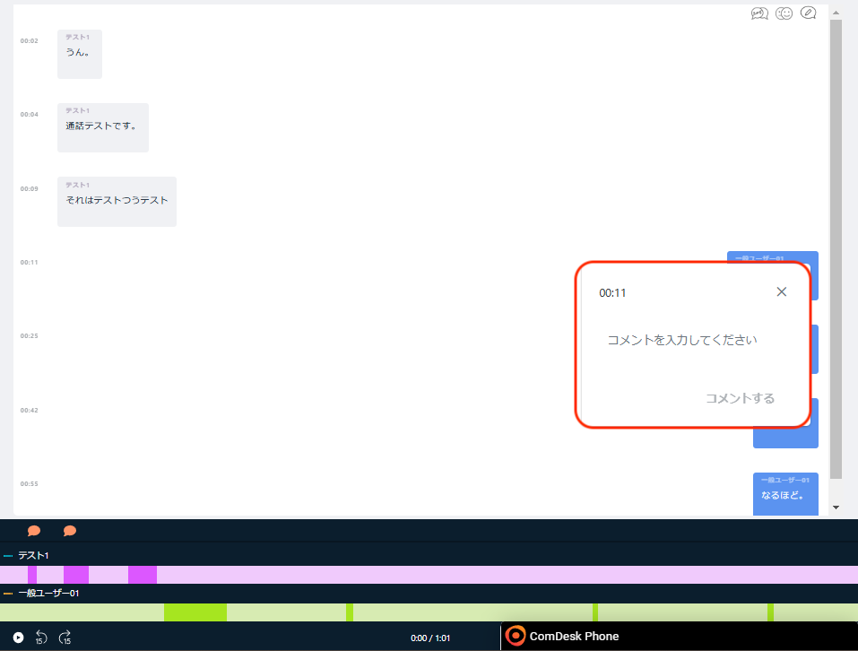
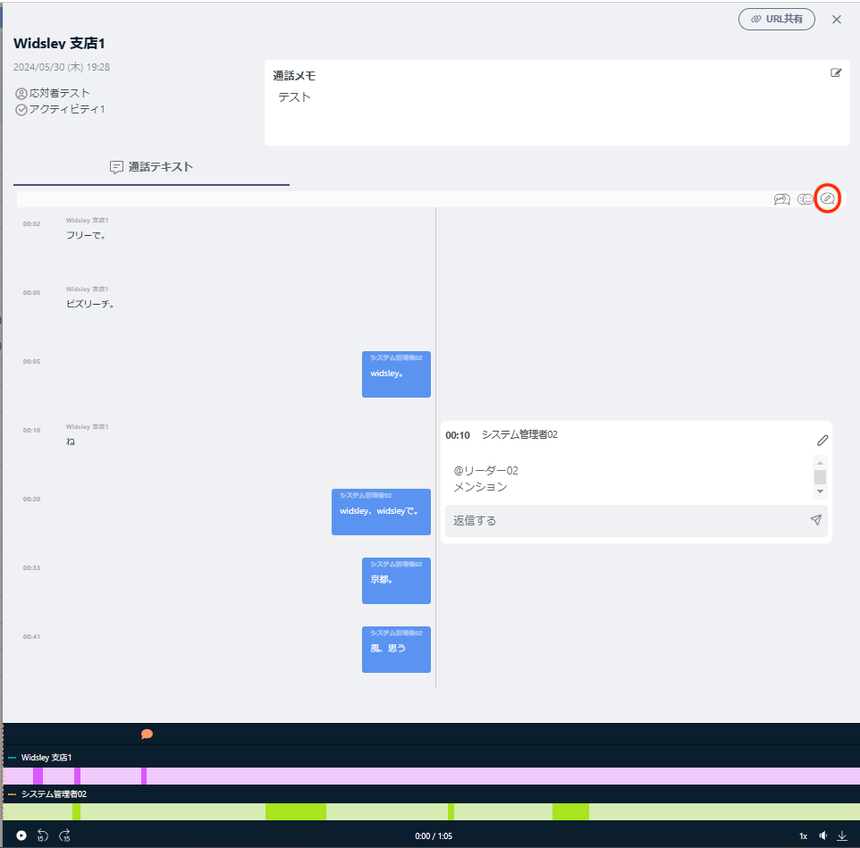
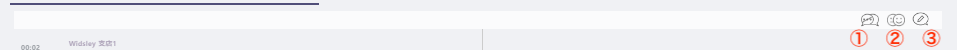
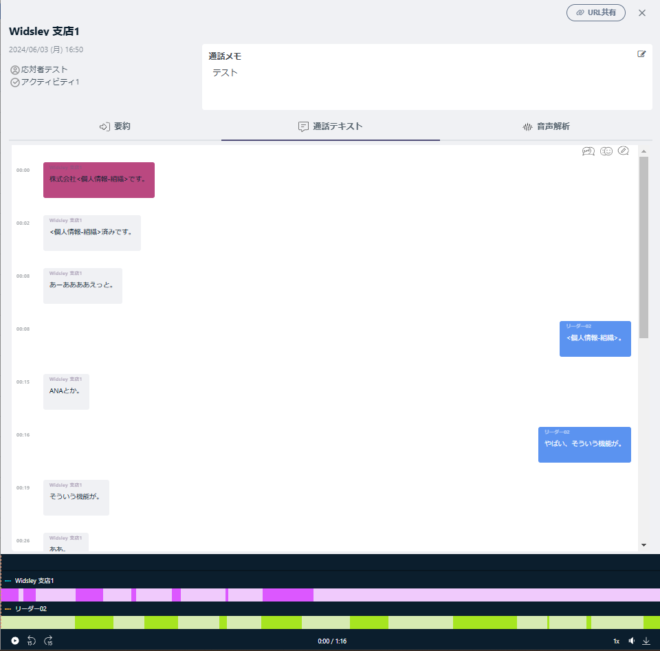
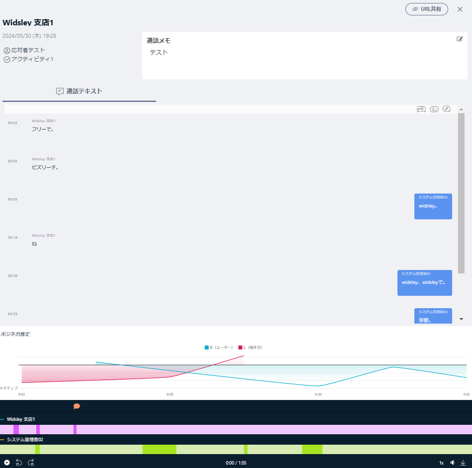
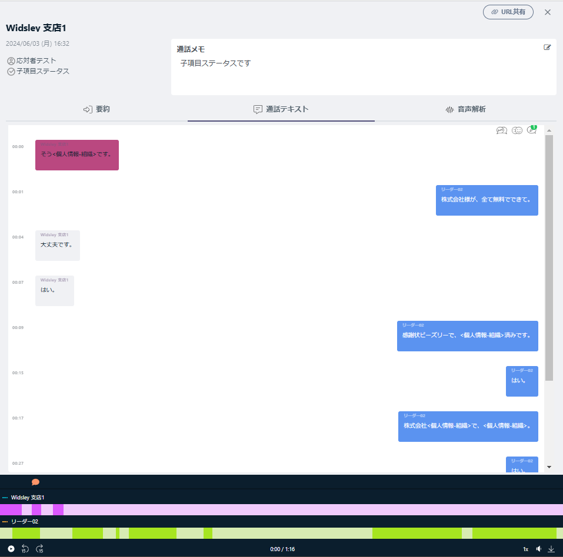
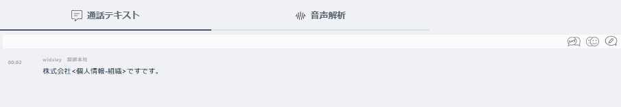

# 活動履歴　通話テキスト・個人情報マスキング機能

## **通話テキストのコメント機能**

通話テキストに対してコメントが可能になりました。

コメントでユーザーに対してメンション（@～でメンション）も可能です。

**コメント方法**

コメントしたい吹き出しをクリックするとコメント入力欄が表示されます。

コメントを入力し、「コメントをする」をクリックするとコメント完了です。

メンションを行う場合は、「＠」を入力するとメンション先のユーザー名が表示されます。

コメントした箇所には音声バーにオレンジ色の吹き出しマークが表示されます。

吹き出しマークをクリックすると、該当の録音時間までスキップが可能です。

コメントに対して「返信する」で返信が可能です。

メンションされた側には画面右上ベルマークに通知されます。

**※メールアドレスとログインIDが一致している場合のみ、メールに通知がされます。**

コメント一覧確認方法は赤枠の鉛筆アイコンで表示・非表示が可能です。

### **通話テキスト内のアイコンについて**

画面右上のアイコンの機能について

　①フィラーアイコン：クリックすると「えーっと」「あのー」「ん－」言葉に詰まったときなどにでてくる言葉が、表示/非表示が可能になります。

　②感情分析アイコン：録音バーの上に感情分析を表示か非表示ができます。

　③コメント表示アイコン：通話テキストが2分割され、コメントが表示可能になります。

**①フィラーアイコン**

・クリックすると下記画像の赤枠内「あーああああえっと。」が非表示になります。

**②感情分析アイコン**

・感情分析アイコンクリックすると、録音再生バーの上にポジネガ推定が表示されます。

**③コメント表示アイコン**

・メンションされたものに関しては、活動履歴詳細画面に通知がされます。

・コメント表示アイコンに緑色で通知マークが表示され確認が可能でございます。

## **個人情報マスキング機能**

個人情報保護の為、通話テキストに文字起こしされる際個人情報がマスキングされます。

**個人情報マスキング**

・<個人情報-住所>、<個人情報-氏名>、<個人情報-数詞>、<個人情報-組織>

（例）個人情報マスキング＜組織＞

その他ご不明点などございましたら、[**サポートチームまでお問い合わせ**](https://comdesklead.zendesk.com/hc/ja/requests/new)をお願い致します。

お問い合わせ方法は**[こちら](../../トラブルシューティング/サポートチームへのお問い合わせ方法/12828937533081_サポートチームへのお問い合わせ方法.md)**
