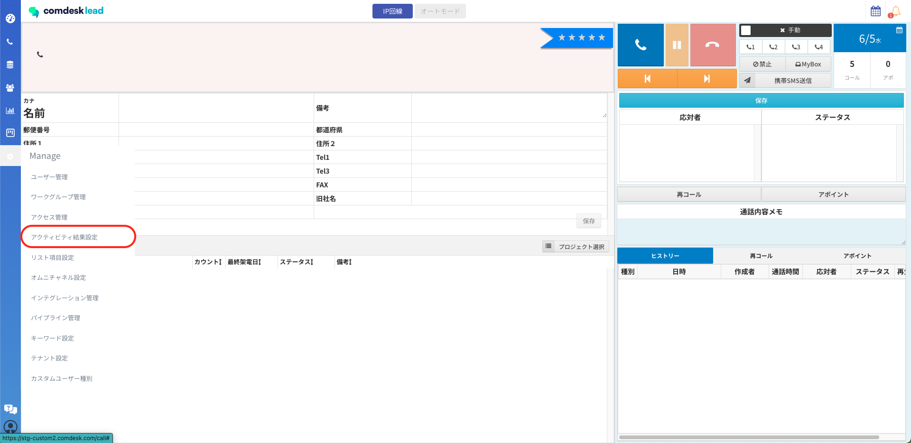
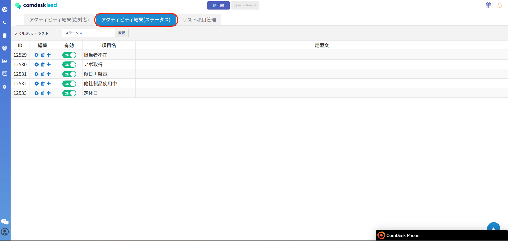
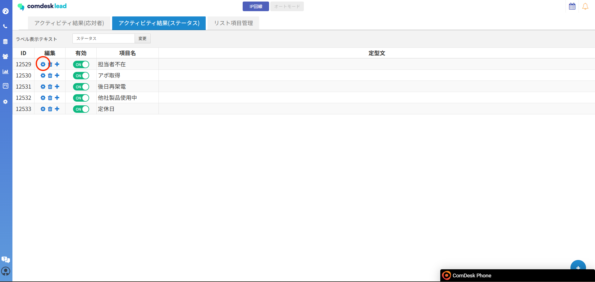
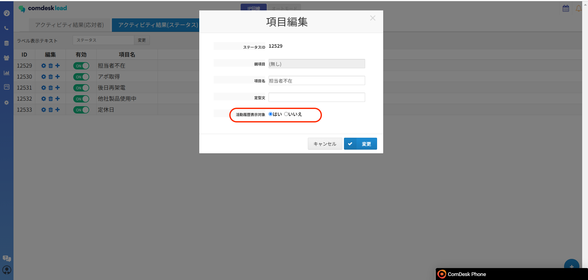

# ▽活動履歴新機能　活動履歴の非表示

特定のステータスを選択した場合、選択した活動履歴のレコードは表示させない機能となります。

活用シーン：間違えて架電してしまった履歴等があり、対象のレコードを活動履歴から非表示にしたい場合

・アクティビティ結果（ステータス）から設定が可能になりました。

・非表示設定にしたものは履歴自体が、活動履歴・ヒストリーに残りません。

※レポートには反映されるので、活動履歴と差分がある状態になっております。

以下、設定方法になります。

1.  Manegeからアクティビティ結果設定をクリックします。  
      
      
    
2.  アクティビティ結果（ステータス）をクリックします。  
    
3.  現在作成されているステータスが表示されています。  
    選択した際に非表示にさせたいステータスの歯車マークをクリックします。  
    新しくステータスを作成する方法は[こちら](../../はじめてガイド/管理者ガイド/12740334296345_アクティビティ結果の項目を設定する.md)の記事をご参照ください。  
      
      
    
4.  ポップアップが表示されます。  
    赤枠内を活動履歴表示対象を「はい」から「いいえ」を選択し、犯行をクリックすると設定可能でございます。  
    

再度表示させたい場合は、活動履歴表示対象を「いいえ」から「はい」に変更することで表示の対象となります。

**※過去設定したステータスも適用対象となります。**

その他ご不明点などございましたら、[**サポートチームまでお問い合わせ**](https://comdesklead.zendesk.com/hc/ja/requests/new)をお願い致します。

お問い合わせ方法は**[こちら](../../トラブルシューティング/サポートチームへのお問い合わせ方法/12828937533081_サポートチームへのお問い合わせ方法.md)**
