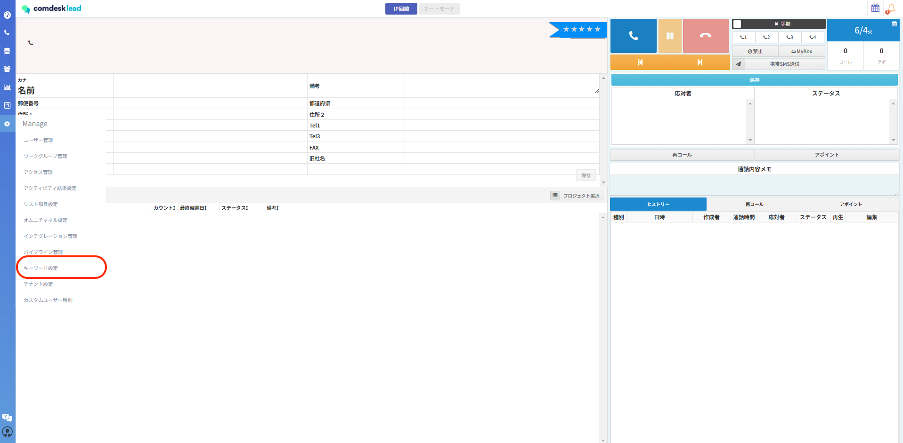
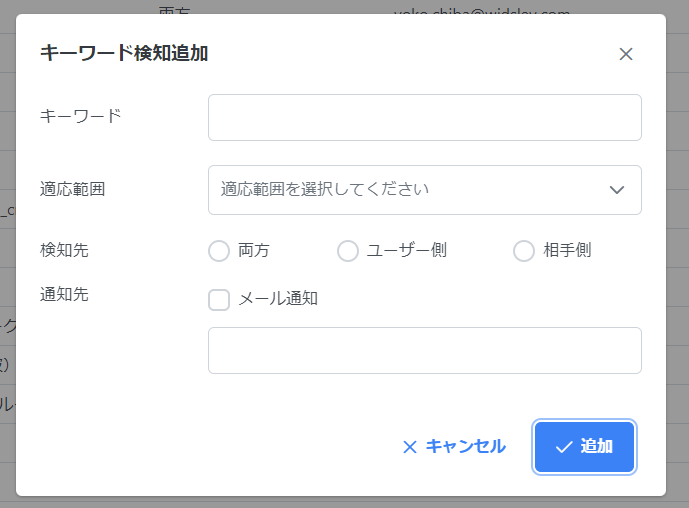
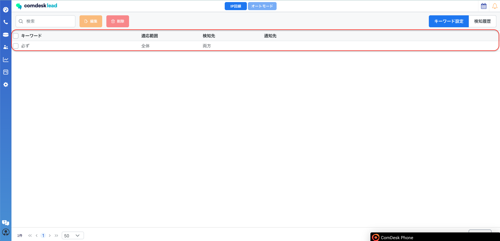
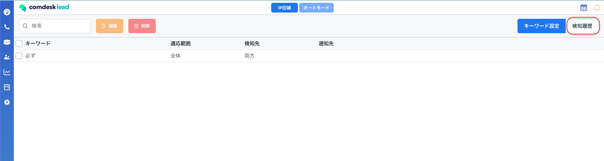

# ▽活動履歴新機能　設定したキーワードを検知・通知機能

会話の中に設定したキーワードが出た場合、Comdesk Lead内・設定したメールアドレス宛に通知が送られる新機能となります。

活用シーン：NGワードが会話の中で発生した場合、いち早く検知したい場合等

## **キーワード検知通知の設定方法**

1.  歯車マーク「Manage」を開き「キーワード設定」を選択します。  
      
      
    
2.  右下の「＋追加」を選択すると「キーワード検知追加」のポップアップが表示されます。  
    検知させるキーワードと条件を入力し、「追加」ボタンをクリックします。  
      
    適応範囲：テナント全体/各ワークグループ  
    検知先：両方・ユーザー側・相手側  
    通知先：メールでの通知を希望する場合は、✔を入れた上で送信先のメールアドレス入力が必要となります。  
      
    **※必ずメール通知に✓を入れてからメールアドレスをご入力ください。**  
      
    
3.  設定が完了すると、登録したキーワードが確認可能です。  
      
      
    
4.  Comdesk Lead内で検知したキーワードを確認する場合は、赤枠内「検知機能」タブを開きます。  
    
5.  検知したキーワードが表示されます。

メールの通知を希望している場合は「[noreply@comdesk.com」](mailto:noreply@comdesk.com%E3%80%8D%E3%81%AE%E3%82%A2%E3%83%89%E3%83%AC)のアドレスからメールが届きます。

件名：【comdesk lead】キーワードを検知しました。

本文：

キーワードを検知しました。詳細は以下リンクを参照してください

URL: xxxxxxxx

その他ご不明点などございましたら、[**サポートチームまでお問い合わせ**](https://comdesklead.zendesk.com/hc/ja/requests/new)をお願い致します。

お問い合わせ方法は**[こちら](../../トラブルシューティング/サポートチームへのお問い合わせ方法/12828937533081_サポートチームへのお問い合わせ方法.md)**
