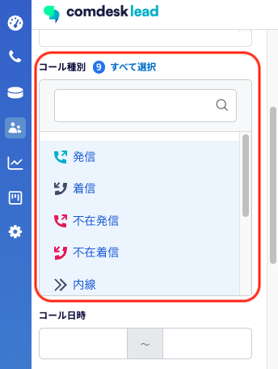
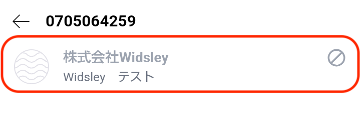

# 2025/02/19　Comdesk Lead夜間リリースのお知らせ

平素より大変お世話になっております。Widsley Supportでございます。

いつもご利用ありがとうございます。

本日（2025/02/19）夜間リリースにて、Comdesk Leadに下記リリースを実施予定でございます。

挙動や仕様において、一部変更となる部分がございますので、ご認識いただけますと幸いです。

——————————————————————————–————————————————–——

【Web】

・活動履歴の条件検索においてコール種別が検索できるようになりました。

　┗活動履歴のページを開いたタイミングでは全てのコール種別が選択されている状態となり、絞り込みたいコール種別で検索が可能となります。

・活動履歴／再コール画面の条件検索において、ワークグループの検索窓にてプロジェクトを検索し

　選択すると、対象のワークグループごと選択されてしまう不具合を改修いたしました。

【Mobile Client】

・通常コールモードで初期／カスタム項目の絞り込みを行い、オートコールモードで架電すると

　絞り込んで表示されたリスト以外にも発信されてしまう不具合を修正いたしました。

・キーパット画面で番号を検索すると、Mybox登録されているリストが別ユーザ架電できてしまう不具合を修正いたしました。

・キーパット画面で番号を検索した際、禁止番号登録されているリストに禁止フラグが表示されない不具合を修正いたしました。

Mobile Clientをご利用中のお客様に関しましては

・Playストアで「Comdesk Lead」アプリの更新

・Playストア上でアプリの更新ができない場合はアプリをアンインストールし、再インストール

　をお願いいたします。

操作方法は以下の記事をご参照ください。

・[アンインストール方法](../../機能一覧/基本ガイド/14501428133145_MobileClient_アンインストール.md)

・[インストール方法](../../機能一覧/基本ガイド/14501355033241_MobileClient_インストール.md)

——————————————————————————–————————————————–——

リリース日時 ： 2025年02月19日(水）  21：00～26：00頃

※サービスの停止はありません。

——————————————————————————–————————————————–——

以上、ご確認ください。

ご不明点ございましたら、お気軽にサポート窓口・担当CSまでご連絡くださいませ。

今後も、より一層みなさまのお役に立てるよう取り組んでまいりますので

引き続き、Comdesk Leadのご愛顧を賜りますよう心よりお願い申し上げます。
