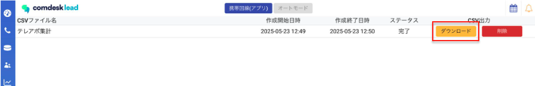
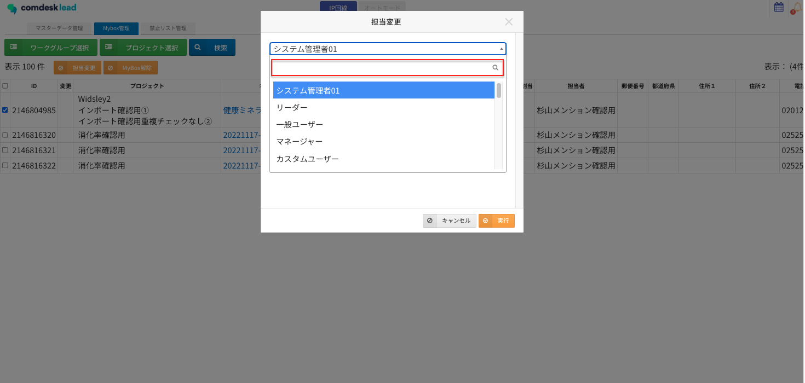

# 2025/06/04　Comdesk Lead夜間リリースのお知らせ

平素より大変お世話になっております。Widsley Supportでございます。

いつもご利用ありがとうございます。

本日（2025/06/04）夜間リリースにて、Comdesk Leadに下記リリースを実施予定でございます。

挙動や仕様において、一部変更となる部分がございますので、ご認識いただけますと幸いです。

——————————————————————————–————————————————–————————–

## **■機能追加****【Web】**

### **活動履歴のダウンロード項目に「活動履歴URL・テキスト要約・通話テキスト」が追加されます。**

*   Comdesk Leadにログインをしている状態で、活動履歴URLをクリックすると対象の活動履歴に飛ぶことが可能でございます。
*   Chat GPTオプションをお申し込みいただいておりますお客様には、活動履歴に表示されている要約もダウンロード対象項目となります。
*   1分以上通話した際に活動履歴上に表示される「通話テキスト」は以下のようにダウンロードされます。  
    ※ダウンロード時に表示されるL／Rは、L：発信先番号、R：発信元番号となります。

0:02 L ユーザー1: もしもし。  
0:02 R 株式会社Widsley: 株式会社Widsleyの佐藤が承ります。  
0:05 L ユーザー1: 不在が入っていたので折り返ししました。  
0:11 R 株式会社Widsley: 折り返しのご連絡ありがとうございます。  
・  
・  
・  
1:12 L ユーザー1: ありがとうございます。  
1:56 R 株式会社Widsley:失礼いたします。

### 活動履歴のCSVダウンロード方法が変わり、1ヶ月間保管されるようになります。

*   活動履歴のダウンロード時に「CSV」ボタンでファイルに名前を付け、ダウンロード処理が裏側で実行されます。  
    ダウンロード完了後、Comdesk Lead内の「ベルマーク」に通知が入ります。「履歴」ボタン若しくは通知をクリックで「履歴」画面に遷移しダウンロードが可能になります。
*   過去に実行したダウンロードデータが1ヶ月間、再ダウンロードが可能になります。  
    

### 活動履歴のその他変更点

*   活動履歴で絞り込む際、「日付」のみの絞り込みから「日時」で検索できるようになります。
*   「CSV」ダウンロードボタンが活動履歴画面右下から左下の変更となりました。

——————–——————–——————–——————–——————–——————–——————–——————–

### MyBox管理画面で担当変更を実施する際、ユーザーが検索できるようになります。

画像赤枠内にユーザー名を入れていただくことで、検索が可能となります。  
  

## **■機能改修・仕様変更****【Mobile Client】**

*   Mobile Clientアプリ上で端末側のナビゲーションバーと表示が重なってしまう不具合を修正いたしました。
*   通話内容記録画面でステータスが初期値で入力された状態になりました。（※ステータスの入力必須となります）
    
    ※対象リストが所属しているワークグループ設定でONになっているステータスの中で一番上のステータスが初期値として入力されます。
    

Android端末にて、Mobile Clientをご利用中のお客様に関しましては

・Playストアで「Comdesk Lead」アプリの更新

・Playストア上でアプリの更新ができない場合はアプリをアンインストールし、再インストール

　をお願いいたします。

最新バージョン：1.2.16

操作方法は以下の記事をご参照ください。

・[アンインストール方法](../../機能一覧/基本ガイド/14501428133145_MobileClient_アンインストール.md)

・[インストール方法](../../機能一覧/基本ガイド/14501355033241_MobileClient_インストール.md)

——————————————————————————–————————————————–————————–

リリース日時 ： 2025年06月04日(水）  21：00～26：00頃

※サービスの停止はありません。

——————————————————————————–————————————————–——————–——

以上、ご確認ください。

ご不明点ございましたら、お気軽にサポート窓口・担当CSまでご連絡くださいませ。

今後も、より一層みなさまのお役に立てるよう取り組んでまいりますので

引き続き、Comdesk Leadのご愛顧を賜りますよう心よりお願い申し上げます。

——————————————————————————–————————————————
