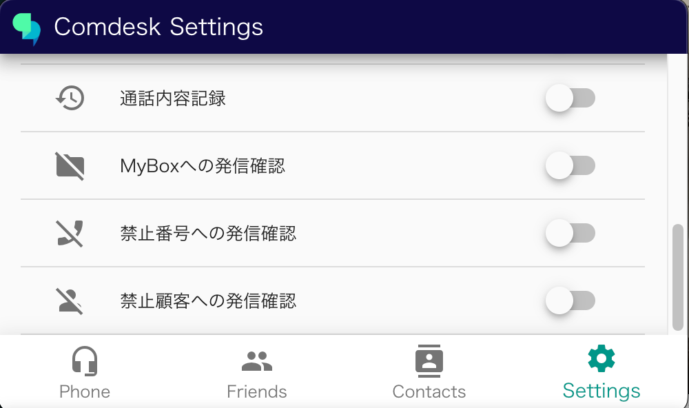
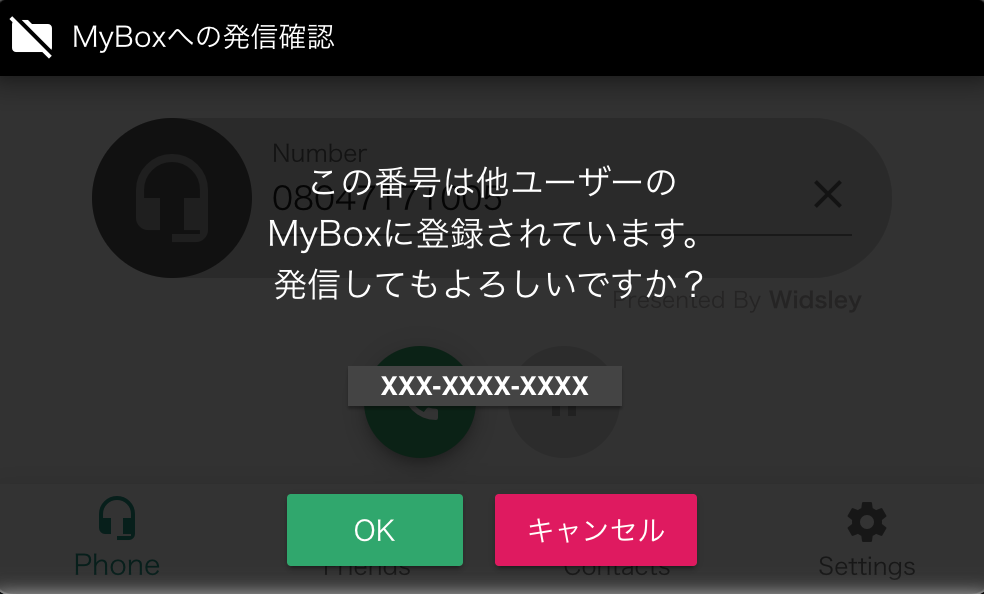
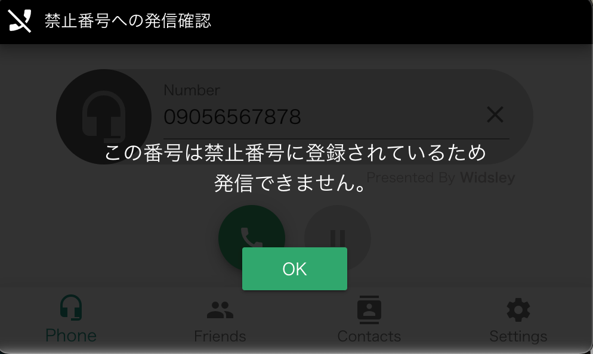
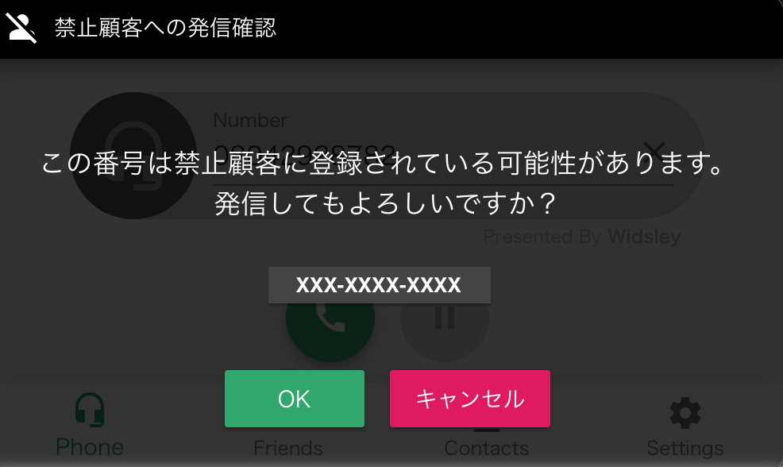

# 2025/11/19　Comdesk Lead夜間リリースのお知らせ

平素より大変お世話になっております。Widsley Supportでございます。

いつもご利用ありがとうございます。

本日（2025/11/19）夜間リリースにて、Comdesk Leadに下記リリースを実施予定でございます。

挙動や仕様において、一部変更となる部分がございますので、ご認識いただけますと幸いです。

——————————————————————————–————————————————–———

### **【Comdesk Lead Web】**

■活動履歴

通話テキスト内の発話箇所をクリックすると、該当する秒数（タイムスタンプ）へ音声プレイヤーが自動的にジャンプし、再生ができるようになりました。

■リスト項目設定

リスト項目設定にてOFFにしている項目が、マスターデータの条件検索で表示されてしまう不具合を修正いたしました。

■着信時のヒストリー表示

Comdesk Leadに登録がない電話番号から着信が入った場合のヒストリー表示処理を内部的に修正いたしました。

### **【デスクトップアプリ】**

■架電前の事前チェック機能を追加

Chrome拡張機能から発信をする際に

「禁止番号」「禁止顧客」「Mybox」への該当有無を事前にチェックができる機能を追加いたしました。

事前チェックを有効にする場合は、デスクトップアプリ内「settings」にて各トグルをONにしてご利用ください。

*   Myboxへの発信確認（ON時）
    

自身のMyboxへ登録されている番号へはそのまま発信ができ、他ユーザーのMyboxに登録されている番号については

「この番号は他ユーザーのMyboxへ登録されています。発信してもよろしいですか？（電話番号）」とポップアップが表示されます。

*    禁止番号への発信確認（ON時）

「この番号は禁止番号に登録されているため、発信できません」と表示され、発信は不可となります。

*    禁止顧客への発信確認（ON時）

「この番号は禁止顧客に登録されている可能性があります。発信してもよろしいですか？（電話番号）」とポップアップが表示されます。

■ IP回線の表示崩れを修正

「回線名／着信グループ名」が長い場合、IP回線着信時にデスクトップアプリが表示崩れしてしまう不具合を修正いたしました。

※文字数が長い場合は省略し、マウスオーバーで全文をご確認いただけます。

デスクトップアプリをご利用中のお客様に関しましては、再インストールをお願いいたします。

最新バージョン：1.1.9  
・[インストール方法（WindowsOS）](../../機能一覧/活用ガイド/14502240732825_ComDesk_Phone（デスクトップアプリ）_アプリインストール_WindowsOS.md)  
・[インストール方法（macOS）](../../機能一覧/活用ガイド/14508506030489_Comdesk_Phone（デスクトップアプリ）_アプリインストール_macOS.md)

——————————————————————————–————————————————–————————–

リリース日時 ： 2025年11月19日(水）  23：00～26：00頃

※作業中はシステムへ接続しづらくなる可能性がございます。

——————————————————————————–————————————————–——————–——

以上、ご確認ください。

ご不明点ございましたら、お気軽にサポート窓口・担当CSまでご連絡くださいませ。

今後も、より一層みなさまのお役に立てるよう取り組んでまいりますので

引き続き、Comdesk Leadのご愛顧を賜りますよう心よりお願い申し上げます。

——————————————————————————–————————————————–——————–——
