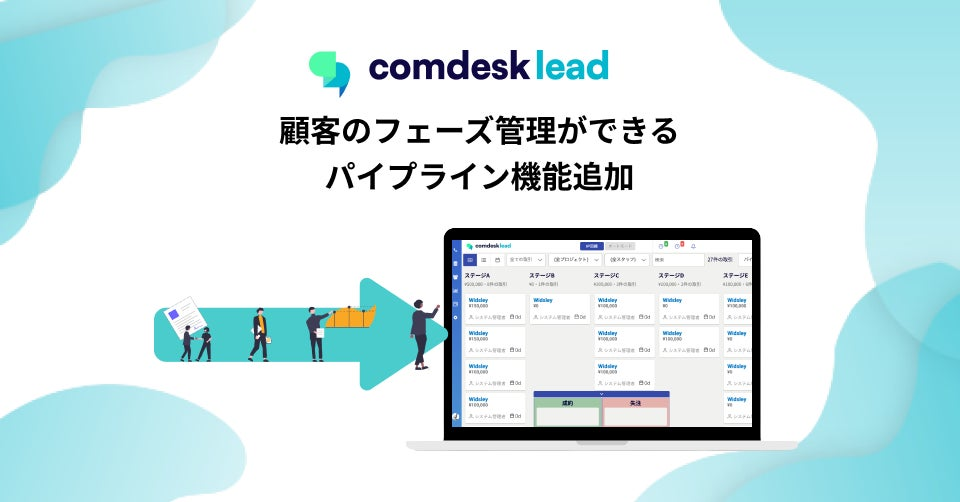
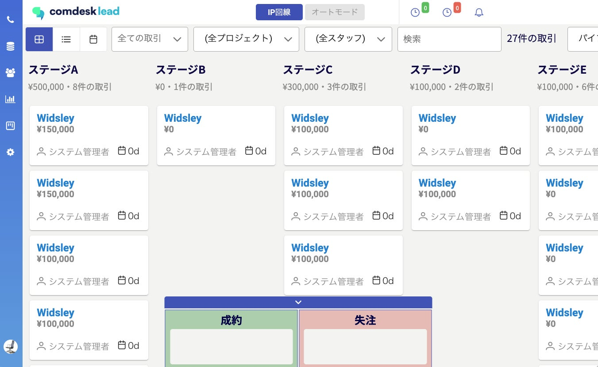
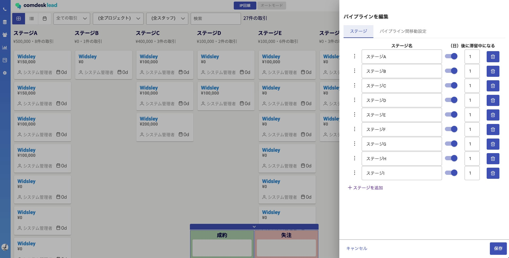
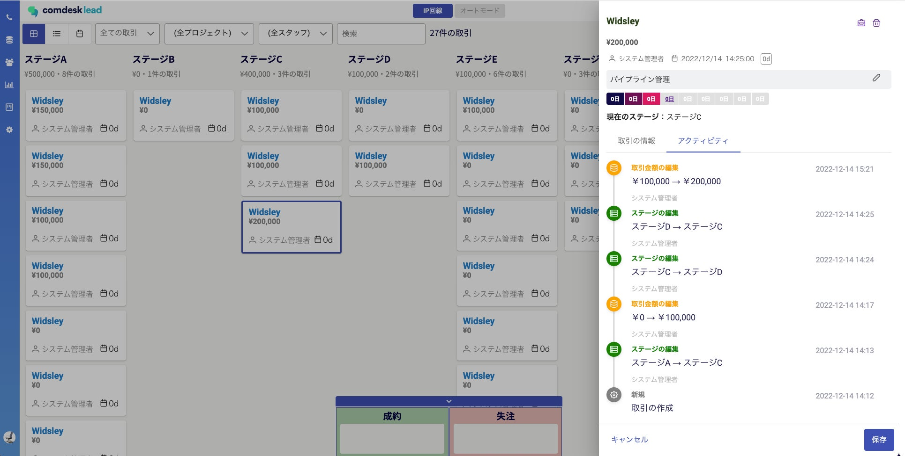

# 「Comdesk Lead」顧客のフェーズ管理ができる新機能、パイプライン機能の提供を開始

## **通話結果の可視化だけでなく商談管理まで顧客のフェーズがひと目で分かる！CRM機能をアップデート**

携帯電話回線と連動するCTIシステム「Comdesk Lead」（旧称：Telforce）の新機能となる

パイプライン機能の提供を開始しました。

今回のパイプライン機能の追加により、顧客フェーズがひと目で分かり、顧客管理から商談管理までを効率的に行うことが可能になります。従来のコール管理システムから発展し、CRM機能をアップデートすることでシームレスに営業活動を行うことができます。

  

*    **​新機能「パイプライン」の提供の背景**

ウィズリーでは、従来より企業における営業やインサイドセールスなどの業務向けに、「Comdesk Lead」を提供してきました。多くの企業でご利用いただく中で、コールリスト管理と併せて営業活動のパイプライン管理をしたいという要望をいただいていました。特にリードタイムの長い商材を扱う企業様において、活動履歴と併せてパイプライン管理したいという要望を多くいただきました。

従来は顧客毎の活動履歴や架電毎のステータスなどでミクロな営業活動の把握に留まっており、営業活動全体のマクロな把握に課題があり、今回のパイプラインにて**活動履歴から商談の管理まで営業活動を俯瞰して把握できる**ビジュアル化機能として新規開発いたしました。

ステータスの名前の編集、追加も可能です。企業ごとの活動履歴、取引履歴もワンクリックでご覧いただけます。

*   **新しいパイプライン機能による活用例・メリット**

・従来の顧客情報や活動履機能、新たに実装されたパイプライン機能を加えて、ComdeskLeadで各企業の営業体制に合わせて営業活動全体を把握・管理できます。  
  
・営業活動全体を可視化することでどのルート・どの顧客属性への営業活動が高いアウトカムにつながるかを分析でき、より経営貢献を考えやすくなります。

  
・商談から成約までのリードタイムや、商談毎の見込み金額なども管理でき、パイプライン管理によってひと目で見えることで管理側の工数も大きく削減することが可能となります。

  
・営業体制に合わせてそれぞれパイプライン管理が可能。インサイドセールスにてアポイントを獲得したのち、フィールドセールスのパイプラインへ顧客情報を渡すという活用が可能となります。

  
・流入経路毎や担当者毎など、利用企業様の営業活動実態に合わせて自由度高くパイプライン管理することも可能になります。用途としては同一顧客（企業）への営業活動において流入経路や担当者毎に取引カードを分けて商談管理することで、どのルートの営業活動が最適なのかがビジュアル化されたパイプライン画面で把握しやすくなります。

  
・これらの管理を直感的に操作でき、煩雑な操作は不要で、現場でも簡単にお使いいただけます。

公式発表（参照：PR TIMES）  
[https://prtimes.jp/main/html/rd/p/000000022.000012305.html](https://prtimes.jp/main/html/rd/p/000000022.000012305.html)

その他ご不明点などございましたら、[**サポートチームまでお問い合わせ**](https://comdesklead.zendesk.com/hc/ja/requests/new)をお願い致します。

お問い合わせ方法は**[こちら](../../トラブルシューティング/サポートチームへのお問い合わせ方法/12828937533081_サポートチームへのお問い合わせ方法.md)**
