# 活動履歴の確認

活動履歴では発信・着信の履歴を閲覧・条件での絞り込みが行えます。

本記事では活動履歴で行える各機能をご説明します。

目次  
　[検索方法](#h_01GN70KHSW2QS8HKN1VMYNNHRZ)  
　[フィルター](#h_01GN70KTAE4A406NJ3VHCF78FP)  
　[通話録音再生・ダウンロード方法](#h_01GN70M5NKEER8Q3RETVTC8KJF)  
　[CSVダウンロード](#h_01GN70MHF2CF6YWDRJRCX03VWE)

※ユーザー種別「一般ユーザー」のアカウントでは、ログインしている自身の活動履歴のみしか閲覧できません。

ー関連記事ー

活動履歴の編集については、[こちら](../../はじめてガイド/管理者ガイド/21610979714073_活動履歴の編集.md)　をご参照ください。

## **検索方法**

ワークグループ・アクティビティ結果・リスト・日時で特定の活動履歴を検索できます。

1.  活動履歴を開きます。  
    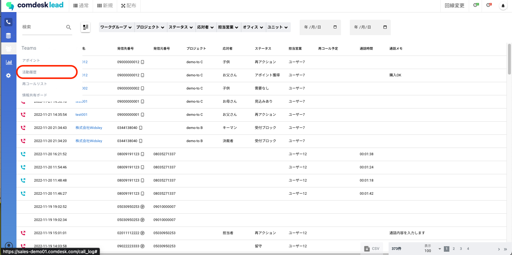
2.  条件検索ボタンをクリックします  
    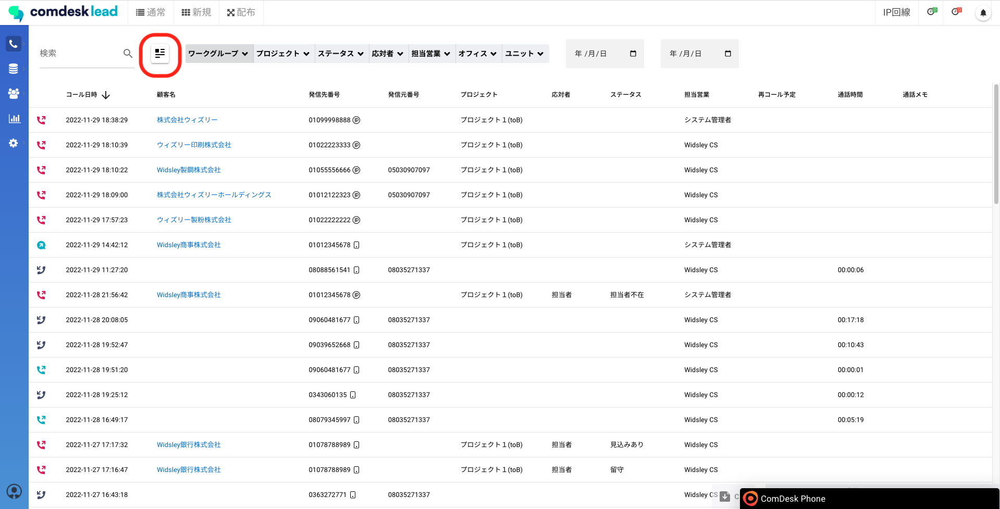
3.  検索かけたい項目を入力し、「適用」をクリックします  
    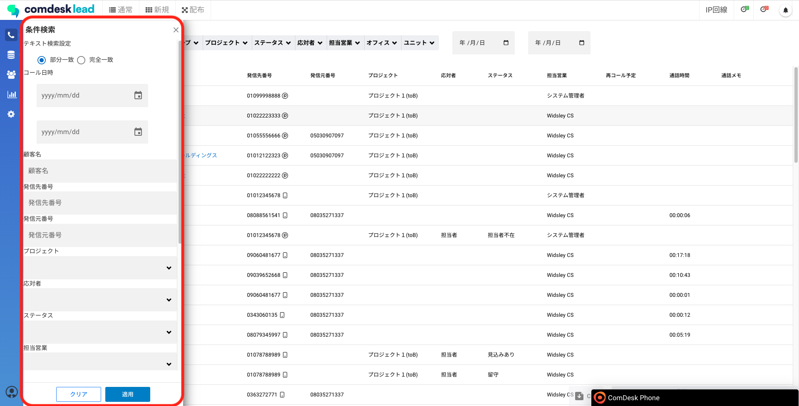

## **フィルター**

ワークグループ・アクティビティ結果・リスト・日時で活動履歴をフィルターかけることができます。

1.  活動履歴を開きます。  
      
      
    
2.  活動履歴を開いた時点では最新の活動履歴から表示されています。  
    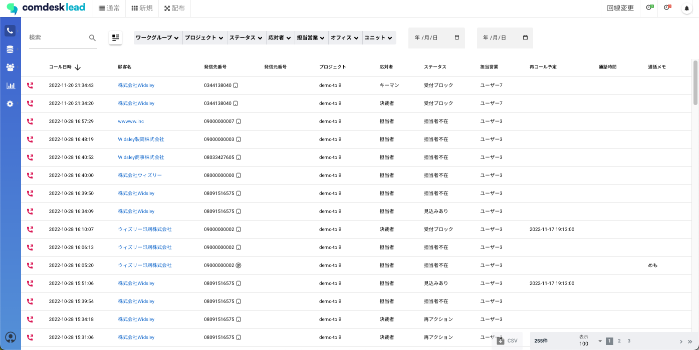  
      
    
3.  赤枠内で選択した条件選択で活動履歴の絞り込みができます。  
    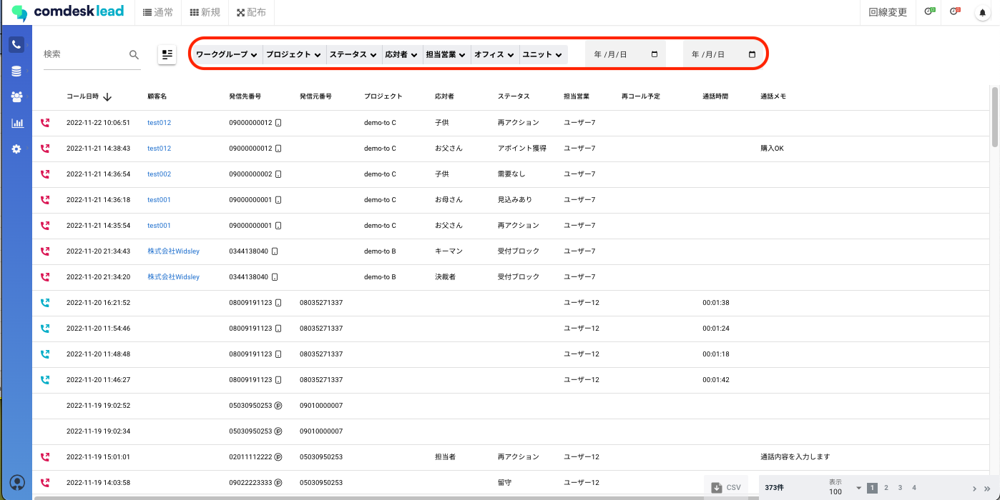  
      
    例1）11/21の活動履歴を表示させたい  
    カレンダーの日付を11/21~11/21で選択し絞り込む。  
    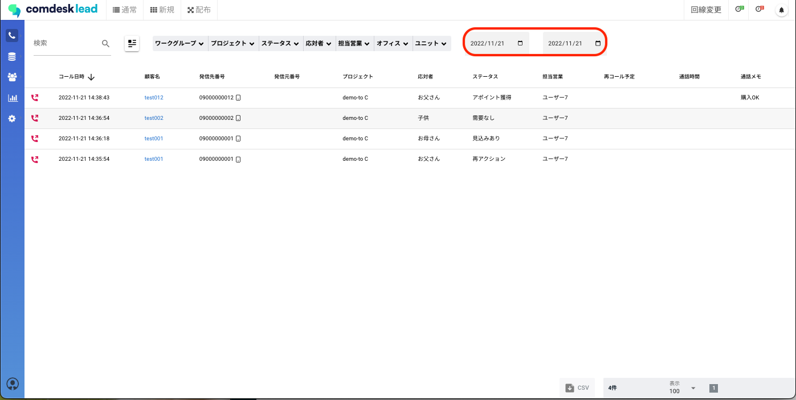  
      
    例2）特定のプロジェクトで絞り込みたい  
    赤枠、プロジェクトから表示させたいプロジェクトを選択し「適用」で絞り込みができます。  
    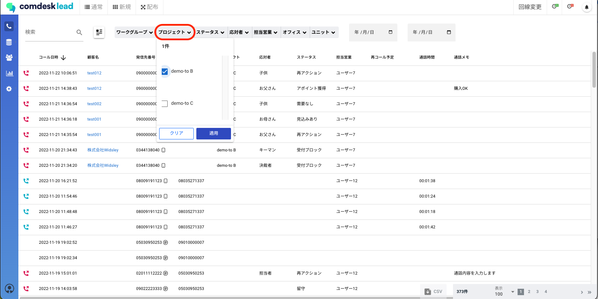

## **通話録音再生・ダウンロード方法**

活動履歴からユーザーの録音を再生/ダウンロードできます。  

1.  活動履歴を開き、録音の再生を行いたい活動履歴を選択します。  
    （この際、顧客名をクリックするとリストに飛んでしまうため、顧客名以外のところでクリックしてください。）  
      
    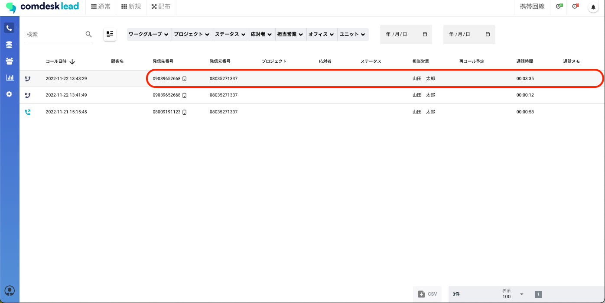  
      
    
2.  選択すると右側赤枠のような表示が出てきます。  
    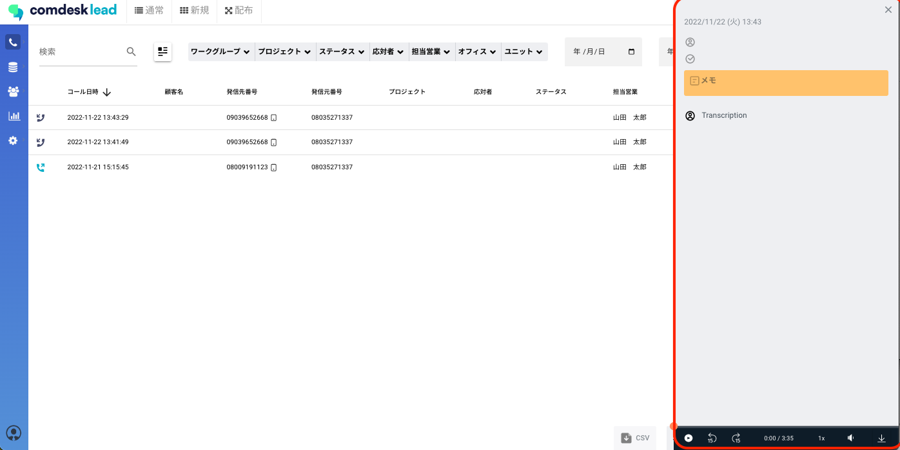  
      
    
3.  録音再生の場合  
    録音の再生・再生スピード・音量調節等ができます。  
    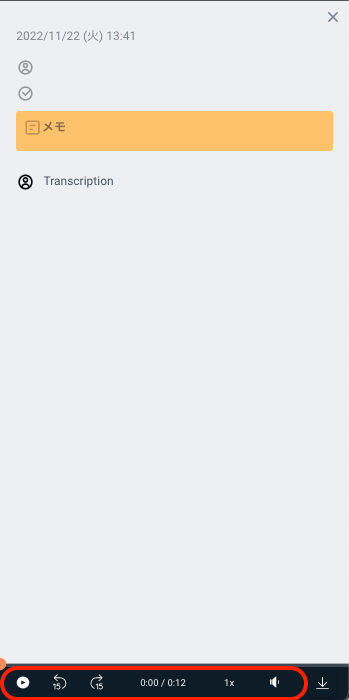  
      
    
4.  録音のダウンロードの場合  
    録音の赤枠からダウンロードができます。  
    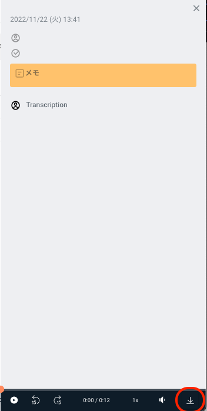

## **CSVダウンロード**

活動履歴画面をCSV形式でダウンロードできます。より詳細な分析等にお使いください。  
  

1.  活動履歴を開き、csvエクスポートしたい条件で絞り込み後赤枠よりcsvダウンロードができます。  
      
    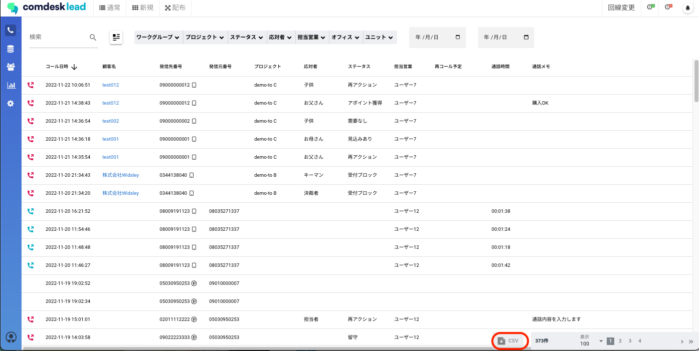  
      
    この際、ComDesk Phone が表示されてしまいcsvボタンが選択できない場合は、  
    画面左下にある人形マークを選択後、「ComedeskPhoneHide On」で非表示にできます。  
      
    同じ操作でComDesk Phoneを再度表示させることができます。  
      
    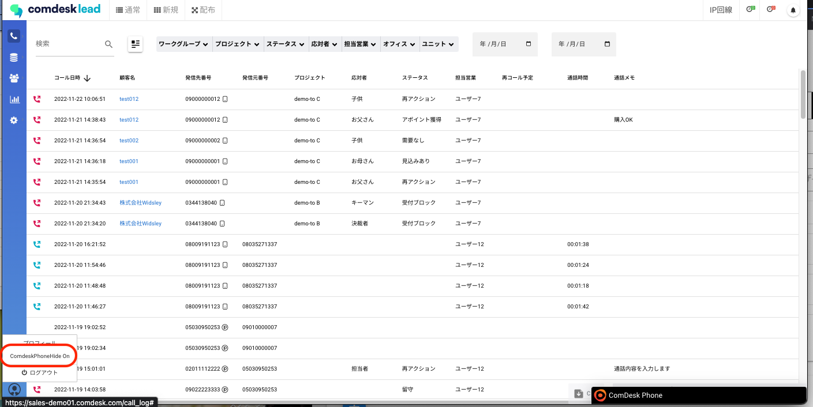  
      
    
2.  csvを開くと活動履歴が確認できます。集計などにお使いいただけます。

その他ご不明点などございましたら、[**サポートチームまでお問い合わせ**](https://comdesklead.zendesk.com/hc/ja/requests/new)をお願い致します。

お問い合わせ方法は**[こちら](../../トラブルシューティング/サポートチームへのお問い合わせ方法/12828937533081_サポートチームへのお問い合わせ方法.md)**
