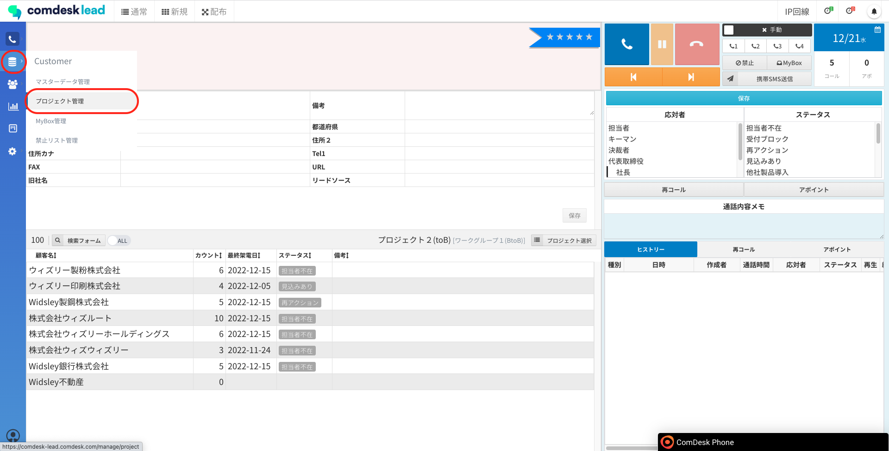
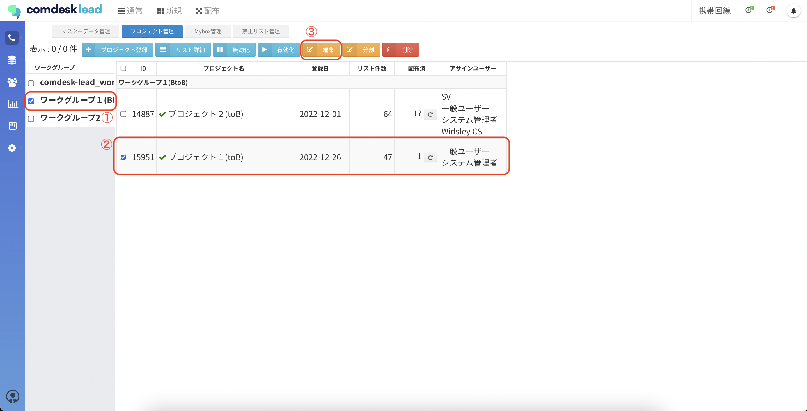
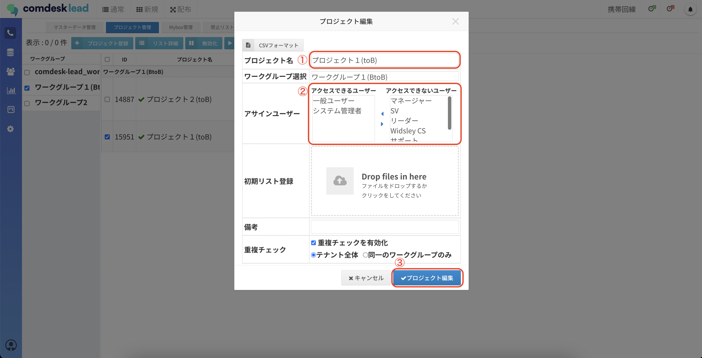

# プロジェクトの編集

本記事では、既存プロジェクトの編集について説明いたします。

## **プロジェクト名とアサインユーザーの変更**

1.  画面左側のCustomerメニューの「プロジェクト管理」をクリックします。  
      
      
    
2.  プロジェクト管理画面が表示されますので、ワークグループを選択し（①）、プロジェクトを選択し（②）、「編集」（③）ボタンをクリックします。  
      
      
    
3.  プロジェクト編集画面が表示されます。  
    「プロジェクト名」に変更したいプロジェクト名を入力します（①）。  
    「アサインユーザー」で、登録するリストを利用できるユーザーを選択し、左の「アクセスできるユーザー」に反映させます（②）。  
    最後に「プロジェクト編集」ボタンをクリックしてください（③）。  
      
      
    

その他ご不明点などございましたら、[**サポートチームまでお問い合わせ**](https://comdesklead.zendesk.com/hc/ja/requests/new)をお願い致します。

お問い合わせ方法は**[こちら](../../トラブルシューティング/サポートチームへのお問い合わせ方法/12828937533081_サポートチームへのお問い合わせ方法.md)**
