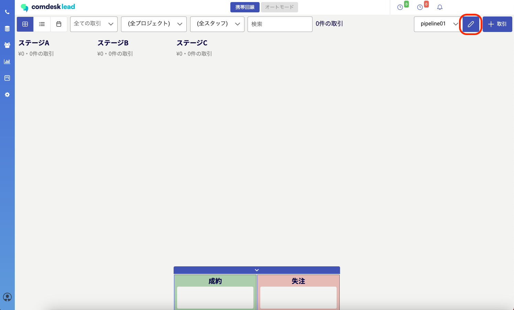
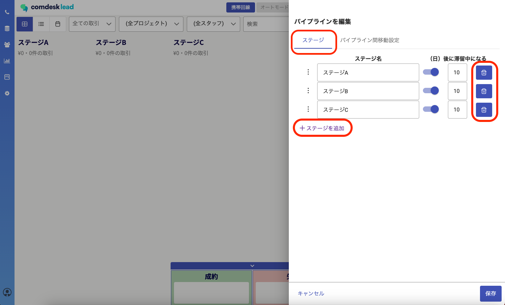
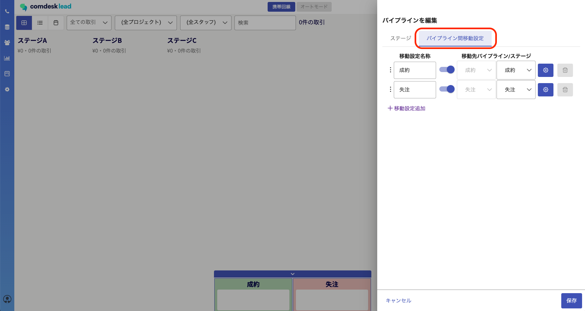
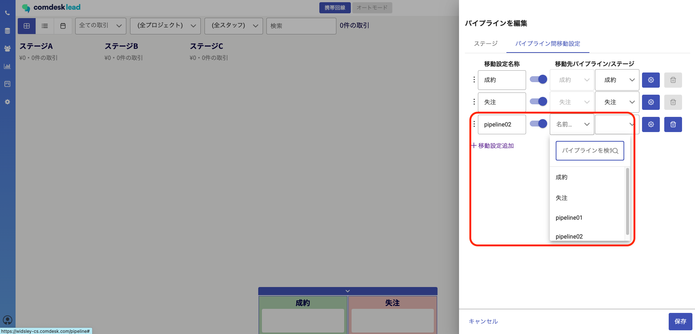
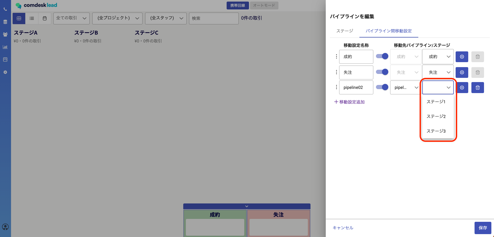
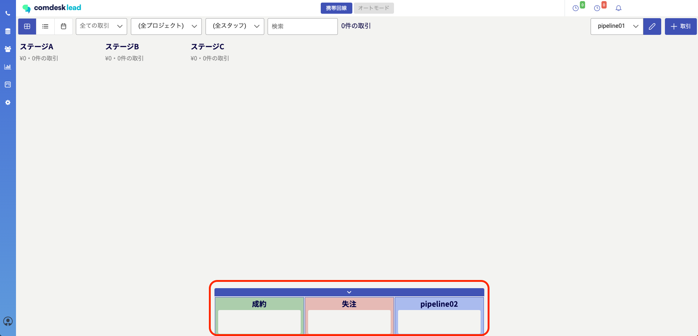
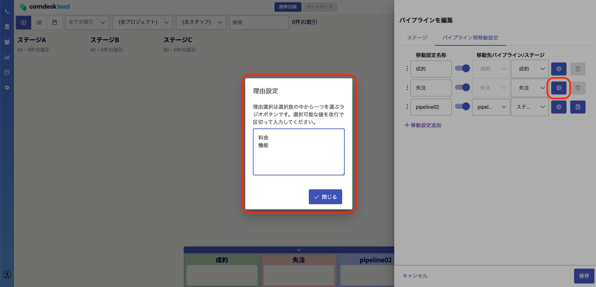
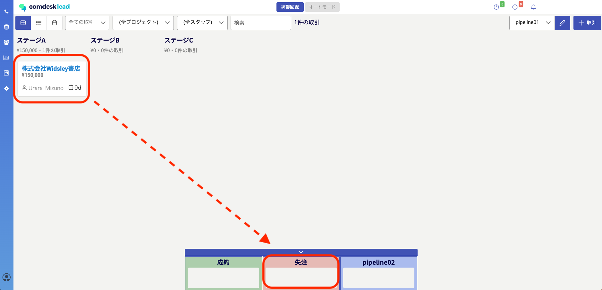
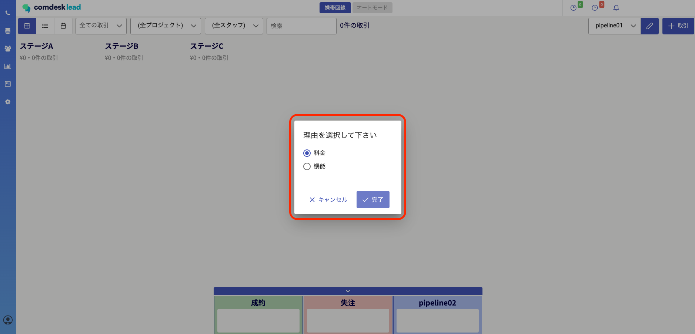

# パイプライン機能：パイプラインを編集する

## **パイプラインの編集**

編集したいパイプラインの横の鉛筆マークから、現在選択されているパイプライン設定の編集ができます。

### **ステージの編集**

パイプライン編集内の「ステージ」タブで、以下の操作が可能です。

・ステージ名の編集

・ステージの追加

・ステージの削除

・ステージの並び替え

・ステージの有効化/無効化

・ステージに入ってから滞留中とされる日数の設定

### **パイプライン間移動設定**

パイプライン編集内の「パイプライン間移動設定」タブでは、  
あるパイプラインに作成した取引を別のパイプラインに移動させる場合の設定をすることができます。

※「成約」「失注」のパイプラインはデフォルトで設定されています。

1.　「パイプライン間移動設定」タブをクリックします。

2.　名称を入力し、移動先パイプラインをプルダウンメニューから選択します。

3.　移動先として選択したパイプラインへ移動した際の、そのパイプライン内の移動先ステージもプルダウンメニューから選択します。

4.　「パイプライン間移動設定」で設定したものは画面下部に表示されます。

### **パイプライン間移動時に選択する理由の設定**

「パイプライン間移動設定」タブでは、パイプラインを移動させる際に選択する理由を設定することができます。

該当する移動設定の右側の歯車ボタンをクリックすると、理由設定のポップアップが表示されますので、選択肢を1行ごとに改行し入力してください。

上記で設定をすると、取引をそのパイプラインにドラッグ＆ドロップで移動させようとすると・・・

設定した理由が選択肢として表示されます。

その他ご不明点などございましたら、[**サポートチームまでお問い合わせ**](https://comdesklead.zendesk.com/hc/ja/requests/new)をお願い致します。

お問い合わせ方法は**[こちら](../../トラブルシューティング/サポートチームへのお問い合わせ方法/12828937533081_サポートチームへのお問い合わせ方法.md)**
