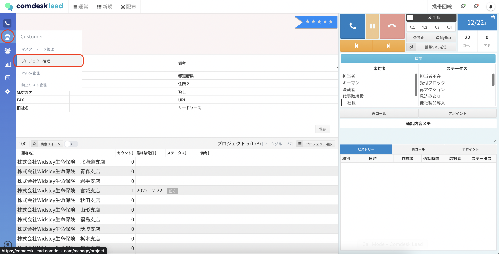
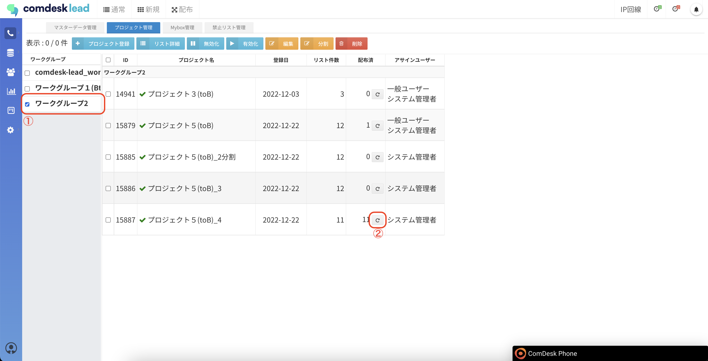
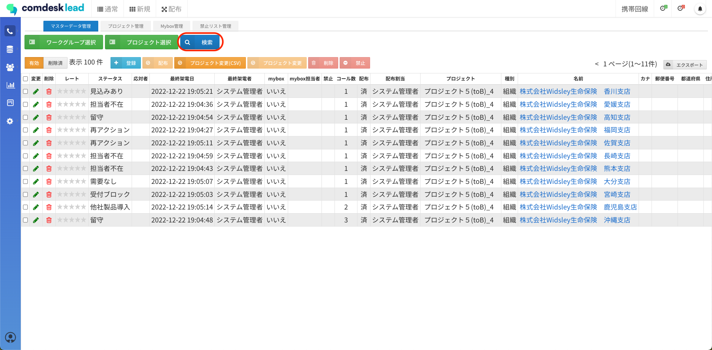
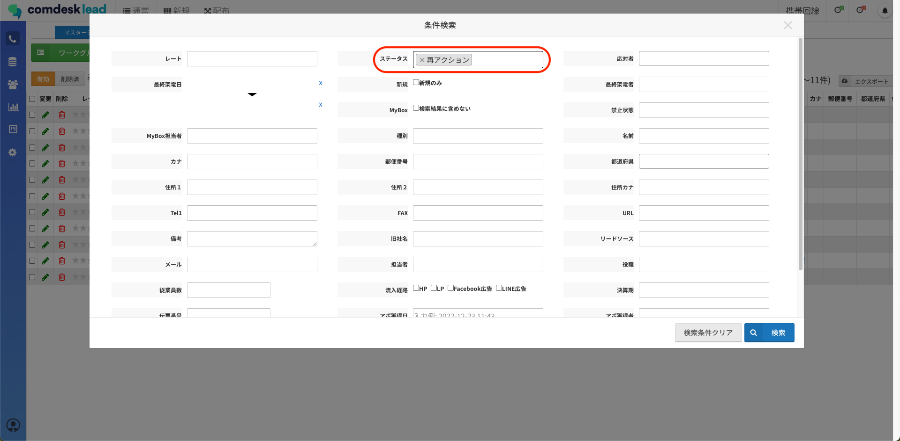
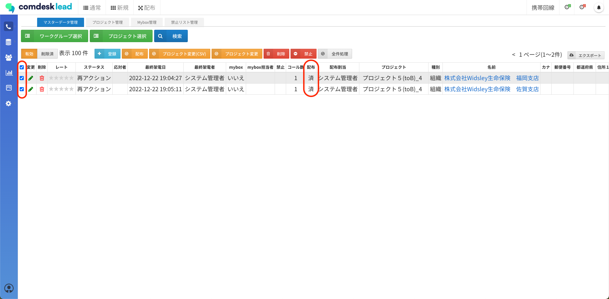
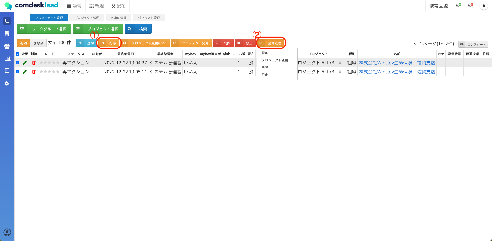
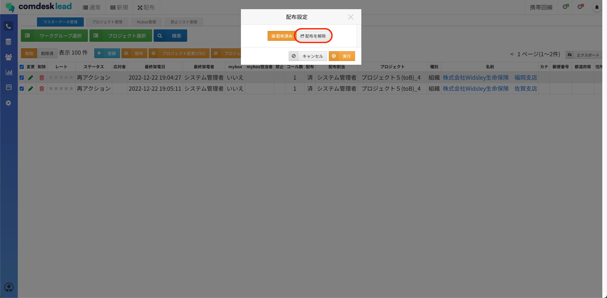
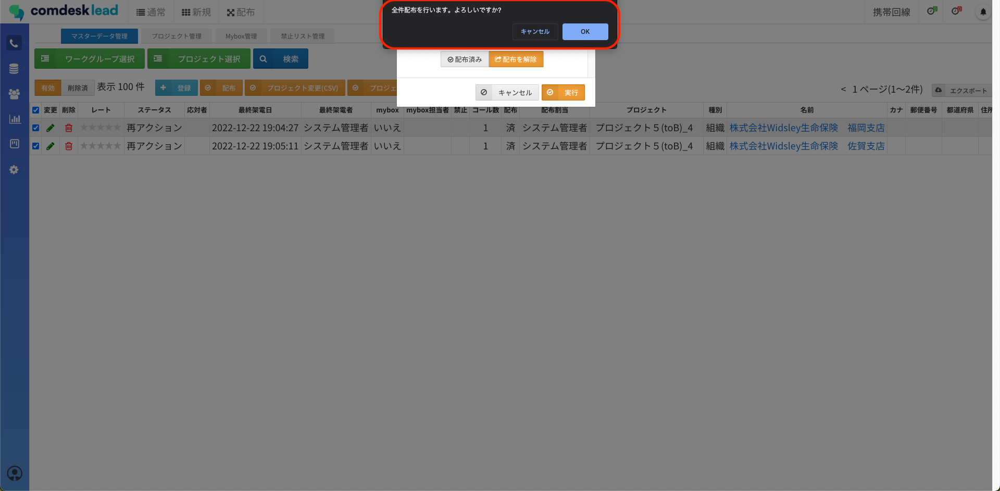
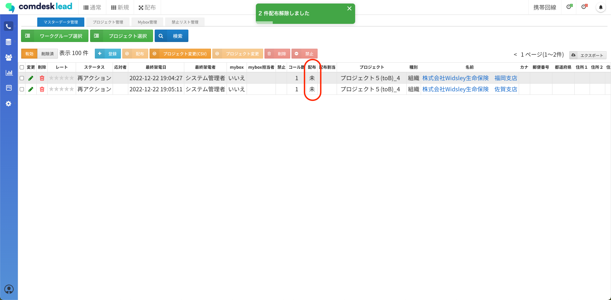

# プロジェクトの配布リセット

目次  
[プロジェクトごと配布済みリストを一括で配布リセットする](#h_01GKZQGDJWED0YR5QSBK78BSK4)  
[特定条件に一致するリストのみ配布をリセットする](#h_01GMYEBRS7WZZPP3294YMK8EHD)

## **プロジェクトごと配布済みリストを一括で配布リセットする**

配布コールモードで架電したプロジェクトごと、配布済みリストを全てリセットし再度配布できる状態にすることが可能です。

1.  画面左側のCustomerメニューの「プロジェクト管理」をクリックします。  
      
      
    
2.  プロジェクト管理画面が表示されますので、ワークグループを選択し（①）、対象プロジェクトの配布リセットボタン（②）をクリックし、配布解除完了です。  
      
      
    

## **特定条件に一致するリストのみ配布をリセットする**

配布コールモードで架電したリストのうち、条件に一致する特定のリストのみ配布リセットすることができます。

活用例：架電したリストのうち「再アクション」のステータスになったリストのみを再配布できる状態にしたい

1.  マスターデータ管理を開き、配布の解除を行いたいワークグループ・プロジェクトを選択し、検索フォームを開きます。  
      
      
    
2.  検索フォームで、特定の条件で検索します。  
    （今回はステータス：再アクション　で絞り込みます。）  
      
      
    
3.  条件で絞り込み後、配布解除対象のリストのチェックボックスに✔を入れます。  
      
      
    
4.  絞り込み後、対象のリストを数件選択した場合は①の「配布」ボタンをクリックし、  
    全件選択した場合は、②「全件処理」のボタンがオレンジ色に変わりますので「全件選択」をクリックし、配布を選択します。  
      
      
    
5.  ①②共「配布設定」のポップアップが表示されますので「配布を解除」を選択し、「実行」をクリックします。  
      
    
6.  再度ポップアップが表示されますので、問題なければ「OK」をクリックしてください。  
      
      
    
7.  配布解除が完了すると「○件配布解除しました」と表示されたら解除完了です。  
    

その他ご不明点などございましたら、[**サポートチームまでお問い合わせ**](https://comdesklead.zendesk.com/hc/ja/requests/new)をお願い致します。

お問い合わせ方法は**[こちら](../../トラブルシューティング/サポートチームへのお問い合わせ方法/12828937533081_サポートチームへのお問い合わせ方法.md)**
