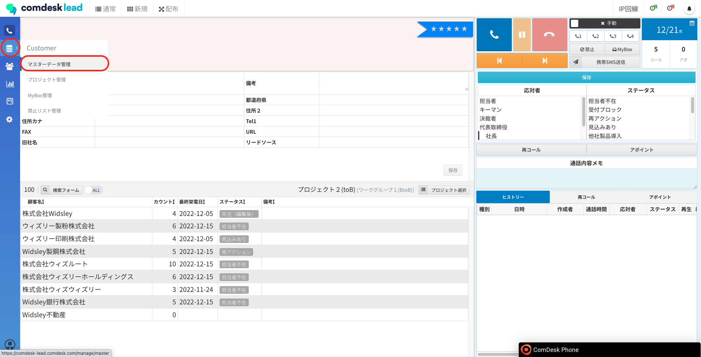
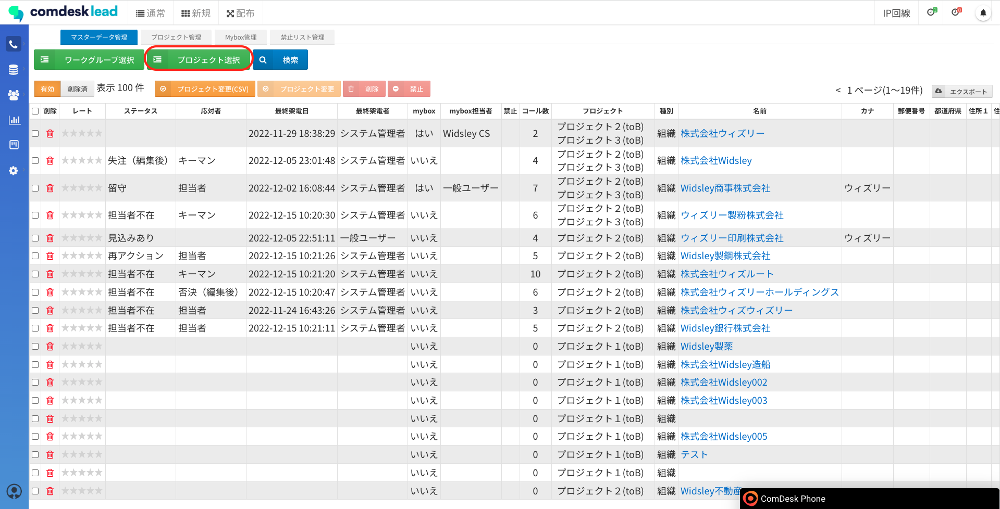
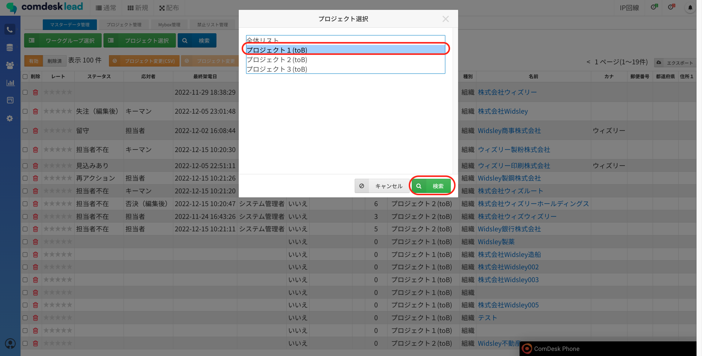
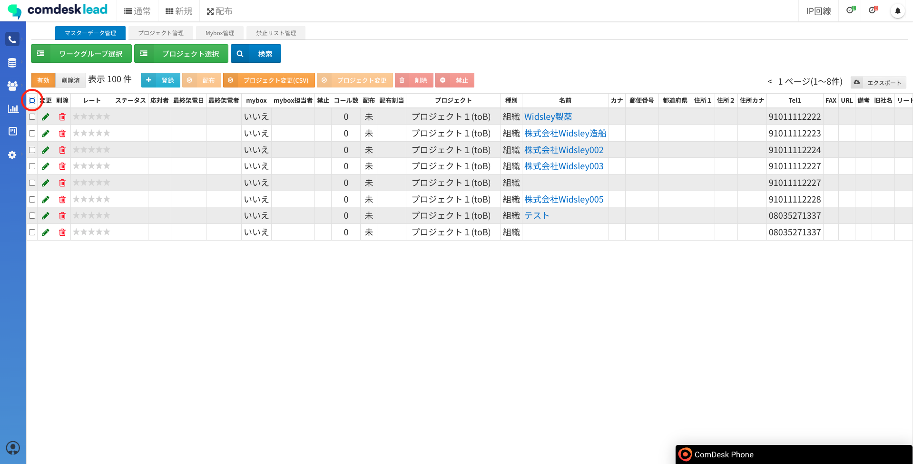
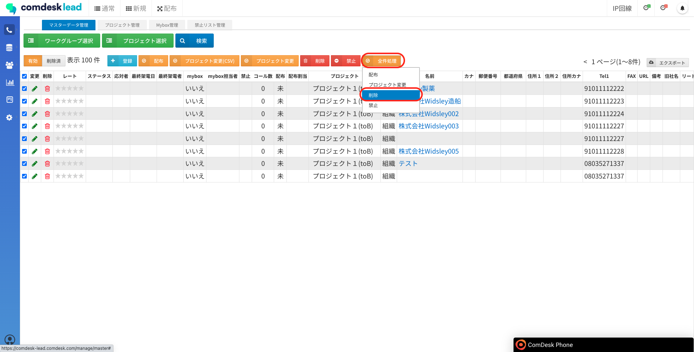
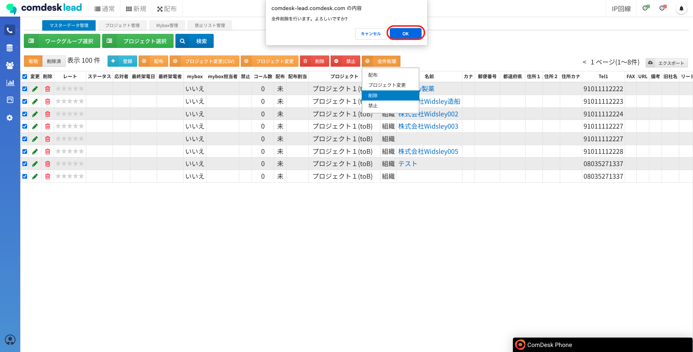
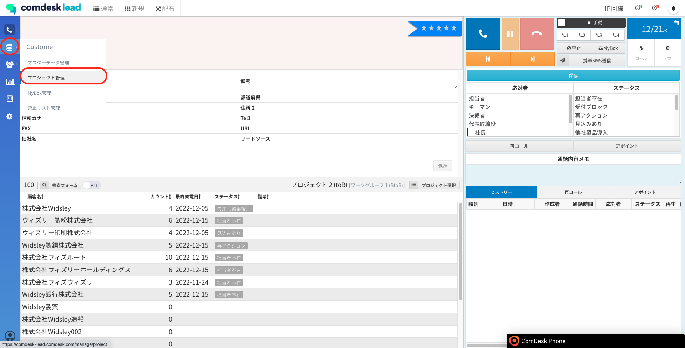
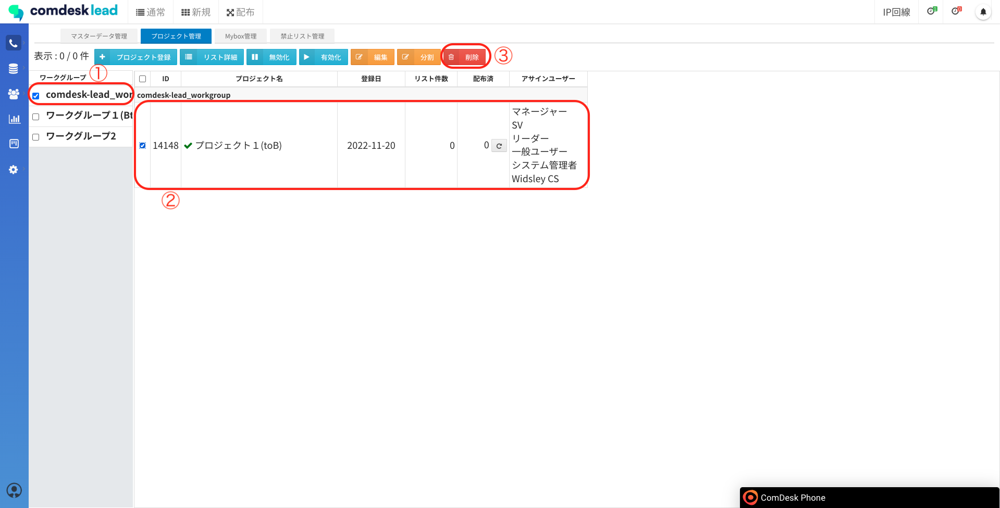
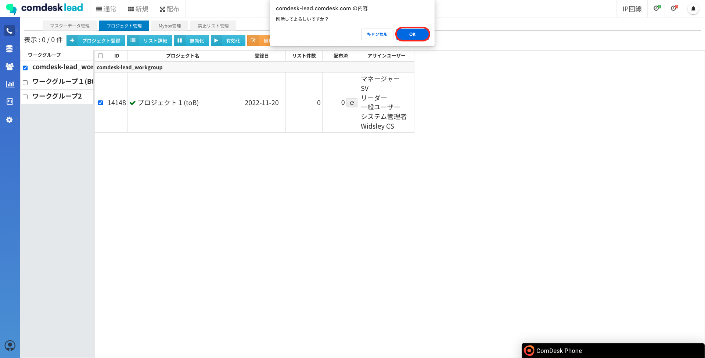

# プロジェクトの削除

本記事では、不要となったプロジェクトの削除方法をご説明します。

※必ず下記の手順のとおり、削除したいプロジェクトのリストを削除してからプロジェクトを削除してください。  
プロジェクトだけを削除すると紐付け先のないリストが残ってしまいますのでご注意ください。

1.  画面左側のCustomerメニューの「マスターデータ管理」をクリックします。  
      
      
    
2.  「プロジェクト選択」をクリックします。  
    
3.  削除したいプロジェクトを選択し、「検索」をクリックします。  
      
      
    
4.  全選択のチェック✔︎を入れます。  
    
5.  全選択のチェックを入れると「全件処理」のボタンが出現します。  
    「全件処理」をクリックしたのち「削除」をクリックしてください。  
    
6.  ポップアップの「OK」をクリックしてください。  
      
    
7.  画面左側のCustomerメニューの「プロジェクト管理」をクリックします。  
      
      
    
8.  プロジェクト管理画面が表示されますので、「リスト件数」が0件となって要ることを確認の上、  
    ワークグループを選択（①）、プロジェクトを選択（②）、「削除」ボタン（③）をクリックします。  
      
      
    
9.  「削除してよろしいですか？」というモーダルが表示されますので、「OK」ボタンをクリックします。  
      
    
    💡複数プロジェクトを選択しての削除はできません。プロジェクトを１つずつ選択して操作してください。  
    
    

その他ご不明点などございましたら、[**サポートチームまでお問い合わせ**](https://comdesklead.zendesk.com/hc/ja/requests/new)をお願い致します。

お問い合わせ方法は**[こちら](../../トラブルシューティング/サポートチームへのお問い合わせ方法/12828937533081_サポートチームへのお問い合わせ方法.md)**
