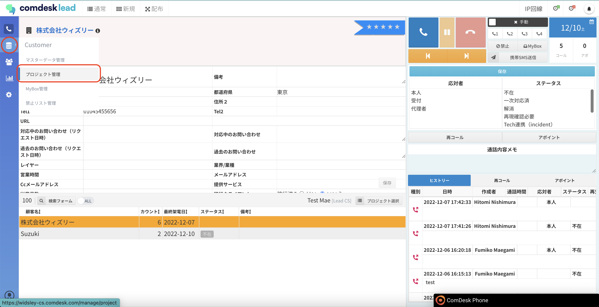
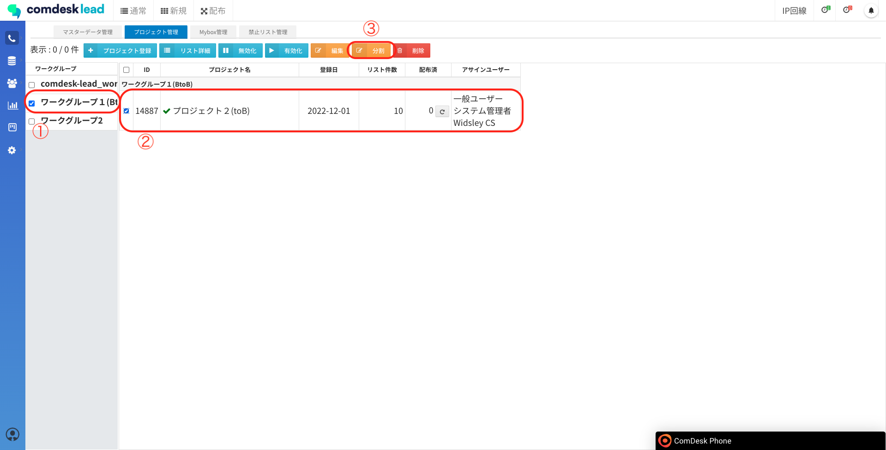
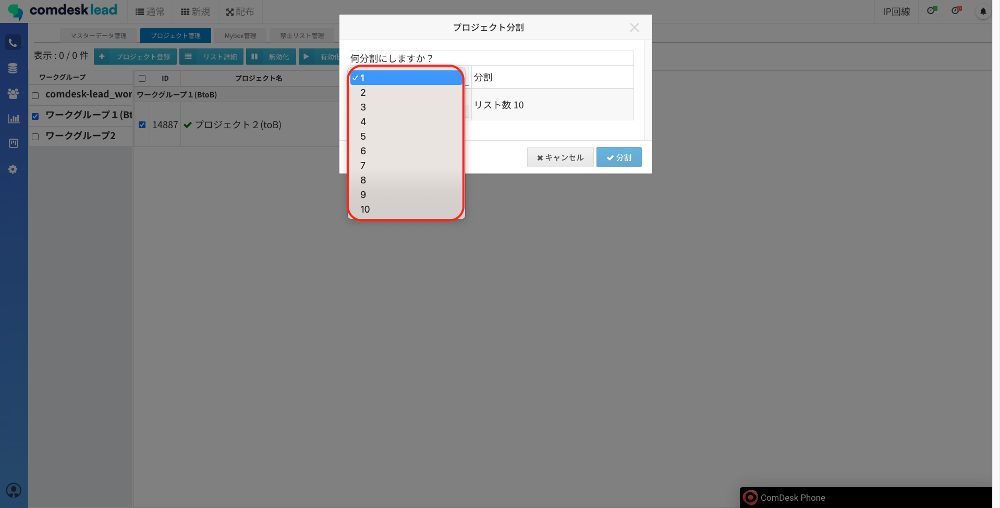
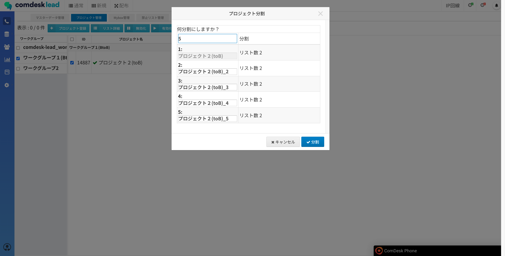
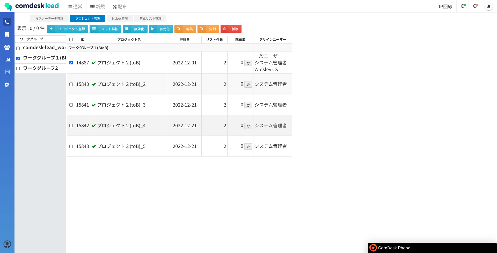

# プロジェクトの分割

本記事では、プロジェクト内のリストを分割する方法をご説明します。

1つのプロジェクトを、アポインター毎に無条件に分割したい場合などにご活用いただけます。

1.  画面左側のCustomerメニューの「プロジェクト管理」をクリックします。  
      
      
    
2.  プロジェクト管理画面が表示されますので、ワークグループを選択し（①）、プロジェクトを選択し（②）、「分割」ボタン（③）をクリックします。  
      
      
    
3.  プロジェクト分割画面が表示されます。  
    「何分割にしますか？」下のセレクトボックスをクリックすると分割する数を指定できます。  
    ※最大で10分割まで指定できます。  
      
      
    
4.  分割数を指定すると、分割後のプロジェクト名とリスト数が表示されますので、以下を入力して「分割」ボタンをクリックします。  
    プロジェクト名：入力項目　ただし、分割元プロジェクト名は変更不可です。  
    リスト数：入力項目　初期状態は均等に割り振られますが、変更可能です。  
      
      
    
5.  プロジェクトの分割が完了しました。  
    

その他ご不明点などございましたら、[**サポートチームまでお問い合わせ**](https://comdesklead.zendesk.com/hc/ja/requests/new)をお願い致します。

お問い合わせ方法は**[こちら](../../トラブルシューティング/サポートチームへのお問い合わせ方法/12828937533081_サポートチームへのお問い合わせ方法.md)**
