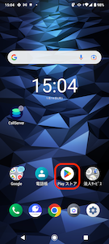
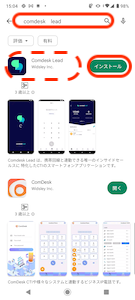
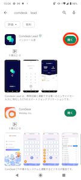
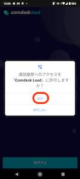
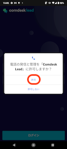
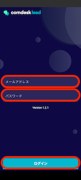
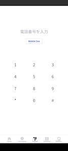

# MobileClient インストール

MobileClientアプリのインストール方法をご説明します。

ー関連記事ー

MobileClientアプリのアンインストール方法は[こちら](14501428133145_MobileClient_アンインストール.md)　の記事をご参照ください。  
  
**注意！：インストールの前に、Chromeが最新バージョンになっていることをご確認ください。**

1.  Playストアを開きます。  
      
      
    
2.  検索枠に「comdesk lead」と検索すると、Comdesk Lead MobileClientアプリが表示されます。  
    赤枠のインストールをクリックします。  
      
      
    
3.  インストール完了後、「開く」をクリックしアプリを開きます。  
      
      
    
4.  「通話履歴へのアクセスをComdesk Leadに許可しますか？」とポップアップが表示されるので、「許可」をクリックします。  
      
      
    
5.  「電話の発信と管理をComdesk Leadに許可しますか？」とポップアップが表示されるので、  
    「許可」をクリックします。  
      
      
    
6.  ログイン画面が表示されますので、メールアドレスとパスワードを入力して、「ログイン」ボタンをタップします。**  
      
      
    **
7.  下図画面が表示されると、ログイン完了です。**  
    **

その他ご不明点などございましたら、[**サポートチームまでお問い合わせ**](https://comdesklead.zendesk.com/hc/ja/requests/new)をお願いいたします。

お問い合わせ方法は**[こちら](../../トラブルシューティング/サポートチームへのお問い合わせ方法/12828937533081_サポートチームへのお問い合わせ方法.md)**
