# MobileClient　通常コールモード

MobileClientの通常コールモードでの操作方法をご説明します。

[通常コールモードでの発信方法](#h_01GRMYGTTJ2HBW370ESJSEB9KE)  
[再コール登録方法](#h_01GRMY0B68SFAMYVS78P0NT46A)

## **通常コールモードでの発信方法**

1.  「Standard（通常）」クリックします。  
    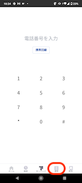  
      
    
2.  現在開いているプロジェクト（青枠）とそのプロジェクトに所属しているリスト（赤枠）が表示されます。  
    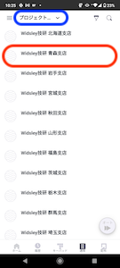  
      
    プロジェクト変更する場合：プロジェクト（青枠）をクリックすると、「ワークグループ」が選択でき、その中の「プロジェクト」をタップしてプロジェクトの選択ができます。  
    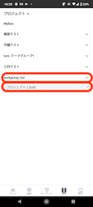  
      
    
3.  プロジェクトを選択し、リストをクリックすると顧客情報が表示されます。  
    受話器（赤枠）アイコンをクリックすると発信ができます。  
    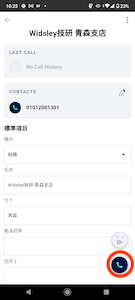  
      
    
4.  通話中は下図の画像のように表示されます。  
    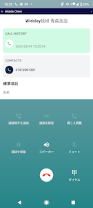  
      
    
5.  通話終了後、アクティビティ結果登録画面が表示されます。  
    左からステータス・応対者・メモの登録ができます。  
      
    
    **ステータス登録**
    
    **応対者登録**
    
    **メモ登録**
    
    
    
    
    
    
    
    ##   
    **再コール登録方法**
    
    1.  「再コールを設定」をクリックします。  
          
          
        
    2.  カレンダーで再コール日を選択し「時刻」をタップすると、時計が表示されます。  
        再コールの日時を選択してください。  
          
          
        
    3.  「時」の選択は外側が午前、内側が午後となっており、選択はドラッグでもタップでも可能です。  
          
        
        **時：午前指定は外側の数字を選択**
        
        **時：午後指定は内側の数字を選択**
        
        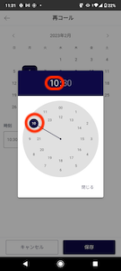
        
        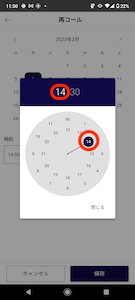
        
    4.  「分」は1分単位で指定可能です。選択はドラッグでもタップでも可能です。  
        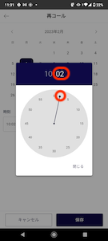  
          
        
    5.  アクティビティ結果の登録が終わったら、「保存」をクリックします。  
        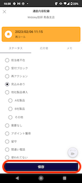  
          
        
    6.  「通話結果を保存しました」が表示されたら保存が完了しています。  
        「閉じる」をクリックします。  
        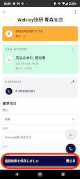  
          
        
    7.  画面左上の矢印（赤枠）をクリックするとリスト一覧に戻ります。  
        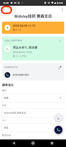  
          
        
    8.  リスト一覧に戻りました。  
        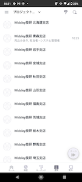

その他ご不明点などございましたら、[**サポートチームまでお問い合わせ**](https://comdesklead.zendesk.com/hc/ja/requests/new)をお願いいたします。

お問い合わせ方法は**[こちら](../../トラブルシューティング/サポートチームへのお問い合わせ方法/12828937533081_サポートチームへのお問い合わせ方法.md)**
