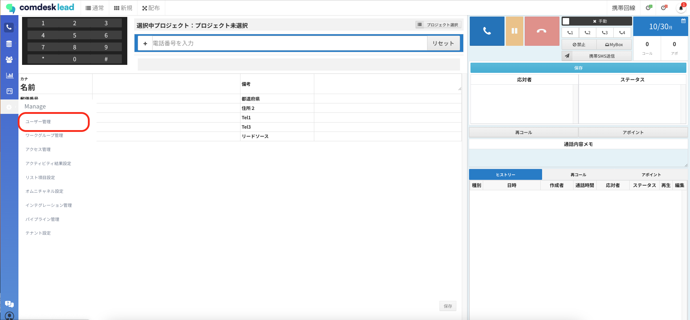
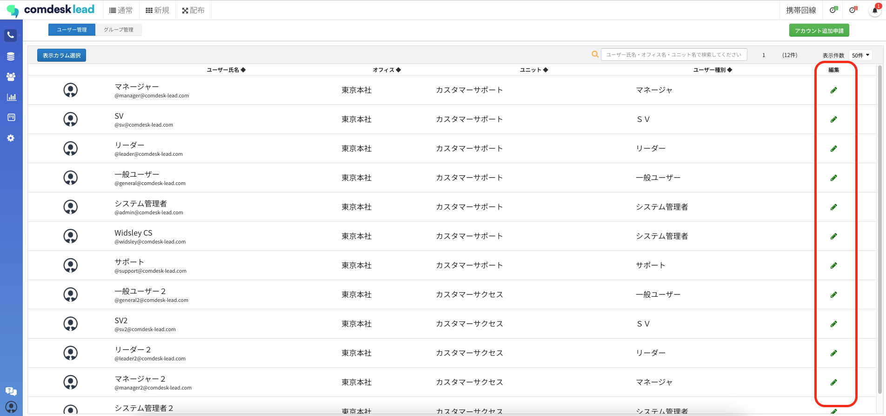
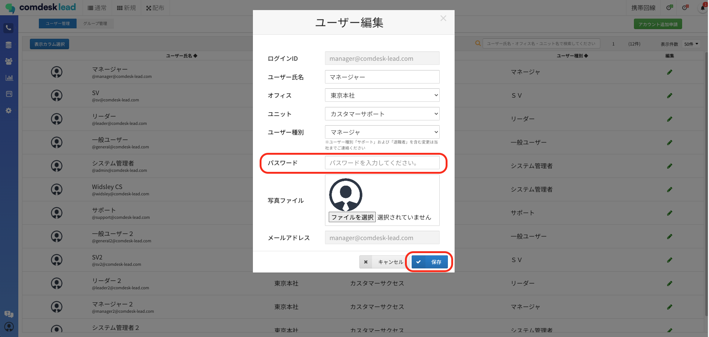
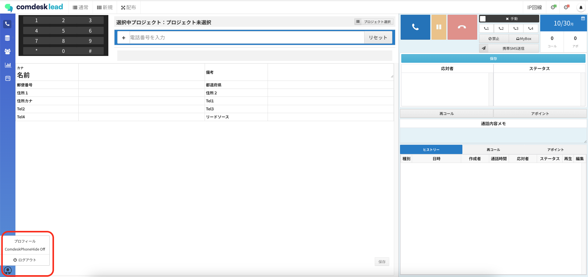
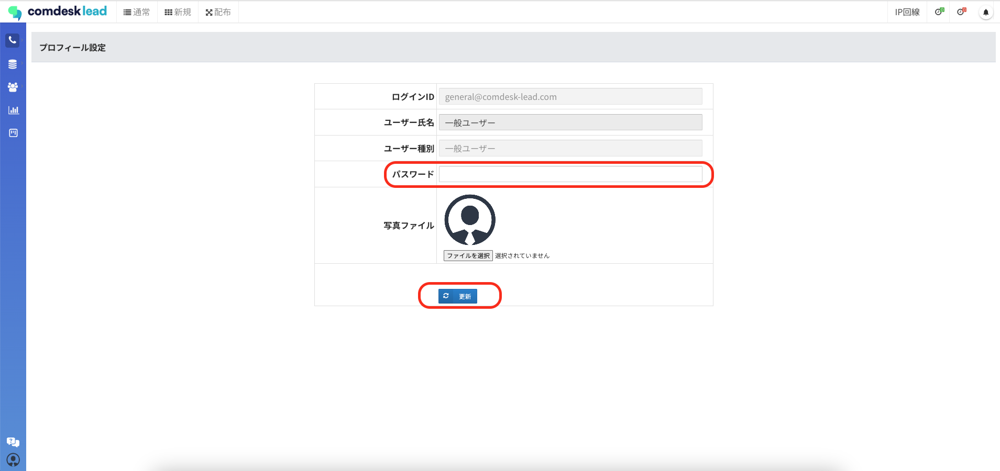

# Comdesk Lead ログインパスワード変更方法

Comdesk Leadのログインにおけるパスワードの変更方法をご案内いたします。

目次  
1[. 「システム管理者」「マネージャー」「サポート」権限をお持ちの場合](12777071015833_Comdesk_Lead_ログインパスワード変更方法.md)  
2\. [「SV」「リーダー」「一般ユーザー」権限をお持ちの場合](12777071015833_Comdesk_Lead_ログインパスワード変更方法.md)

### **「システム管理者」「マネージャー」「サポート」権限をお持ちの場合**

※ご本人のパスワードは、[「SV」「リーダー」「一般ユーザー」権限をお持ちの場合](12777071015833_Comdesk_Lead_ログインパスワード変更方法.md)　の方法でも変更可能です。  
ご本人以外のパスワードを変更する場合はこちらの方法をご利用ください。

1.  左側の「Manage」メニューから「ユーザー管理」を選択します。**  
      
      
      
    **
2.  パスワードを変更したいユーザーの「編集」ボタンをクリックします。  
      
      
    
3.  希望するパスワードを入力し「保存」ボタンをクリックして完了です。  
    

### 「SV」「リーダー」「一般ユーザー」権限をお持ちの場合

1.  Comdesk Lead画面左下の人型のボタンから「プロフィール」を選択します。  
      
      
    
2.  希望するパスワードを入力し「更新」ボタンをクリックして完了です。  
    

その他ご不明点などございましたら、[**サポートチームまでお問い合わせ**](https://comdesklead.zendesk.com/hc/ja/requests/new)をお願い致します。

お問い合わせ方法は**[こちら](../../トラブルシューティング/サポートチームへのお問い合わせ方法/12828937533081_サポートチームへのお問い合わせ方法.md)**
