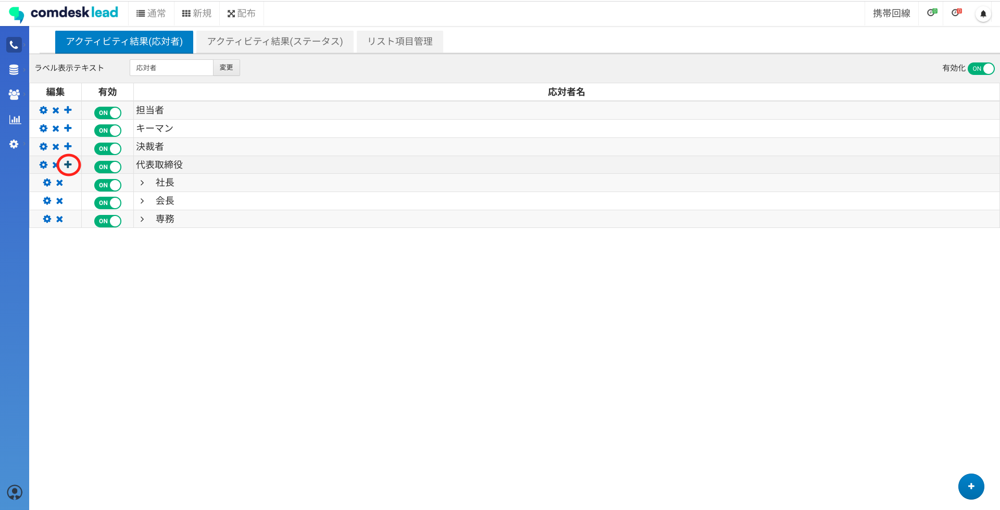
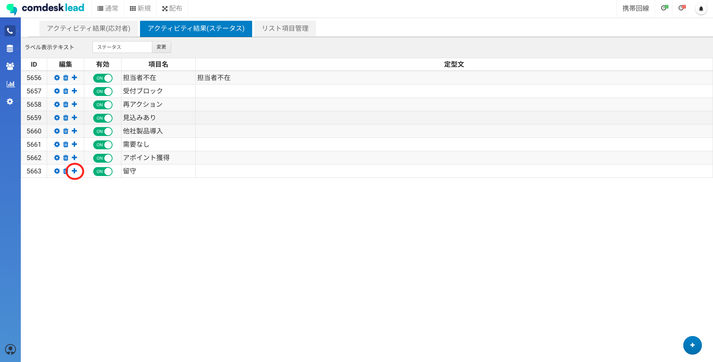
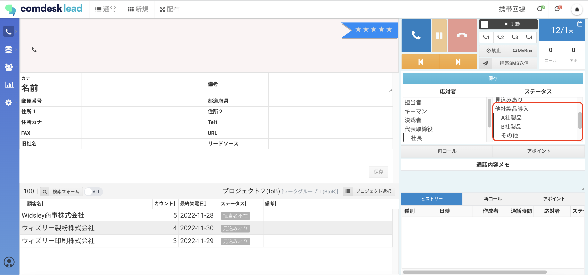

# アクティビティ結果設定で親子関係を作成

アクティビティ結果設定では、コール画面に表示させる「応対者」「ステータス」「リスト項目」の設定ができますが、そのうち「応対者」と「ステータス」は親子関係を作成することができます。

（例）応対者：代表取締役  
　　　　　　　∟社長  
　　　　　　　∟会長  
　　　　　　　∟専務

その作成方法をご説明します。

## **応対者の親子関係を作成**

1.  アクティビティ結果設定を開き、「アクティビティ結果（応対者）」タブをクリックします。  
    応対者の子項目を作成する場合は、親となる応対者の＋ボタンをクリックします。
    
      
      
    
2.  項目編集画面が表示されますので、各項目を入力して「変更」ボタンを選択します。
    
    **親応対者名**：自動で入力され、変更不可です。
    
    **応対者名**：必須入力項目
    
    
    
    💡 親子関係の応対者を登録した場合、以下のように画面に表示されます。  
    
    

## **ステータスの親子関係を作成**

1.  アクティビティ結果設定を開き、「アクティビティ結果（ステータス）」タブをクリックします。  
    ステータスの子項目を作成する場合は、親となるステータスの＋ボタンをクリックします。
    
      
      
    
2.  項目編集画面が表示されますので、各項目を入力して「変更」ボタンをクリックします。
    
    **親項目**：自動で入力され、変更不可です。
    
    **項目名**：必須入力項目
    
    **定型文**：任意入力項目　コール画面でステータスを選択した際、「通話内容メモ」に定型文を挿入できます。
    
    
    
    💡 親子関係のステータスを登録した場合、以下のように画面に表示されます。  
    
    

その他ご不明点などございましたら、[**サポートチームまでお問い合わせ**](https://comdesklead.zendesk.com/hc/ja/requests/new)をお願い致します。

お問い合わせ方法は**[こちら](../../トラブルシューティング/サポートチームへのお問い合わせ方法/12828937533081_サポートチームへのお問い合わせ方法.md)**
