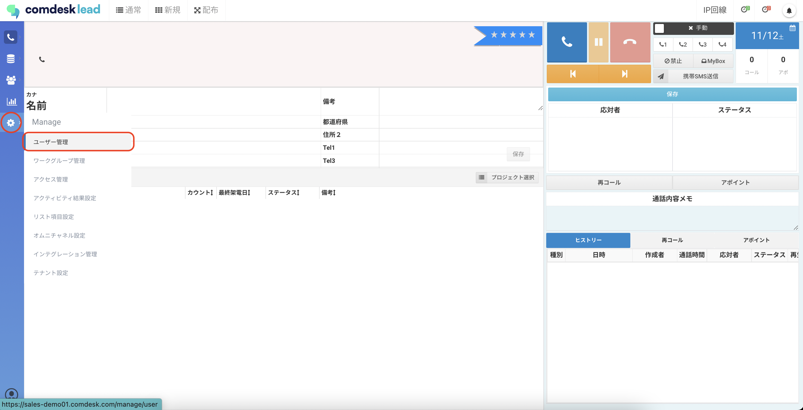
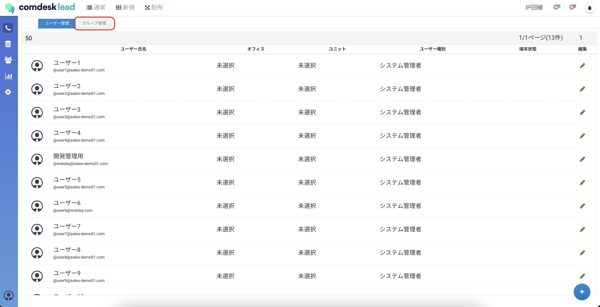
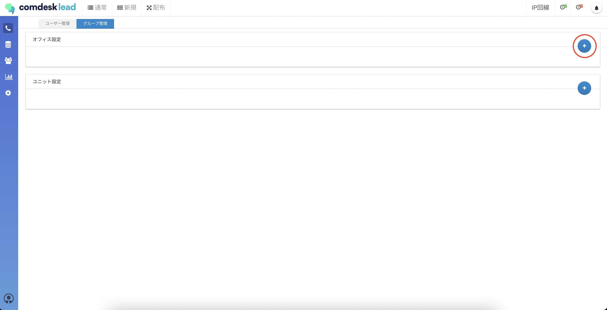
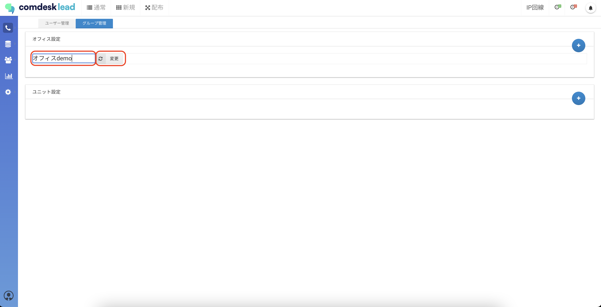
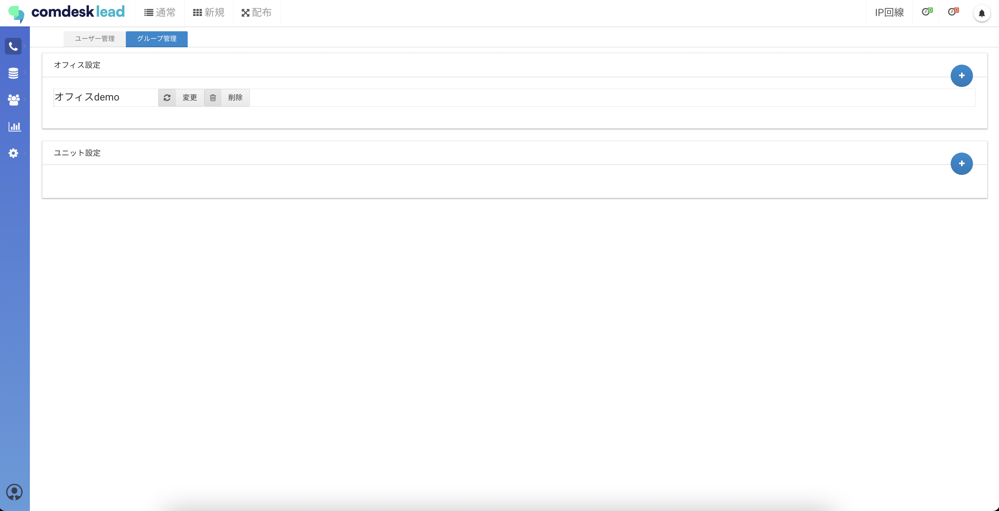
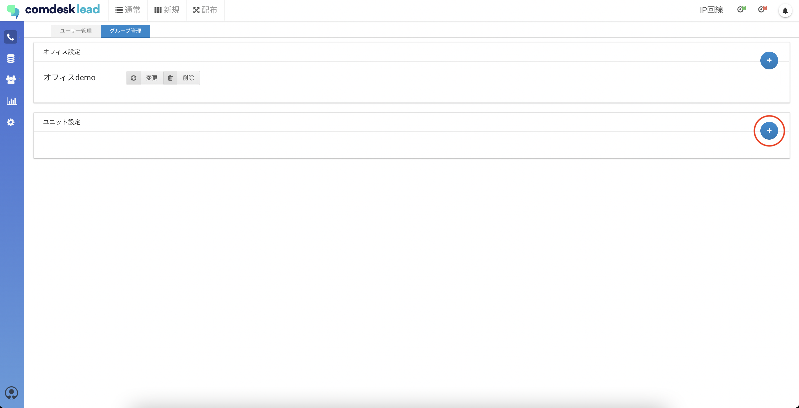
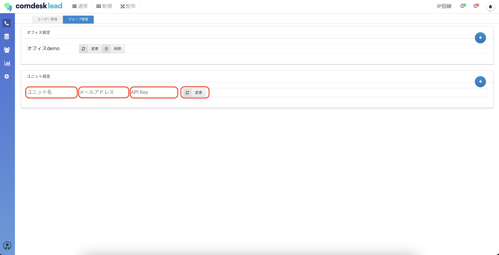
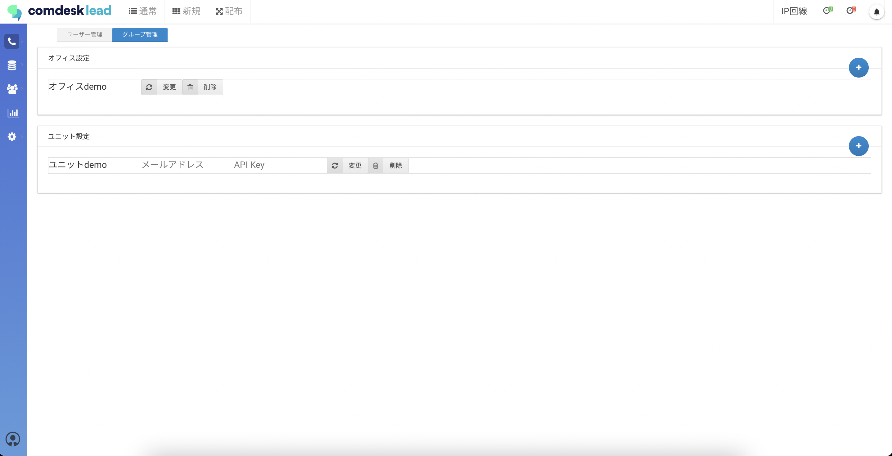

# オフィス・ユニット作成

## **「オフィス」「ユニット」の概要**

登録してあるユーザーを、オフィスやユニットごとに管理することができます。  
この記事では、「オフィス」「ユニット」の登録方法をご説明致します。

ー関連記事ー  
「オフィス」「ユニット」のユーザーへの割り当て方法は[こちら](12790339370521_ユーザーをオフィス・ユニットに割り当てる.md)

目次  
　[オフィス作成](12790321037081_オフィス・ユニット作成.md)  
　[ユニット作成](12790321037081_オフィス・ユニット作成.md)

## **オフィス作成**

1.  画面左側の「Manage」アイコンをクリックし、「ユーザー管理」をクリックします。
    
    
    
2.  グループ管理タブをクリックします
    
    
    
3.  オフィスを登録する際は、オフィス設定欄の右端の追加ボタンをクリックします。
    
    
    
4.  オフィス名を入力し、「変更」ボタンをクリックします。
    
    
    
5.  オフィス登録完了です。
    
    
    

## **ユニット作成**

1.  ユニットを登録する際は、ユニット設定欄の右端の追加ボタンをクリックします。
    
    
    
2.  以下の通り設定し、「変更」ボタンをクリックします。
    
    ユニット名：必須入力項目
    
    メールアドレス：任意入力項目
    
    API Key：任意入力項目
    
    
    
3.  ユニット登録完了です。
    
    
    

その他ご不明点などございましたら、[**サポートチームまでお問い合わせ**](https://comdesklead.zendesk.com/hc/ja/requests/new)をお願い致します。

お問い合わせ方法は**[こちら](../../トラブルシューティング/サポートチームへのお問い合わせ方法/12828937533081_サポートチームへのお問い合わせ方法.md)**
