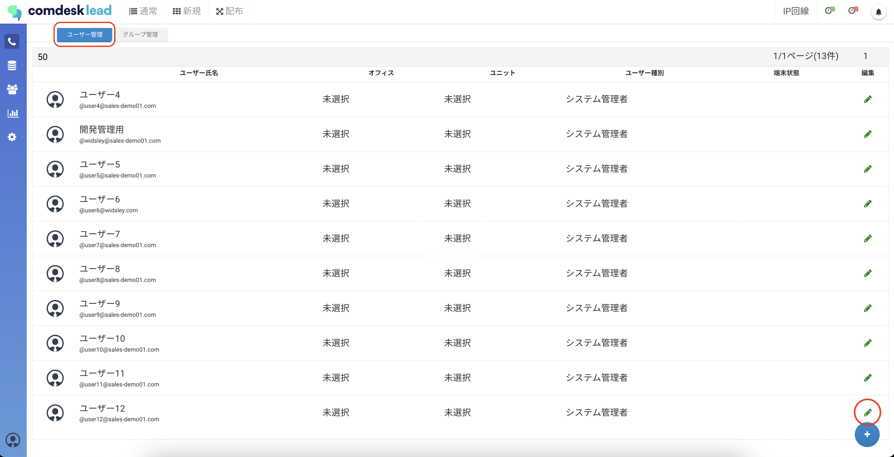
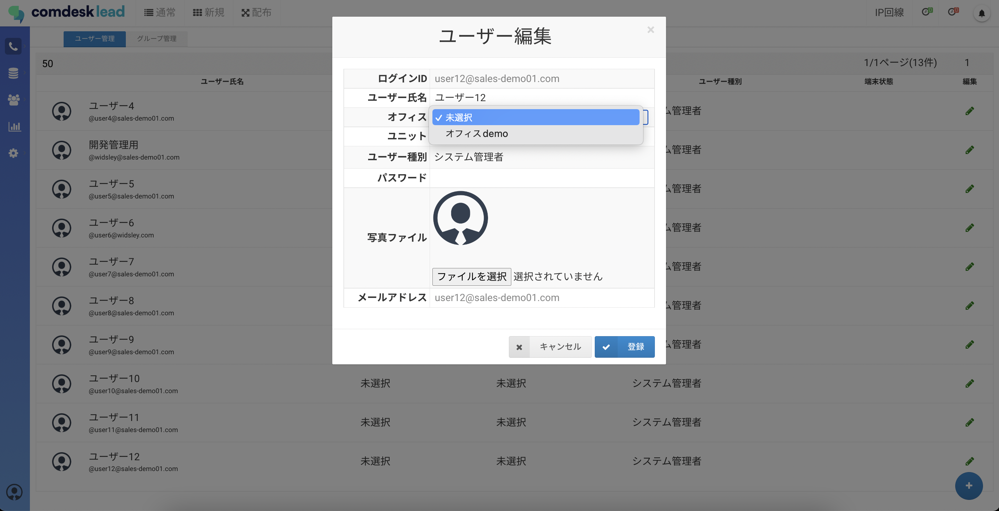
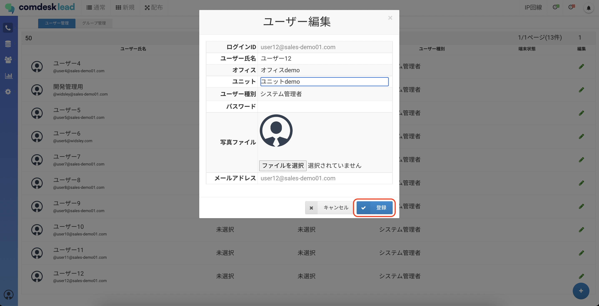

# ユーザーをオフィス・ユニットに割り当てる

ー関連記事ー  
オフィス・ユニット作成については[こちら](12790321037081_オフィス・ユニット作成.md)

1.  ユーザー管理画面の「ユーザー管理」タブに表示されるユーザーの、「編集」ボタンをクリックします。
    
    
    
2.  ユーザー編集画面が表示されますので、設定したいオフィスとユニットを選択します。
    
    
    
3.  「登録」ボタンをクリックします。
    
    
    

その他ご不明点などございましたら、[**サポートチームまでお問い合わせ**](https://comdesklead.zendesk.com/hc/ja/requests/new)をお願い致します。

お問い合わせ方法は**[こちら](../../トラブルシューティング/サポートチームへのお問い合わせ方法/12828937533081_サポートチームへのお問い合わせ方法.md)**
