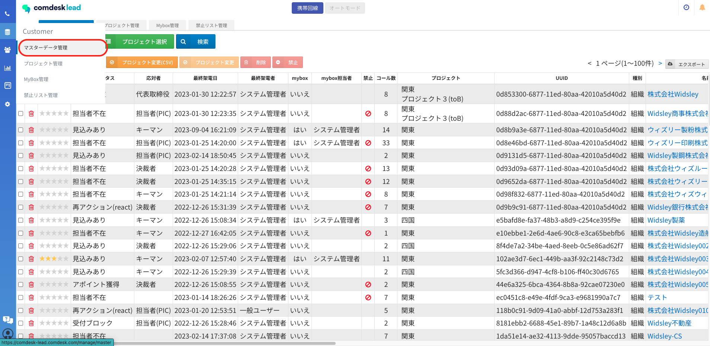
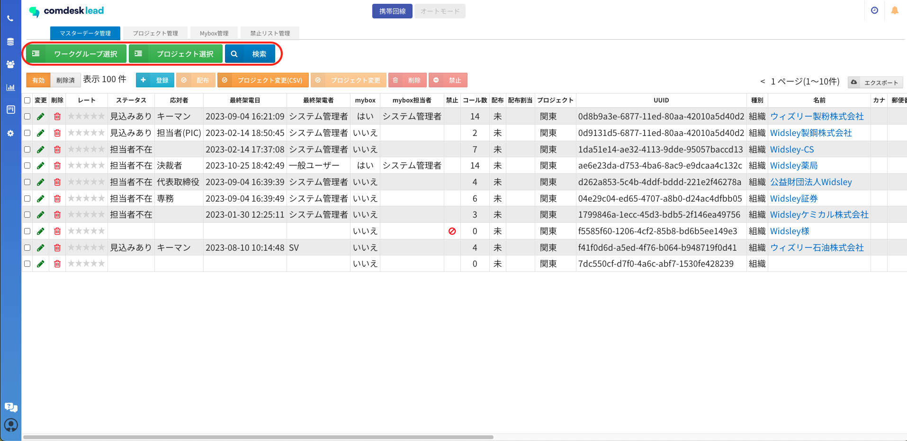
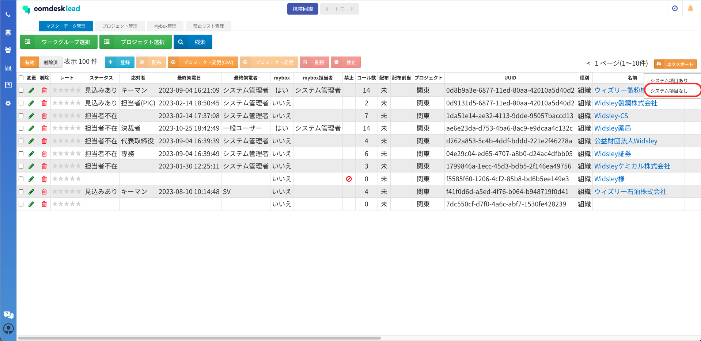
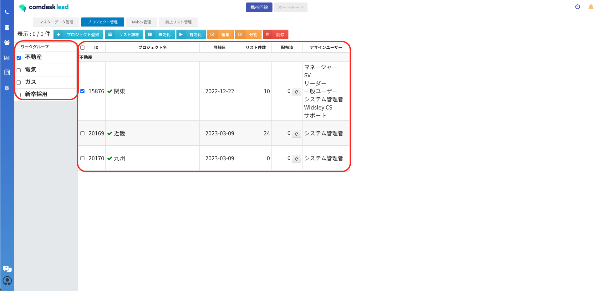
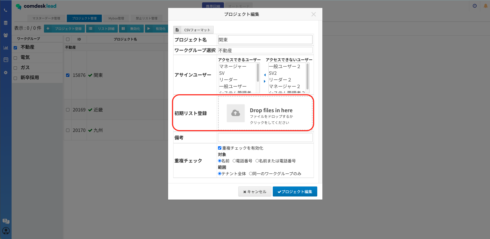
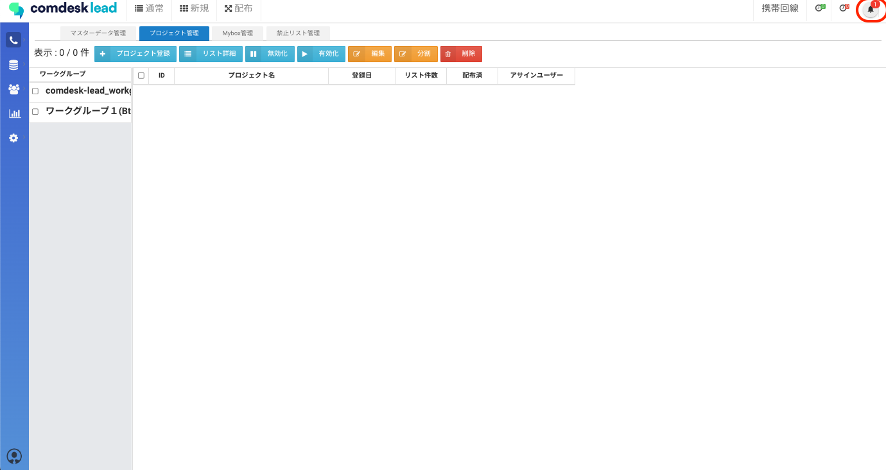
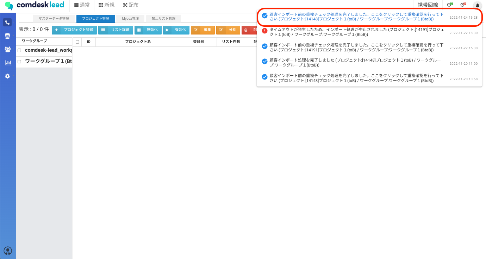
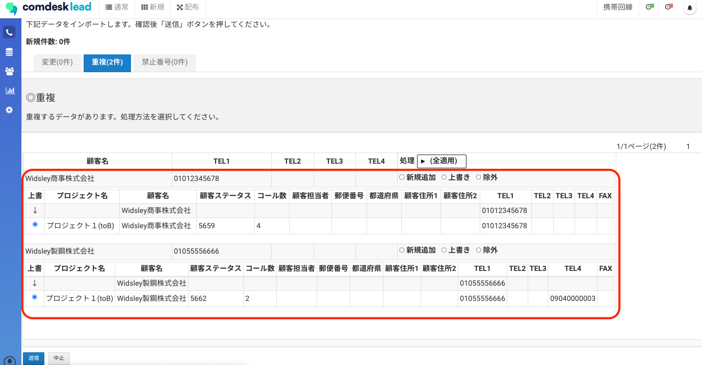
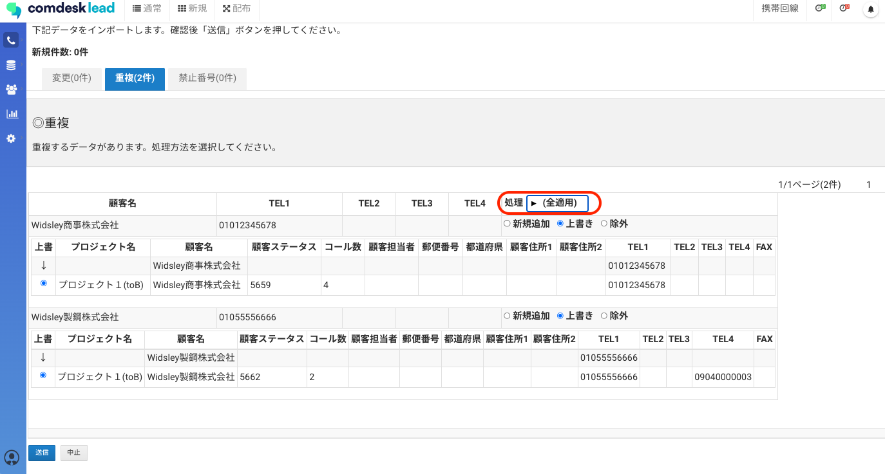

# リストを特定して上書きインポートをする

マスターデータからデータをエクスポートし、特定のデータを変更後にインポートし上書きする手順をご説明します。

1.  マスターデータ管理を開きます。  
      
      
    
2.  上書きを行いたいワークグループ・プロジェクトを選択します。  
    （条件検索での絞り込みもできます。）  
      
      
    
3.  リストが表示されたら赤枠内「エクスポート」をクリックし、「システム項目なし」を選択しエクスポートを行います。  
      
      
    
4.  エクスポートしたCSVファイルを開き、変更箇所を編集します。  
    **※この際、空白も上書き対象になるので注意してください。  
      
    **
5.  変更が完了したら、CSVファイルを保存します。  
      
    
6.  プロジェクト管理を開き、上書きしたいリストが入っているプロジェクトを選択し「編集」をクリックします。  
      
      
    
7.  「初期リスト登録」部分に保存したCSVファイルを格納し、「プロジェクト編集」をクリックします。  
    ※重複チェックを有効化のチェックボックスに✔を入れます。  
      
    重複チェックの対象に関しては、[こちら](../../はじめてガイド/管理者ガイド/12743928066585_リストをプロジェクトにインポート.md)の記事の「6」をご参照ください。  
      
      
    
8.  インポート処理が始まり重複チェックが完了すると、画面右上のベルマークに赤く通知が表示されます。  
      
      
    
9.  ベルマークを押すと「顧客インポート前の重複チェック処理を完了しました。ここをクリックして重複確認を行ってください」と表示が出ますのでメッセージをクリックします。  
      
      
    
10.  重複チェック画面が表示されるので、赤枠内の「重複」をクリックし移動します。  
       
       
     
11.  上書き内容を確認します。  
       
       
     
12.  重複した情報に対して一括で処理を行う場合は、（全適用）をクリックするとリストが表示されますので、「新規追加/上書き/除外」のいずれかを選択します。  
     特定のリストだけ上書きする場合は各リスト部分に記載の「新規追加/上書き/除外」にそれぞれのチェックボックスに✔を入れます。  
       
       
     
13.  選択後、送信を押すと「本当によろしいですか？」というポップアップが表示されますので問題なければ「OK」を押します。  
       
     
14.  「保存しました。インポート処理を開始します。処理完了後に通知いたします。」  
     とポップアップが表示されますので「OK」を押すとインポートが開始されます。  
       
     
15.  インポート完了後にベルマークに「顧客.インポート処理を完了しました」と通知が来たら  
     上書きインポート処理の完了です。

その他ご不明点などございましたら、[**サポートチームまでお問い合わせ**](https://comdesklead.zendesk.com/hc/ja/requests/new)をお願い致します。

お問い合わせ方法は**[こちら](../../トラブルシューティング/サポートチームへのお問い合わせ方法/12828937533081_サポートチームへのお問い合わせ方法.md)**
