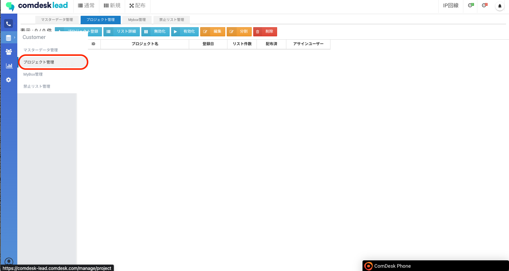
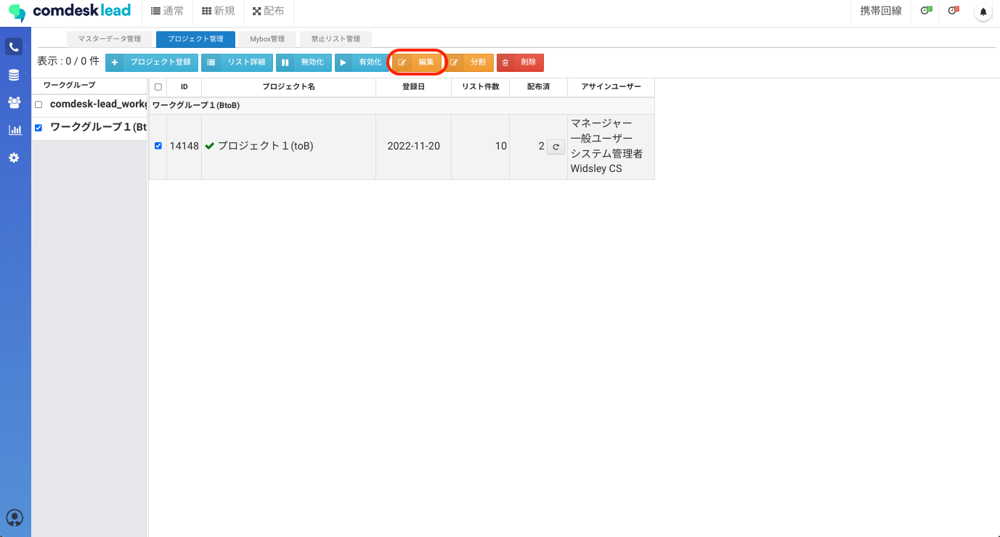
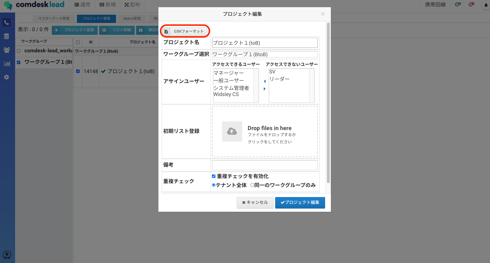
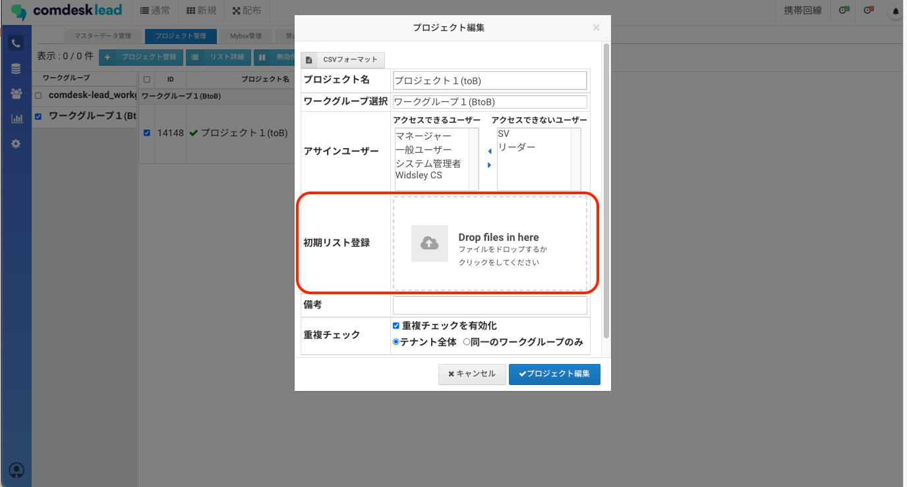
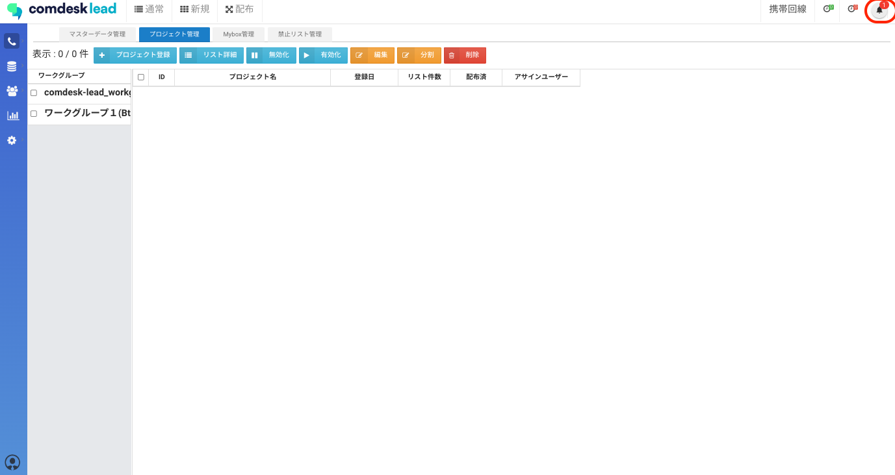
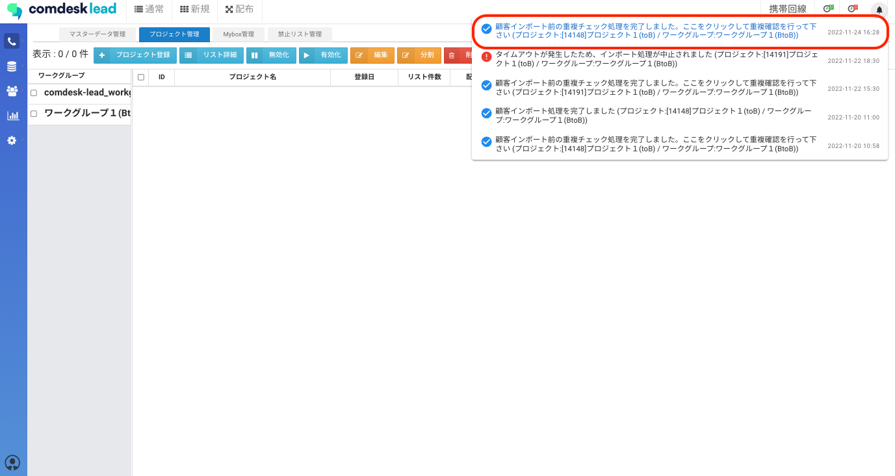
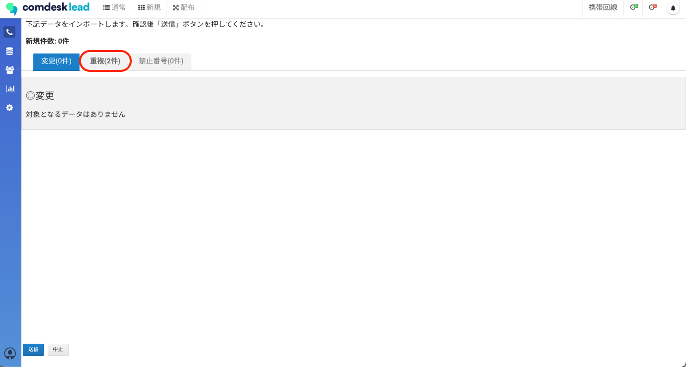
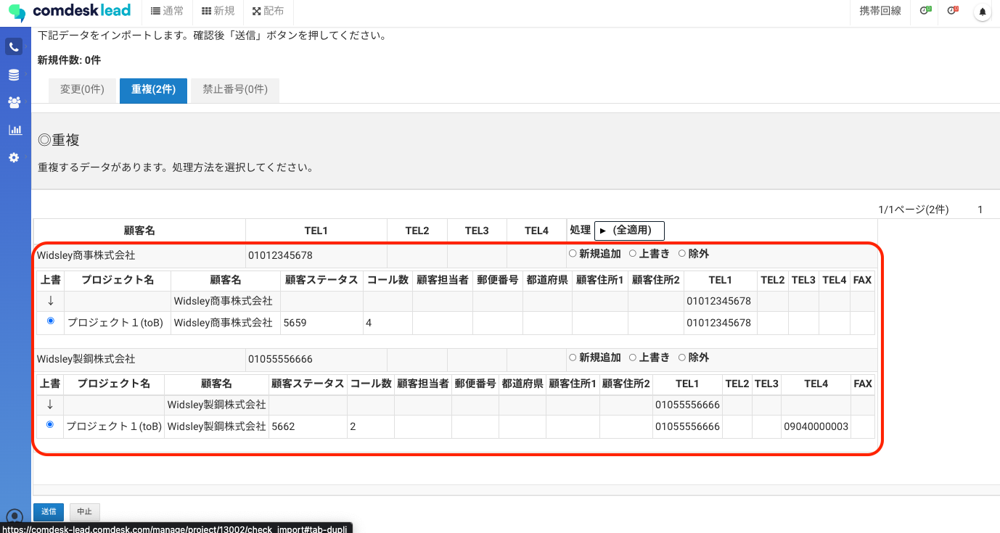
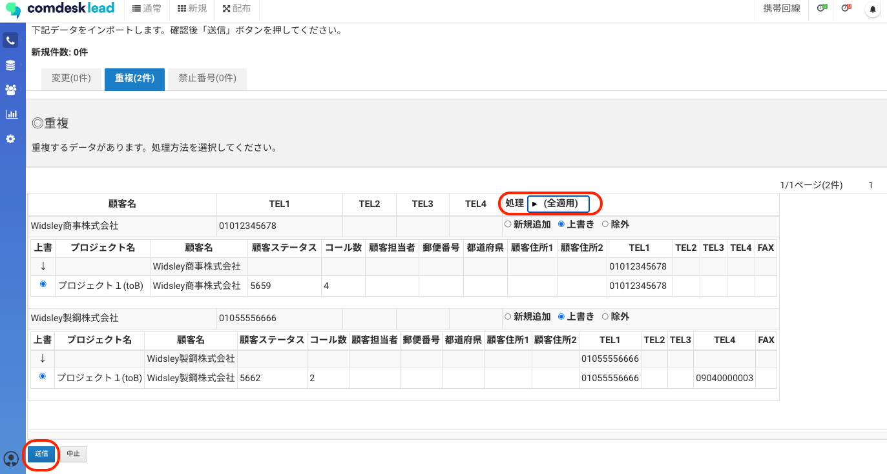

# 重複したデータについて上書きインポートをする

名前、電話番号、住所のいずれかが重複しているデータを上書きインポートをする方法をご説明します。

1.  「プロジェクト管理」画面を開きます。  
      
      
    
2.  データの上書きを行いたいワークグループ・プロジェクトを1つ選択し「編集」をクリックします。  
      
      
    
3.  赤枠内「CSVフォーマット」を押し、編集を行うプロジェクトが所属しているワークグループのCSVフォーマットをダウンロードします。  
      
      
    
4.  CSVファイルを開き、1行目の項目に沿ってデータを入力します。  
    **※この際、空白も上書き対象になるので注意してください。  
    **
5.  入力が完了したら、CSVファイルを保存します。  
      
    
6.  「初期リスト登録」部分に保存したCSVファイルを入れ、「プロジェクト編集」を押します。  
    ※重複チェックを有効化のチェックボックスに✔を入れます。  
    ※重複チェックの適用範囲は、「名前/電話番号/名前または電話番号」から選択できます。  
      
      
    
7.  インポート処理が始まり重複チェックが完了すると、画面右上のベルマークに赤く通知が表示されます。  
      
      
    
8.  ベルマークを押すと「顧客インポート前の重複チェック処理を完了しました。ここをクリックして重複確認を行ってください」と表示が出ますのでメッセージをクリックします。  
      
      
    
9.  重複チェック画面が表示されるので、赤枠内の「重複」を押し移動します。  
      
      
    
10.  上書き内容を確認します。  
       
       
     
11.  重複した情報に対して一括で処理を行う場合は、（全適用）を選択するとリストが表示されますので、「新規追加/上書き/除外」のいずれかを選択します。  
     特定のリストだけ上書きする場合は各リスト部分に記載の「新規追加/上書き/除外」にそれぞれのチェックボックスに✔を入れます。  
       
       
     
12.  処理方法をそれぞれ選択し終わったら、画面左下の「送信」を押すと「本当によろしいですか？」というモーダルが表示されますので問題なければ「OK」をクリックします。  
       
     
13.  「保存しました。インポート処理を開始します。処理完了後に通知いたします。」  
     とポップアップが表示されますので「OK」を押すとインポートが開始されます。  
       
     
14.  インポート完了後にベルマークに「インポート処理を完了しました」と通知が来たら  
     上書きインポート処理の完了です。  
       
     

その他ご不明点などございましたら、[**サポートチームまでお問い合わせ**](https://comdesklead.zendesk.com/hc/ja/requests/new)をお願い致します。

お問い合わせ方法は**[こちら](../../トラブルシューティング/サポートチームへのお問い合わせ方法/12828937533081_サポートチームへのお問い合わせ方法.md)**
