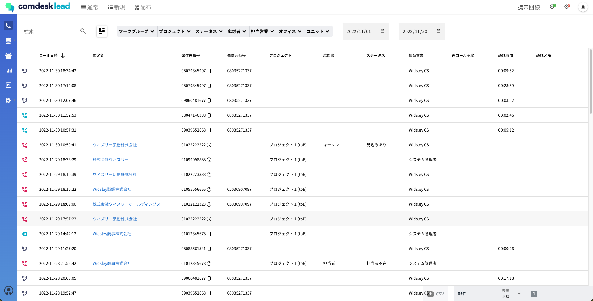

# 一旦一致させる→（techと合わせて調査が必要のため当分公開禁止）活動履歴の各アイコン・項目について

[https://comdesklead.zendesk.com/knowledge/articles/13445521958937/ja?brand\_id=12566890609049](https://comdesklead.zendesk.com/knowledge/articles/13445521958937/ja?brand_id=12566890609049)

この記事では活動履歴の各アイコンや項目の見方をご説明します。

ー関連記事ー  
活動履歴で通話履歴を確認する方法は[こちら](../../はじめてガイド/ユーザーガイド/12753517305753_活動履歴で通話履歴を確認する.md)  
活動履歴の確認は[こちら](../基本ガイド/12750509438233_活動履歴の確認.md)  
活動履歴の検索は[こちら](12876176090905_活動履歴を検索する.md)

目次  
[活動履歴の画面](#h_01GPQ2SQQHK0XYFC1DTWJ3DN1F)  
[活動履歴CSVファイルの概要](#h_01GPQ2VD0S4161MR6NPAJS6VRZ)

## **活動履歴の画面**

## 

## **活動履歴CSVファイルの概要**

活動履歴はCSVダウンロードが可能です。

活動履歴をCSVダウンロードする方法は [**こちら**](../基本ガイド/12750509438233_活動履歴の確認.md) をご参照ください。  
（必要に応じて絞り込みや検索を行ってください。）

## **各項目の詳細**

**コールタイプ**

**活動履歴画面のコールタイプアイコン  
※CSVには表示されません**

**説明**

発信

水色の受話器（上向き矢印）

発信　かつ　通話が発生した

不在発信

赤色の受話器（上向き矢印）

発信　かつ　通話が発生しなかった

着信

紺色の受話器（下向き矢印）

着信　かつ　通話が発生した

不在着信

赤色の受話器（下向き矢印）

着信　かつ　通話が発生しなかった

転送

紺色の矢印のみ

転送

SMS発信

水色の吹き出し（上向き矢印）

SMS送信

SMS受信

紺色の吹き出し（下向き矢印）

SMS受信

留守録

留守電再生

留守電が入っている

（空欄）

（空欄）

IP回線の着信にて、ガイダンス音声が流れている際に相手方が切断した

  
  

**項目名**

**表示されている場合**

**空欄の有無  
◯：空欄の場合あり  
×：空欄の場合なし**

**空欄の場合**

コールタイプ

上記表の通り

**◯**

上記表の通り

コール日時

コールした日時

**×**

\-

顧客名

リストに登録されている顧客名

**◯**

【携帯回線・IP回線】  
・顧客名が未登録のリスト  
  

【携帯回線】  
・Comdesk Leadを使用せず、携帯の電話アプリから直接架電を行っている  
　かつ、同番号のリストが複数Comdesk Lead内に登録されている場合  
・留守番電話  
　かつ、同番号のリストが複数Comdesk Lead内に登録されている場合  
  
【IP回線】  
・着信時に該当リストをしなかった場合  
・ComDesk Phoneから直接、発信・着信を行っている場合  
・ComDesk Phone(Desktop App)を利用している場合

発信先番号

発信した相手先（着信時は着信先）の電話番号

**◯**

SMSを受信した

回線種類

【発信した場合】

＜活動履歴画面＞  
(発信先番号の後ろに)：発信元番号が携帯回線（SMS送信含む）  
(発信先番号の後ろに)：発信元番号がIP回線

＜活動履歴CSV＞  
携帯回線：発信元番号が携帯(SMS送信含む)  
IP回線：発信元番号がIP回線

【受信した場合】

＜活動履歴画面＞  
(発信先番号の後ろに)：発信先番号が携帯回線（SMS送信含む）  
(発信先番号の後ろに)：発信先番号がIP回線

＜活動履歴CSV＞  
携帯回線：発信先番号が携帯(SMS送信含む)  
IP回線：発信先番号がIP回線

**×**

\-

techに確認していただきたいこと

SNS受信時、発信先番号は空で、回線種類が携帯アイコンが表示されているのは正しいか

発信元番号

発信した側（着信時は発信元）の電話番号

**◯**

通話が発生していない

SMSを送信をした

プロジェクト

リストが所属しているプロジェクト

**◯**

**ここから下まだCSチェック未実施**

着信時のプロジェクト選択をしなかった  
転送  
携帯から直接架電  
携帯へ直接着信  
プロジェクト管理にてプロジェクトを削除しており、リストがプロジェクト未所属になっている

応対者

架電した際に登録する応対者  
ヒストリーで修正した応対者

**◯**

架電終了時の通話内容記録にて、応対者が未選択  
ヒストリーで未選択に修正  
使用している応対者を、アクティビティ結果設定で削除

ステータス

架電した際に登録するステータス  
ヒストリーで修正したステータス

**◯**

ヒストリーで未選択に修正  
使用しているステータスを、アクティビティ結果設定で削除

担当営業

ログインして通話したユーザー名

**◯**

不在着信  
Comdesk Leadを使用せず、携帯の電話アプリから架電を行っている  
留守番電話  
転送

再コール予定

設定した再コール日時

**◯**

再コール日時が未設定

通話時間

通話した時間

**◯**

通話が発生していない

通話メモ

アクティビティ結果やヒストリーに入力した通話内容メモ

**◯**

アクティビティ結果やヒストリーの通話内容メモが未記載

録音URL

※活動履歴CSVのみ表示

リンクをクリックすると、録音の再生・保存が可能

**◯**

録音が発生していない

ご不明点ございましたら、**[サポートチームまでお問い合わせ](https://comdesklead.zendesk.com/hc/ja/requests/new)**をお願いいたします。

お問合わせ方法は**[こちら](../../トラブルシューティング/サポートチームへのお問い合わせ方法/12828937533081_サポートチームへのお問い合わせ方法.md)**
