# （まとめ記事として完成させる）マスターデータ管理

マスターデータ管理画面の機能を説明いたします。

目次  
[全所属プロジェクト閲覧](#h_01GM03JY4B0RGMABM1JTR8XHBY)  
[プロジェクト変更](#h_01GM062GN4J8Z5KMBMWRS166V6)  
[エクスポート](#h_01GM06352XJ88B01H65Q4SP1N8)  
[削除](#h_01GM063D7ZEWN4V00DVZ00D78J)  
[禁止](#h_01GM063W5M90DDWR47X4BKMG9M)  
[顧客詳細](#h_01GM0646HCXDMW1VZXG9SSSD2A)  
[リードの管理（マイボックス、禁止等）](#h_01GM064JB5EG5V7PVTPSN23387)

## **全所属プロジェクト閲覧**

1.  画面左側のCustomerメニューより「マスターデータ管理」をクリックします。  
    
    **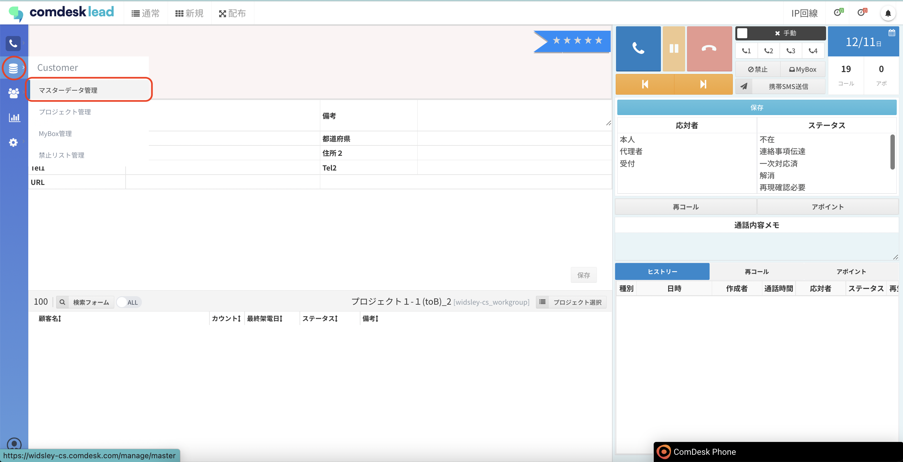  
      
    **
    
2.   マスターデータ管理画面が表示されます。
    
    **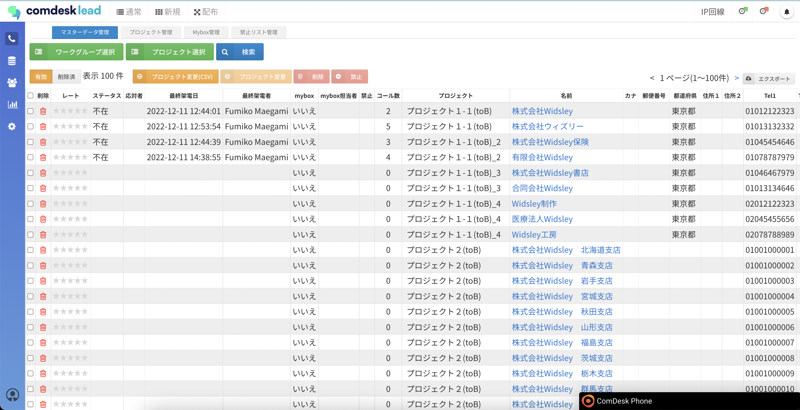  
    **
    
    1.  ワークグループ単位でリストの一覧を表示する場合は、「ワークグループ選択」ボタンをクリックすると、ワークグループ選択画面が表示されますので、該当のワークグループを選択して「検索」ボタンをクリックします。  
        全体リストを選択すると、全所属プロジェクトに所属するリストが表示されます。  
        **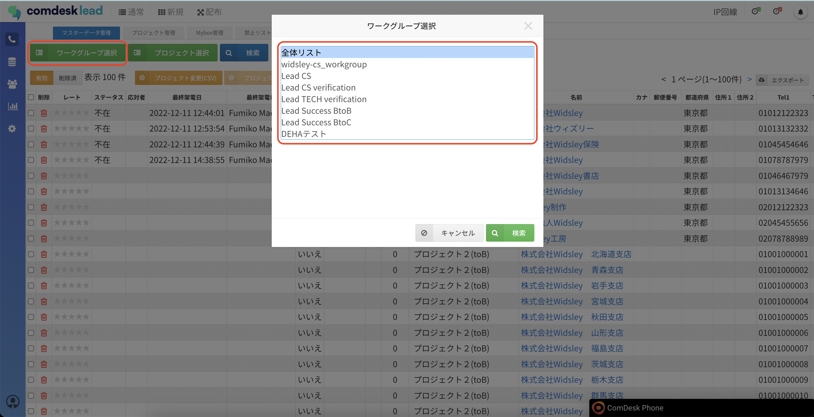**  
          
        
    2.  プロジェクト単位でリストの一覧を表示する場合は、「プロジェクト選択」ボタンをクリックすると、プロジェクト選択画面が表示されますので、該当のプロジェクトを選択して「検索」ボタンをクリックします。  
        全体リストを選択すると、プロジェクト選択画面に表示されている全プロジェクトに所属するリストが表示されます。  
        **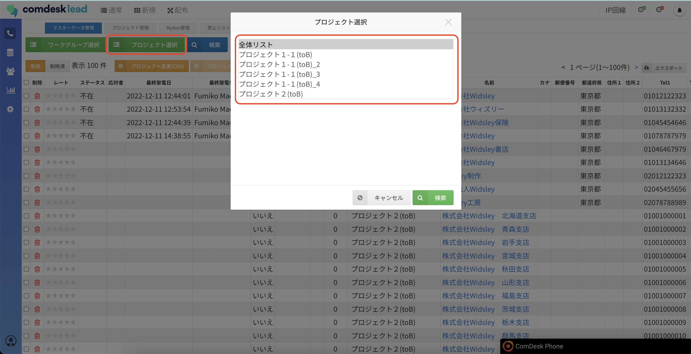  
          
        **
    3.  マスターデータの追加・除外を利用して、別のプロジェクトへリストを移動する方法は、 **[こちら](12787126154649_リストを移動する.md)** をご覧ください。
        
    4.  マスターデータの削除方法は、 [**こちら**](12787129797529_リストを削除する.md) をご覧ください。

## **プロジェクト変更** 

既存リストを、別の既存プロジェクトに一括で追加・削除する方法を説明いたします。

1.  まず、一括追加する方法です。  
    既存リストを既存プロジェクトに一括登録するためのCSVを作成します。  
    CSVフォーマットのダウンロード機能がありませんので、下記の表をExcelやスプレッドシートにコピーして作成をお願いいたします。  
    
    UUID
    
    project\_id
    
    UUIDは、登録するリストをエクスポートしていただくと確認できます。  
    エクスポート方法は [**こちら**](12778734555545_リストをエクスポートする.md) をご覧ください。  
    project\_idは、プロジェクト管理画面で確認できます。  
    作成したファイルはCSVファイル形式で保存します。  
    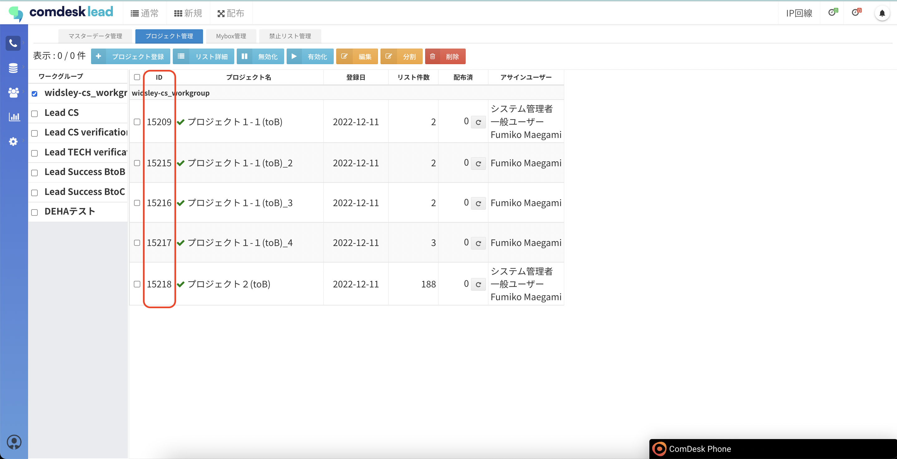
2.  マスターデータ管理画面の「プロジェクト変更(CSV)」ボタンをクリックします。  
    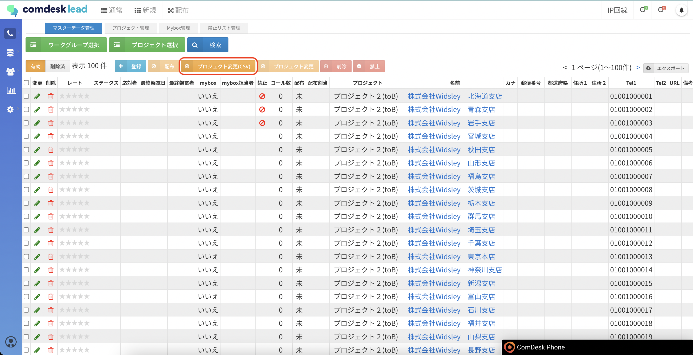
3.  プロジェクト変更(CSV)画面が表示されますので、CSVファイルを指定（①）し、「➕追加」ボタンを選択し（②）、「実行」ボタン（③）をクリックします。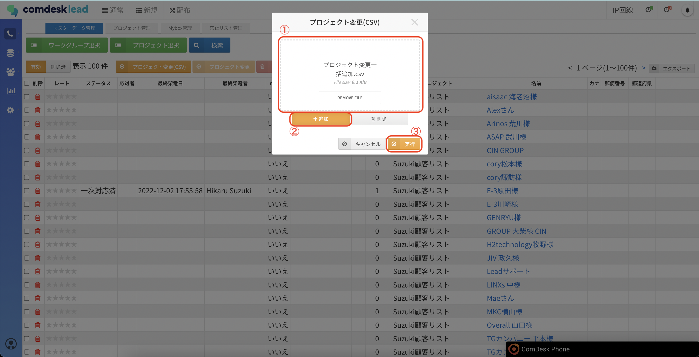  
      
    
4.    
      
    

## **エクスポート**

1.  赤枠の「エクスポート」を押し、「システム項目あり/なし」を選択するとエクスポートができます。  
    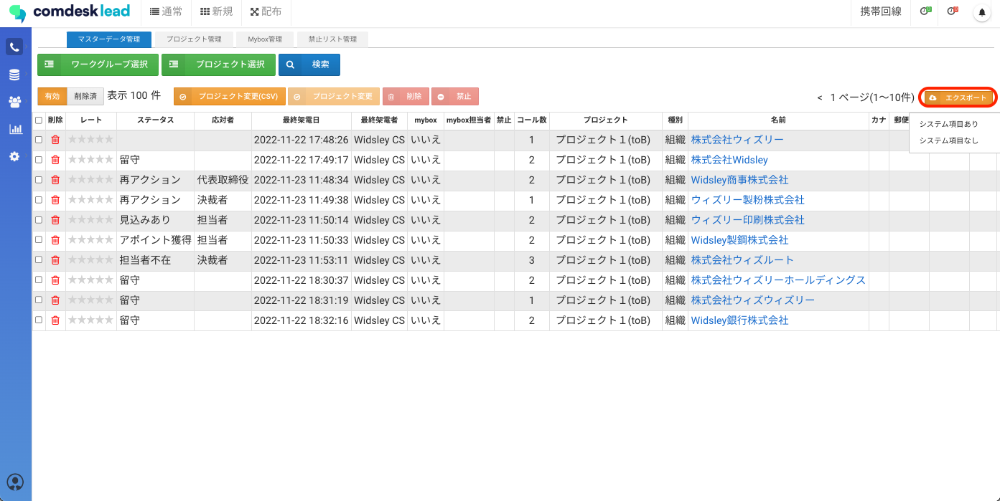  
      
    ・システム項目ありの場合  
    最終架電日時・最終架電者・やステータス等の確認ができます。  
    例）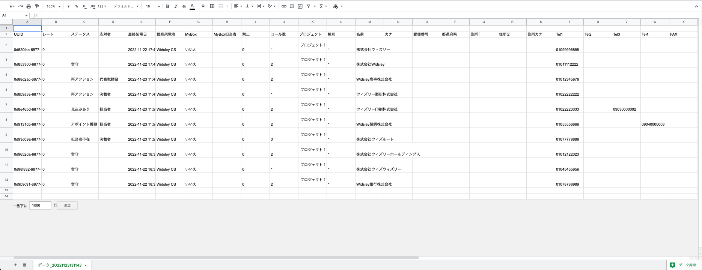  
      
    ・システム項目なしの場合  
    リストをインポートする際のリスト項目の内容が表示されます。  
    例）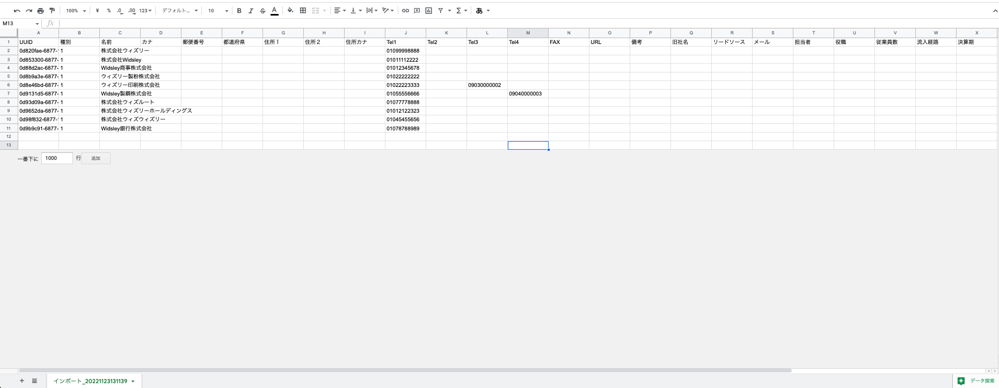

## **削除**

マスターデータの削除方法を説明いたします。

## **禁止**

マスターデータの禁止登録方法を説明いたします。

1.  削除するリストの画面左側のチェックをONにして選択し、「禁止」ボタンをクリックします。  
    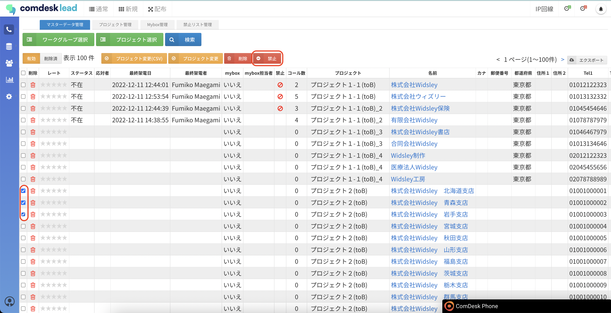  
      
    
2.  禁止登録が完了しました。  
    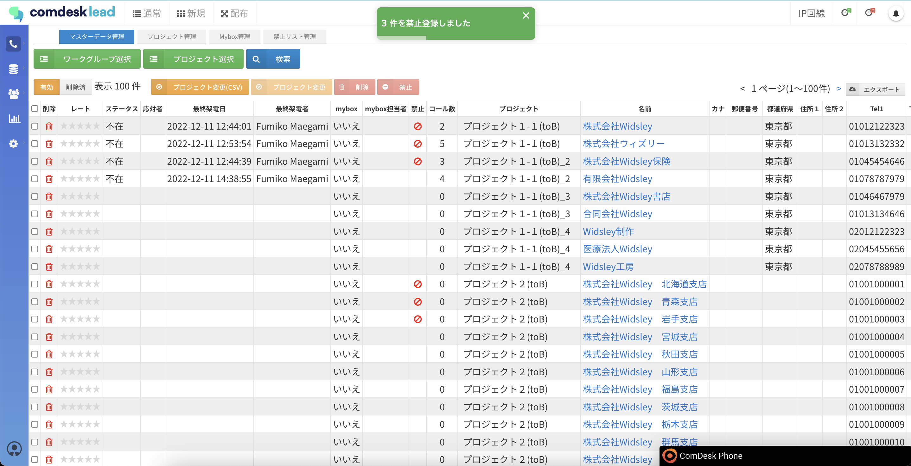
    
    💡禁止登録したリストに架電すると、「禁止番号に設定されています。」というモーダルが表示され、  
    架電できなくなります。「OK」ボタンをクリックして、モーダルを閉じてください。  
    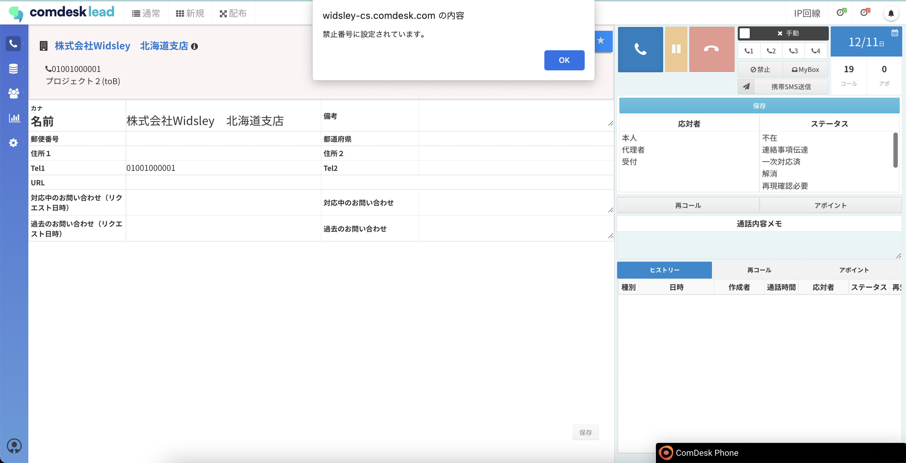
    

## **顧客詳細**

マスターデータ管理画面から顧客詳細画面の表示方法を説明いたします。

1.  マスターデータ管理画面に表示されるリストの、「名前」をクリックします。  
    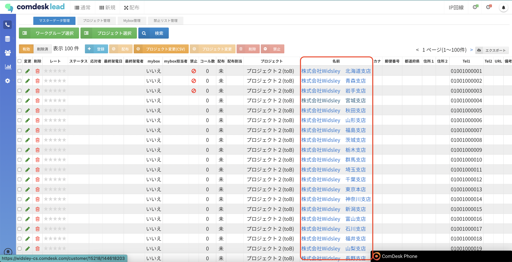  
      
    
2.  1で選択したリストの顧客詳細情報画面が表示されます。  
    

## **リードの管理（マイボックス、禁止等）**

その他ご不明点などございましたら、[**サポートチームまでお問い合わせ**](https://comdesklead.zendesk.com/hc/ja/requests/new)をお願い致します。

お問い合わせ方法は**[こちら](../../トラブルシューティング/サポートチームへのお問い合わせ方法/12828937533081_サポートチームへのお問い合わせ方法.md)**
