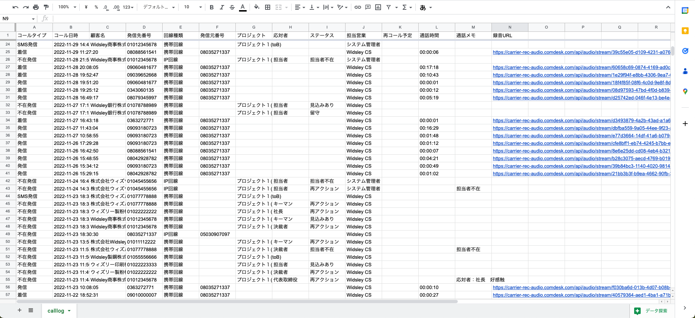

# 一旦一致させる→（techと合わせて調査が必要のため当分公開禁止）活動履歴CSVファイルの確認方法

[https://comdesklead.zendesk.com/knowledge/articles/13254863281305/ja?brand\_id=12566890609049](https://comdesklead.zendesk.com/knowledge/articles/13254863281305/ja?brand_id=12566890609049)

ー関連記事ー  
活動履歴で通話履歴を確認する方法は[こちら](../../はじめてガイド/ユーザーガイド/12753517305753_活動履歴で通話履歴を確認する.md)  
活動履歴の確認は[こちら](../基本ガイド/12750509438233_活動履歴の確認.md)  
活動履歴の検索は[こちら](12876176090905_活動履歴を検索する.md)  
活動履歴の各アイコン・項目の確認方法は[こちら](13254863281305_一旦一致させる→（techと合わせて調査が必要のため当分公開禁止）活動履歴の各アイコン・項目について.md)

## **活動履歴CSVファイルの概要**

*   活動履歴をCSVダウンロードします。

活動履歴をCSVダウンロードする方法は [**こちら**](../基本ガイド/12750509438233_活動履歴の確認.md) をご参照ください。  
（必要に応じて絞り込みや検索を行ってください。）

## **各項目の詳細**

**コールタイプ**

**説明**

**活動履歴画面のアイコン  
****※CSVには表示されません**

発信

発信　かつ　通話が発生した

不在発信

発信　かつ　通話が発生しなかった

着信

着信　かつ　通話が発生した

不在着信

着信　かつ　通話が発生しなかった

転送

転送

SMS発信

SMS送信

留守録

留守電が入っている

（空欄）

IP回線の着信にて、ガイダンス音声が流れている際に相手方が切断した  
**（調査必要）**

**項目名**

**表示されている場合**

**空欄になる場合がある**

**空欄の場合**

コールタイプ

上記表の通り

なる場合がある

上記表の通り

コール日時

コールした日時**（調査必要）**

\-

\-

顧客名

リストの「名前」（顧客名）

なる場合がある

【携帯回線・IP回線】  
・顧客名が未登録のリスト  
  

【携帯回線】  
・Comdesk Leadを使用せず、携帯の電話アプリから直接架電を行っている  
　かつ、同番号のリストが複数Comdesk Lead内に登録されている場合  
・留守番電話  
　かつ、同番号のリストが複数Comdesk Lead内に登録されている場合  
  
【IP回線】  
・着信時に該当リストをしなかった場合  
・ComDesk Phoneから直接、発信・着信を行っている場合  
・ComDesk Phone(Desktop App)を利用している場合

発信先番号

顧客番号**（再定義必要）**

\-

\-

回線種類

携帯回線（SMS送信含む）  
IP回線

\-

\-

発信元番号

ご利用中番号**（再定義必要）**

なる場合がある

通話が発生していない**（SMS送信の際にも出ていないので要確認）**

プロジェクト

リストが所属しているプロジェクト

なる場合がある

**ここから下まだCSチェック未実施**

着信時のプロジェクト選択をしなかった  
転送  
携帯から直接架電  
プロジェクトを削除しており、プロジェクト未所属になっている

応対者

架電した際に登録する応対者

なる場合がある

アクティビティ結果で応対者が未選択  
ヒストリーで未選択に修正

ステータス

架電した際に登録するステータス

なる場合がある

ヒストリーで未選択に修正

担当営業

ログインして通話したユーザー名

なる場合がある

不在着信  
Comdesk Leadを使用せず、携帯の電話アプリから架電を行っている  
留守番電話  
転送

再コール予定

設定した再コール日時

なる場合がある

再コール日時が未設定

通話時間

通話した時間

なる場合がある

通話が発生していない

通話メモ

アクティビティ結果やヒストリーに入力した通話内容メモ

なる場合がある

アクティビティ結果やヒストリーの通話内容メモが空欄

録音URL

リンクをクリックすると、録音の再生・保存が可能

なる場合がある

録音が発生していない

ご不明点ございましたら、**[サポートチームまでお問い合わせ](https://comdesklead.zendesk.com/hc/ja/requests/new)**をお願いいたします。  
お問合わせ方法は**[こちら](../../トラブルシューティング/サポートチームへのお問い合わせ方法/12828937533081_サポートチームへのお問い合わせ方法.md)**
