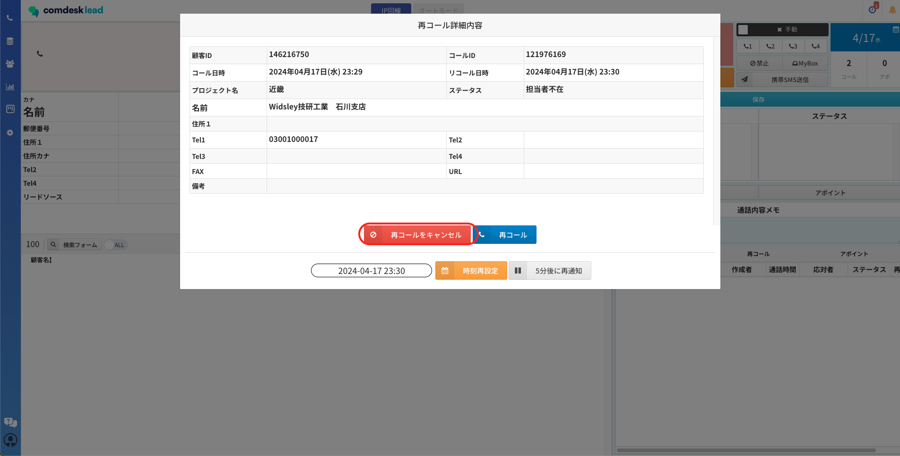
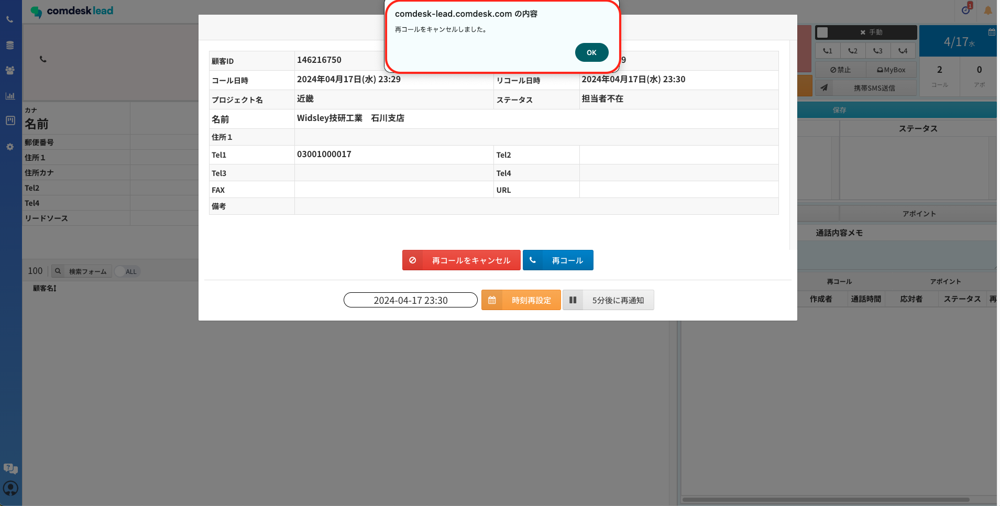
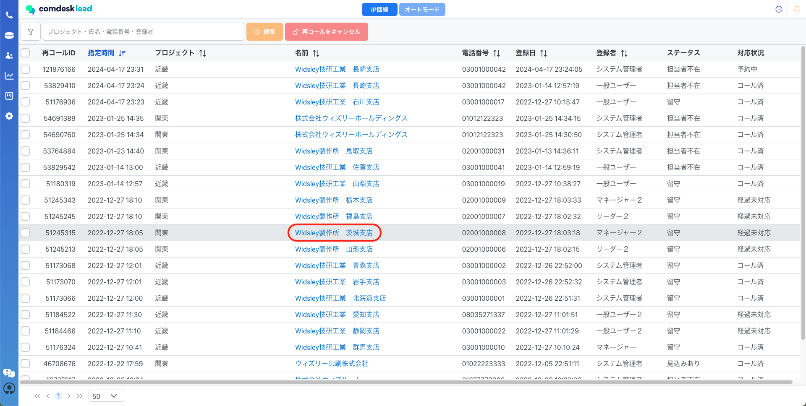
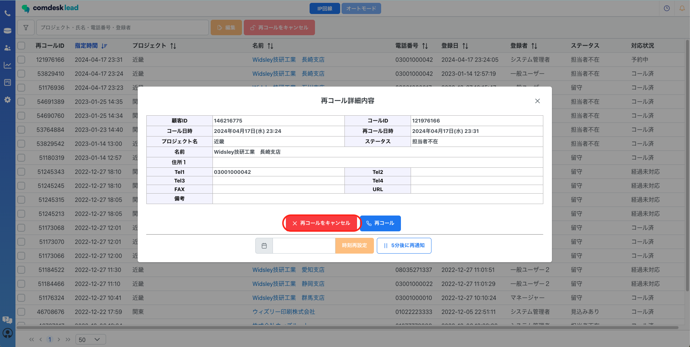
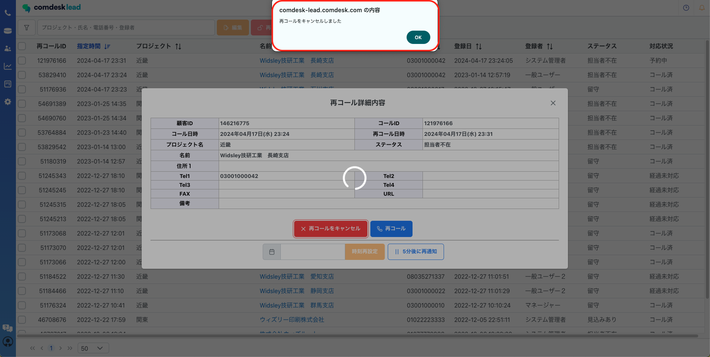

# 再コールリストの解除

ー関連記事ー

再コール時間の再設定は[こちら](13593294000153_再コール時間の再設定.md)

再コールリストの解除方法は2つあります。

[再コールの時間に表示されるポップアップからの解除](#h_01GN9FPD6A9ZS1SCZH1AJ2TB9T)  
[再コールリストからの解除](#h_01GN9FPK45D5SG96YCBY53KZSC)

## **再コールの時間に表示されるポップアップからの解除**

再コールを設定している時間になるとポップアップが表示されます。  
ポップアップ上の「再コールをキャンセル」をクリックします。

「再コールをキャンセルしました」と表示されたら解除完了です。  
再コールリストの対応状況には、「キャンセル」と表示されます。

## **再コールリストからの解除**

再コールリストを開きます。  
対応状況が「予約中/経過未対応」になっているリストの中で  
再コールを解除したいリストの名前（赤枠）をクリックします。

「再コール詳細内容」のポップアップが表示されます。  
「再コールをキャンセル」をクリックします。

「再コールをキャンセルしました」と表示されたら解除が完了です。  
再コールリストの対応状況には、「キャンセル」と表示されます。

ご不明点ございましたら、**[サポートチームまでお問い合わせ](https://comdesklead.zendesk.com/hc/ja/requests/new)**をお願いいたします。

お問合わせ方法は**[こちら](../../トラブルシューティング/サポートチームへのお問い合わせ方法/12828937533081_サポートチームへのお問い合わせ方法.md)**
