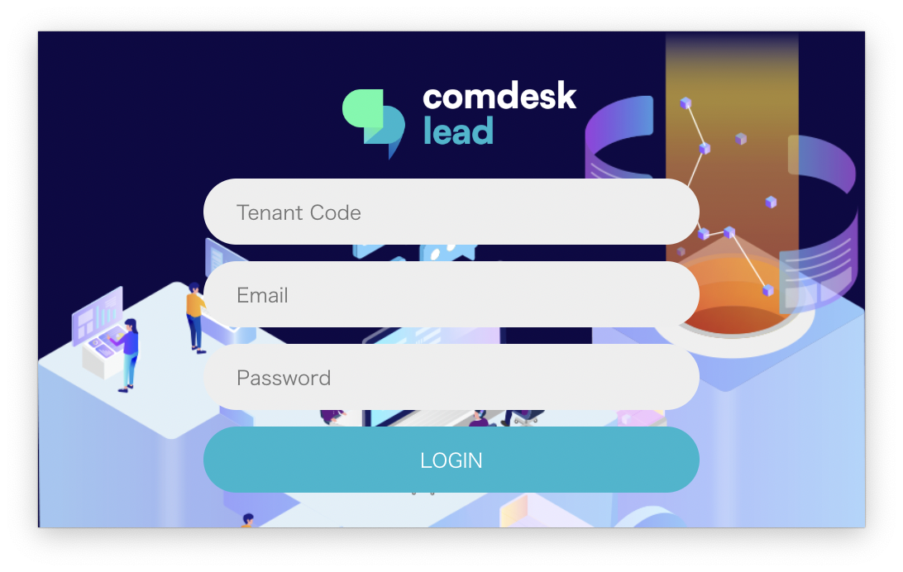
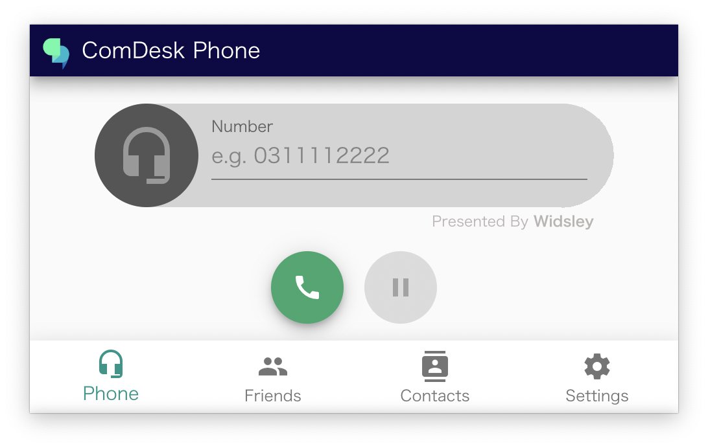

# ComDesk Phone ログイン方法

ComDesk Phoneのログイン方法をご說明します。

ー関連記事ー  
ComDesk Phoneのインストール方法についての記事はこちらをご確認ください。  
MacOSは[こちら](14508506030489_Comdesk_Phone（デスクトップアプリ）_アプリインストール_macOS.md)  
WindowsOSは[こちら](14502240732825_ComDesk_Phone（デスクトップアプリ）_アプリインストール_WindowsOS.md)

1.  ComDesk Phoneを開きます。  
      
    
2.  ログイン画面でComdesk Leadでログインしている情報で入力し「LOGIN」ボタンをクリックしてください。  
    
    項目名
    
    入力する情報
    
    Tenant Code
    
    サブドメイン
    
    Email
    
    Lead ユーザーID
    
    Password
    
    Lead パスワード
    
      
      
      
    
3.  ログインが完了するとこの画面に切り替わります。  
      
      
    

その他ご不明点などございましたら、[**サポートチームまでお問い合わせ**](https://comdesklead.zendesk.com/hc/ja/requests/new)をお願いいたします。

お問い合わせ方法は**[こちら](../../トラブルシューティング/サポートチームへのお問い合わせ方法/12828937533081_サポートチームへのお問い合わせ方法.md)**
