# アポイント登録機能について

架電した顧客へのアポイントが取れた場合のアポイント登録方法について説明します。

[1\. 切電時ポップアップを表示させている場合の登録方法](#h_01GRNK6Z5VW64F9RG98B973XME)  
[2\. 切電時ポップアップを表示させていない場合の登録方法](#h_01GRNK786MTNX057YYPG7WKCTA)  
[3\. アポイント登録データの確認方法](#h_01GRNK7EY3HAJ4X0YN5E8X47BE)  
[4\. アポイント登録をしたリストをコール対象外にしたい場合](#h_01GRNK7NY4QGGVKK2YDFKBNN1B)

## **1\. 切電時ポップアップを表示させている場合の登録方法**

1\. 切電時に表示されるポップアップの「アポイントフォーム」をクリックします。  
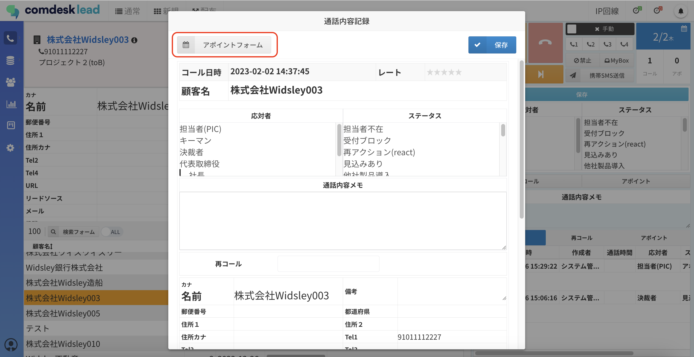  
  

2\. 予定のタイトル・場所はテキストで入力できます。  
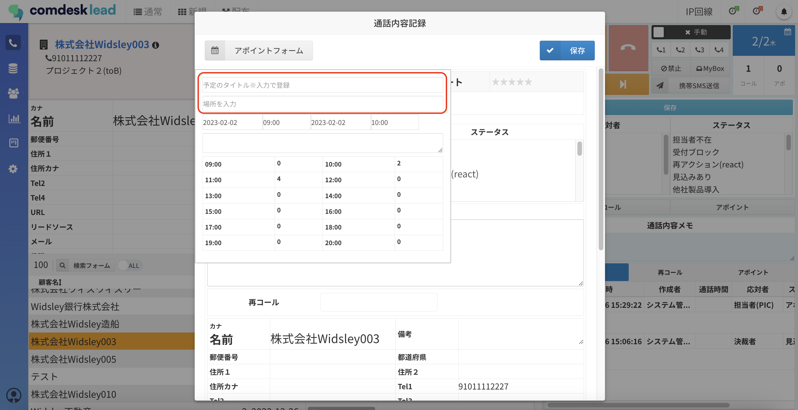  
  

3\. 日にちはカレンダーから、時刻は30分単位で選択して登録できます。  
日付選択画面で表示される時刻テーブルには、同じテナント内で同日にアポイントが登録されている場合、時間帯ごとにアポイント件数が表示されています。

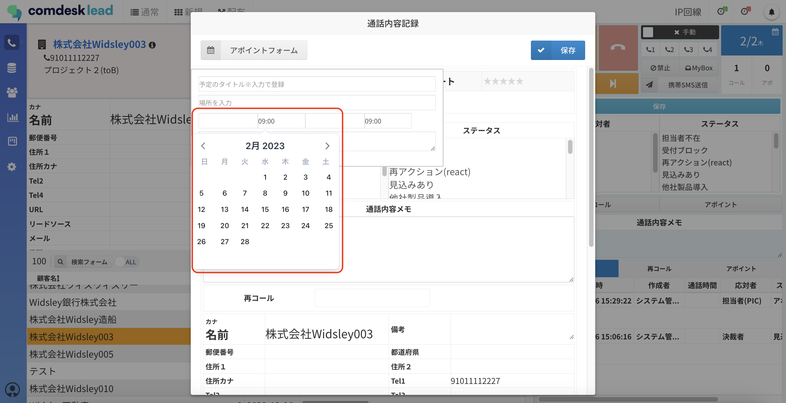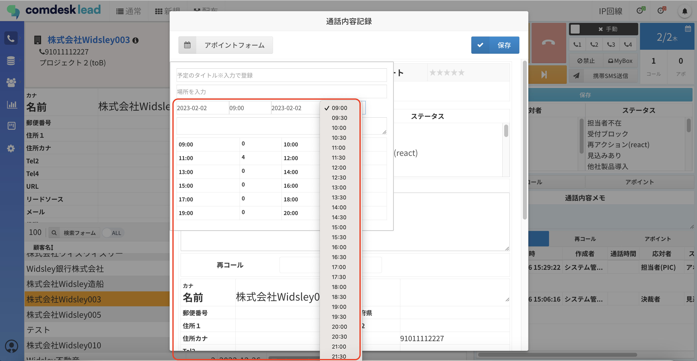  
  

4\. 登録ができたらもう一度「アポイントフォーム」をクリックし、フォームを非表示にして、切電ポップアップ画面の「保存」をクリックしてください。  
（応対者やステータス等の入力した内容と、アポイントフォームに入力した内容が一緒に保存されます。）  
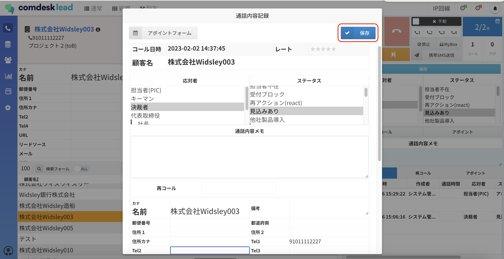  
  

5\. 登録したアポイントは、アポイントタブをクリックすると確認できます。  
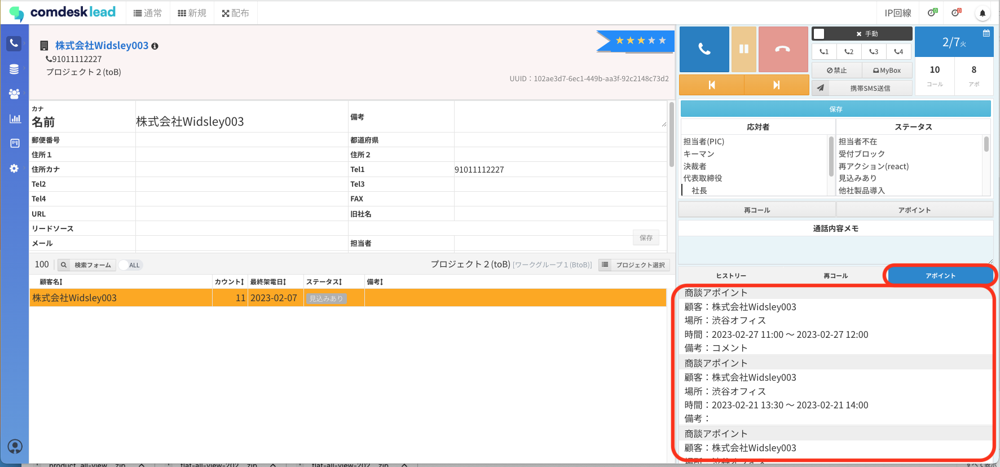

## **2\. 切電時ポップアップを表示させていない場合の登録方法**

1\. 切電ボタンを押したら（①）「アポイント」ボタンをクリックします（②）。  
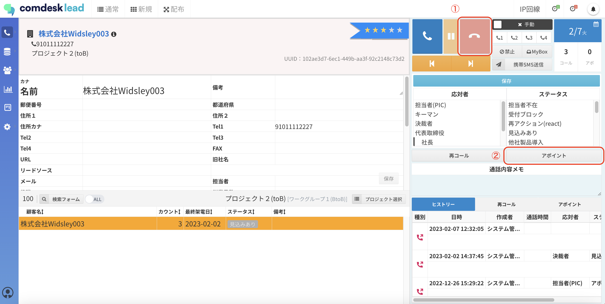  
  

2\. 予定のタイトル・場所はテキストで入力できます。  
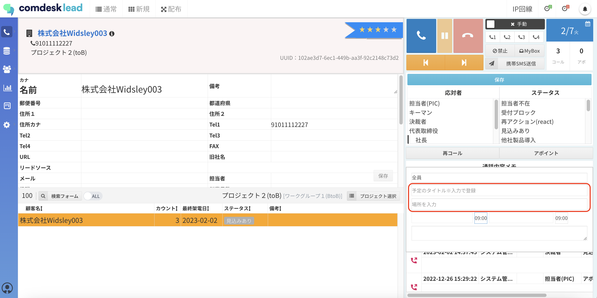  
  

3\. 日にちはカレンダーから、時刻は30分単位で選択して登録できます。

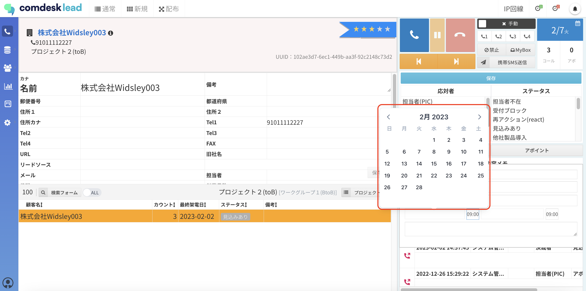  
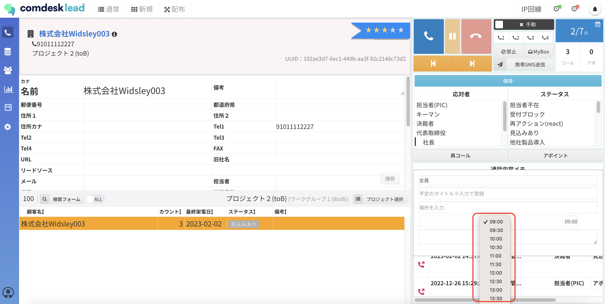

4\. アポイントの入力ができたら、応対者やステータス等、そのほかの入力ができていることを確認し、保存ボタンをクリックしてください。  
（応対者やステータス等の入力した内容と、アポイントフォームに入力した内容が一緒に保存されます。）  
日時欄の下部に表示される時刻テーブルには、同じテナント内で同日にアポイントが登録されている場合、時間帯ごとにアポイント件数が表示されています。

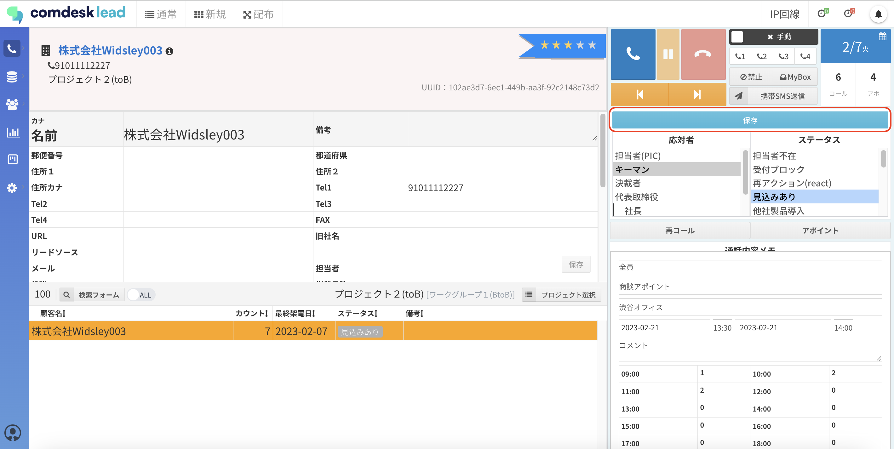

## **3\. アポイント登録データの確認方法**

登録したアポイントは、コール画面右下の「アポイント」タブ、および「アポイント」管理画面にて確認できます。**  
  
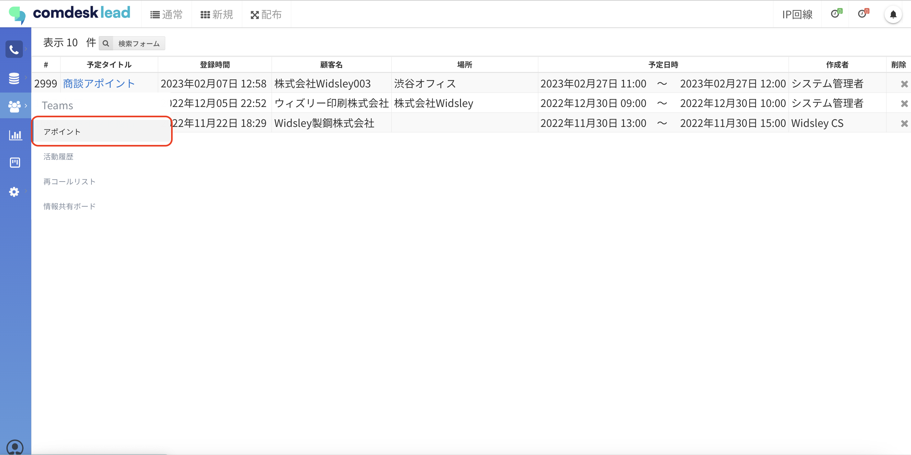**

## **4\. アポイント登録をしたリストをコール対象外にしたい場合**

アポイント登録をしたリストが自動的にコールリストから除外される機能はありません。  
コール対象から除外したい場合は、そのリストをMyboxに登録していただくことで、Mybox登録者以外のユーザーはそのリストに架電することができなくなり、アポイントを設定した顧客への重複架電を防ぐことができます。

Myboxの操作方法等については下記をご参照ください。

Myboxの仕様については[こちら](13598452522009_Myboxの仕様について.md)

Myboxの登録方法は[こちら](../../はじめてガイド/ユーザーガイド/12751011749529_見込み顧客をMyboxに登録する.md)

Myboxの解除方法は[こちら](../../はじめてガイド/ユーザーガイド/13556859672217_MyboxのリストをMyboxから解除する.md)

その他ご不明点などございましたら、[**サポートチームまでお問い合わせ**](https://comdesklead.zendesk.com/hc/ja/requests/new)をお願いいたします。

お問い合わせ方法は**[こちら](../../トラブルシューティング/サポートチームへのお問い合わせ方法/12828937533081_サポートチームへのお問い合わせ方法.md)**
