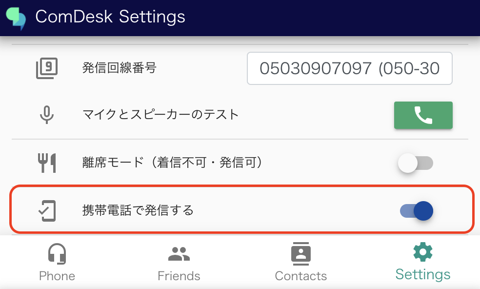
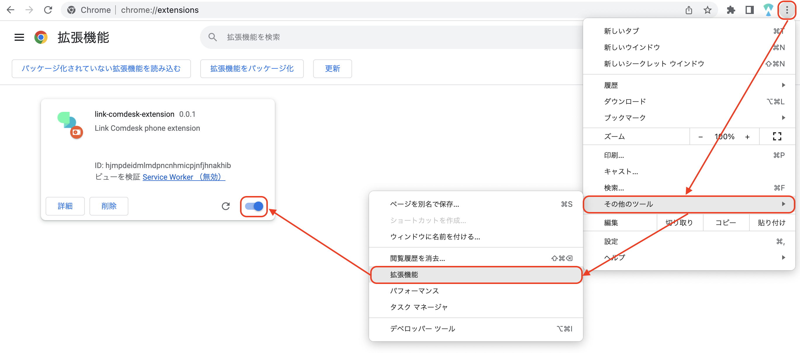
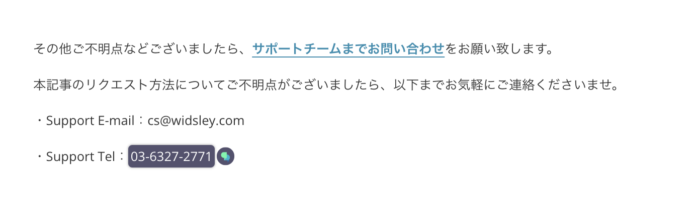
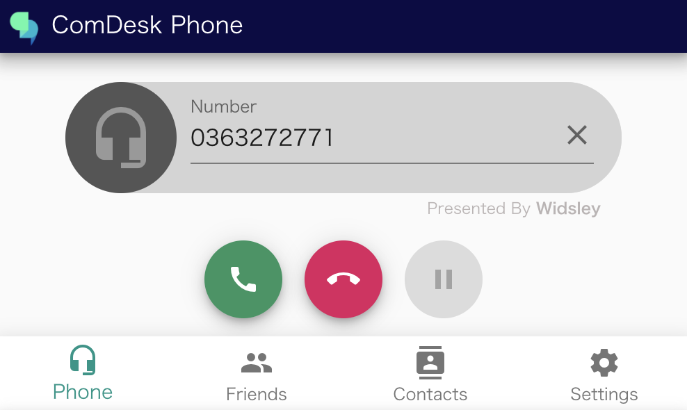

# ComDesk Phone（デスクトップアプリ）を使った携帯回線の発信方法

ComDesk Phoneを使った携帯回線の発信方法をご案内いたします。

## 【事前に用意するもの】

*   ComDesk Phone（バージョン：v1.0.5以上）
*   CallServer（バージョン：v1.2.0以上）
*   Click to Call　Google Chrome拡張  
    ┗インストール方法は[こちら](23421626752665_Chrome拡張機能のインストール方法.md)

## 【ComDesk Phoneの設定】

1.  下記を入力し、「LOGIN」をクリックする  
    Email：ユーザーID  
    password：パスワード  
      
      
    
2.  右下「Setting」をクリックする  
      
      
    
3.  「携帯電話で発信する」をONにする  
    

## 【発信方法】

1.  CallServerを「待ち受け中」で開いた状態にする  
      
      
    
2.  ComDesk Phoneを開いた状態にする  
    ※必ずページ上部の【ComDesk Phoneの設定】が実施済みであることを確認してください。  
      
      
    
3.  Click to Call　Google Chrome拡張をONにする  
      
      
    
4.  発信したい番号にカーソルを合わせ、クリックする  
    ※電話番号の横にComdesk Leadのアイコンが表示されていれば、番号が認識されている状態です。  
      
      
    
5.  「ComDeskを開く」をクリックする  
    ※下記チェックボックスにチェックを入れると、次回以降このポップアップは表示されません。  
      
      
    
6.  事前表示のポップアップの「OK」をクリックする  
    ※事前表示はOFFにすることが可能です。  
      
      
      
    （事前表示をOFFにする方法）  
    「Setting」内にある「Click-to-call 発信先番号の事前表示」をOFFにすることで、次回以降事前表示されなくなります。  
      
      
    
7.  発信が完了  
    ComDesk Phone：発信先の番号が自動で入力されます。  
      
      
    CallServer：通話発信画面に遷移します。  
      
      
    
    その他ご不明点などございましたら、[**サポートチームまでお問い合わせ**](https://comdesklead.zendesk.com/hc/ja/requests/new)をお願い致します。
    
    お問い合わせ方法は**[こちら](../../トラブルシューティング/サポートチームへのお問い合わせ方法/12828937533081_サポートチームへのお問い合わせ方法.md)**
